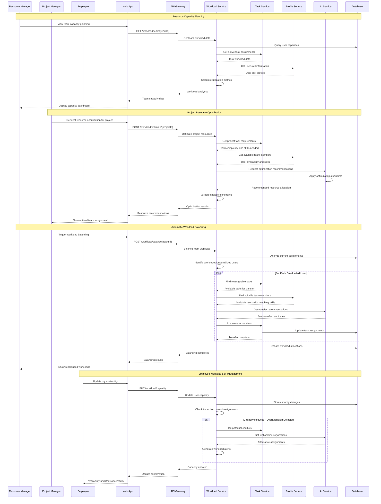
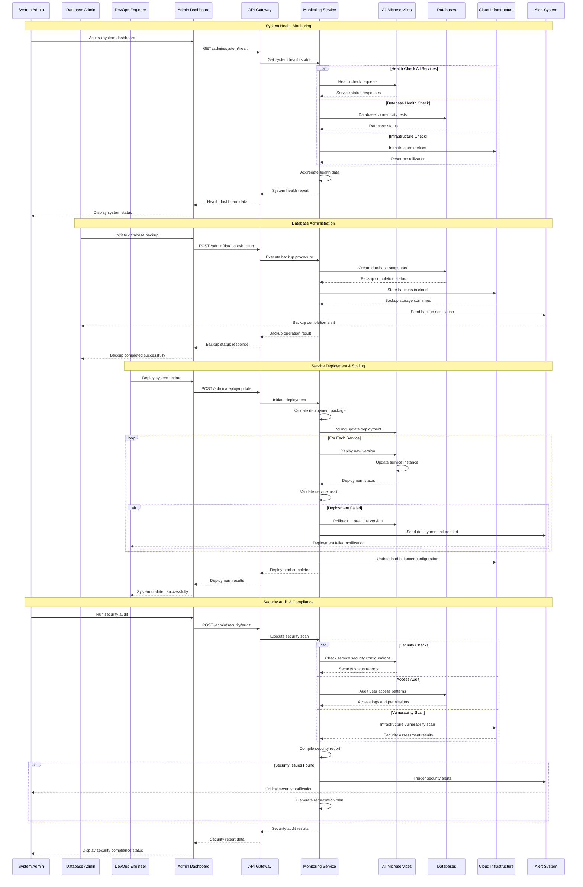

# Comprehensive System Use Case Diagrams

This document contains detailed use case diagrams for all main functions in the Internal Management System. Each diagram includes:
- **Actors**: External entities interacting with the system
- **Use Cases**: System functionality represented as ovals
- **Communication Links**: Lines connecting actors to use cases
- **System Boundaries**: Rectangles defining system scope  
- **Relationships**: Include, Extend, and Generalization relationships

---

## 1. Authentication & User Management Use Case

This diagram covers Identity Service and Profile Service functionalities.

```mermaid
graph LR
    %% Actors
    Employee[👤 Employee]
    Admin[👨‍💼 System Administrator]
    ProjectManager[👨‍💼 Project Manager]
    TeamLead[👨‍💼 Team Lead]
    ExternalSystem[🔌 External System]
    
    %% System Boundary
    subgraph "Authentication & User Management System"
        %% Authentication Use Cases
        Login((Login))
        Logout((Logout))
        RefreshToken((Refresh Token))
        ValidateToken((Validate Token))
        
        %% User Management Use Cases
        CreateUser((Create User))
        UpdateUser((Update User))
        DeactivateUser((Deactivate User))
        ViewUserProfile((View User Profile))
        ManageUserRoles((Manage User Roles))
        
        %% Profile Management Use Cases
        UpdateProfile((Update My Profile))
        ManageSkills((Manage Skills))
        ViewProfileDetails((View Profile Details))
        SearchProfiles((Search User Profiles))
        UploadAvatar((Upload Avatar))
        
        %% CV Processing Use Cases
        ParseCV((Parse CV))
        ExtractSkills((Extract Skills from CV))
        AutoCreateProfile((Auto Create Profile))
        
        %% Department & Role Management
        ManageDepartments((Manage Departments))
        ManagePositions((Manage Positions))
        AssignRoles((Assign User Roles))
        
        %% Performance Tracking
        UpdatePerformance((Update Performance))
        ViewPerformanceMetrics((View Performance Metrics))
        RecalculateScores((Recalculate Performance Scores))
    end
    
    %% Communication Links
    Employee --> Login
    Employee --> Logout
    Employee --> UpdateProfile
    Employee --> ManageSkills
    Employee --> ViewUserProfile
    Employee --> UploadAvatar
    
    Admin --> CreateUser
    Admin --> UpdateUser
    Admin --> DeactivateUser
    Admin --> ManageUserRoles
    Admin --> ManageDepartments
    Admin --> ManagePositions
    Admin --> ParseCV
    Admin --> ViewPerformanceMetrics
    Admin --> RecalculateScores
    
    ProjectManager --> ViewUserProfile
    ProjectManager --> SearchProfiles
    ProjectManager --> ViewProfileDetails
    ProjectManager --> ViewPerformanceMetrics
    
    TeamLead --> ViewUserProfile
    TeamLead --> SearchProfiles
    TeamLead --> UpdatePerformance
    TeamLead --> ViewPerformanceMetrics
    
    ExternalSystem --> ValidateToken
    ExternalSystem --> RefreshToken
    
    %% Include Relationships
    Login -.->|includes| ValidateToken
    CreateUser -.->|includes| AutoCreateProfile
    ParseCV -.->|includes| ExtractSkills
    ParseCV -.->|includes| AutoCreateProfile
    UpdatePerformance -.->|includes| RecalculateScores
    
    %% Extend Relationships
    CreateUser -.->|extends| ParseCV
    ManageSkills -.->|extends| ExtractSkills
```



---

## 2. Project Management Use Case

This diagram covers all Project Service functionalities for managing projects, teams, and budgets.


---

## 3. Task Management Use Case

This diagram covers comprehensive task lifecycle management including assignment and workflow features.

```mermaid
graph LR
    %% Actors
    ProjectManager[👨‍💼 Project Manager]
    TeamLead[👨‍💼 Team Lead]
    Employee[👤 Employee]
    AISystem[🤖 AI System]
    ReviewerEmployee[👤 Reviewer]
    
    %% System Boundary
    subgraph "Task Management System"
        %% Core Task Management
        CreateTask((Create Task))
        UpdateTask((Update Task))
        DeleteTask((Delete Task))
        ViewTask((View Task Details))
        ListTasks((List Tasks))
        
        %% Task Assignment
        AssignTask((Assign Task))
        UnassignTask((Unassign Task))
        TransferTask((Transfer Task))
        GetAIRecommendation((Get AI Assignment Recommendation))
        
        %% Task Status & Progress
        UpdateTaskStatus((Update Task Status))
        UpdateProgress((Update Task Progress))
        CompleteTask((Mark Task Complete))
        ReopenTask((Reopen Task))
        
        %% Task Dependencies
        AddDependency((Add Task Dependency))
        RemoveDependency((Remove Dependency))
        ViewDependencies((View Dependencies))
        CheckDependencyStatus((Check Dependency Status))
        
        %% Task Skills Management
        AddRequiredSkills((Add Required Skills))
        RemoveRequiredSkills((Remove Required Skills))
        ViewTaskSkills((View Task Skills))
        
        %% Task Submission & Review
        SubmitTask((Submit Task))
        ReviewSubmission((Review Task Submission))
        ApproveTask((Approve Task))
        RejectTask((Reject Task))
        RequestRevisions((Request Revisions))
        
        %% Time Tracking
        StartTimeTracking((Start Time Tracking))
        StopTimeTracking((Stop Time Tracking))
        ViewTimeLog((View Time Log))
        UpdateTimeLog((Update Time Log))
        DeleteTimeLog((Delete Time Log))
        
        %% Task Analytics & Reporting
        ViewTaskMetrics((View Task Metrics))
        GenerateTaskReport((Generate Task Report))
        TrackPerformance((Track Task Performance))
        
        %% Task Communication
        AddTaskComments((Add Task Comments))
        NotifyAssignee((Notify Task Assignee))
        SendStatusUpdate((Send Status Update))
        
        %% Batch Operations
        BulkAssign((Bulk Task Assignment))
        BulkStatusUpdate((Bulk Status Update))
        ExportTasks((Export Task Data))
    end
    
    %% Communication Links
    ProjectManager --> CreateTask
    ProjectManager --> AssignTask
    ProjectManager --> UpdateTask
    ProjectManager --> DeleteTask
    ProjectManager --> AddDependency
    ProjectManager --> AddRequiredSkills
    ProjectManager --> BulkAssign
    ProjectManager --> GenerateTaskReport
    ProjectManager --> ExportTasks
    
    TeamLead --> CreateTask
    TeamLead --> AssignTask
    TeamLead --> TransferTask
    TeamLead --> UpdateTask
    TeamLead --> ReviewSubmission
    TeamLead --> ApproveTask
    TeamLead --> RejectTask
    TeamLead --> ViewTaskMetrics
    TeamLead --> GetAIRecommendation
    
    Employee --> ViewTask
    Employee --> UpdateTaskStatus
    Employee --> UpdateProgress
    Employee --> SubmitTask
    Employee --> StartTimeTracking
    Employee --> StopTimeTracking
    Employee --> ViewTimeLog
    Employee --> AddTaskComments
    Employee --> ViewDependencies
    
    ReviewerEmployee --> ReviewSubmission
    ReviewerEmployee --> ApproveTask
    ReviewerEmployee --> RejectTask
    ReviewerEmployee --> RequestRevisions
    
    AISystem --> GetAIRecommendation
    AISystem --> TrackPerformance
    
    %% Include Relationships
    AssignTask -.->|includes| NotifyAssignee
    CreateTask -.->|includes| AddRequiredSkills
    SubmitTask -.->|includes| SendStatusUpdate
    ReviewSubmission -.->|includes| SendStatusUpdate
    CompleteTask -.->|includes| TrackPerformance
    TransferTask -.->|includes| NotifyAssignee
    UpdateTaskStatus -.->|includes| CheckDependencyStatus
    
    %% Extend Relationships
    AssignTask -.->|extends| GetAIRecommendation
    CreateTask -.->|extends| AddDependency
    ViewTask -.->|extends| ViewTimeLog
    UpdateTask -.->|extends| UpdateTimeLog
    ListTasks -.->|extends| ExportTasks
    ReviewSubmission -.->|extends| RequestRevisions
```



---

## 4. AI & Machine Learning Services Use Case

This diagram covers AI Service and ML Service functionalities for intelligent recommendations and continuous learning.


---

## 5. Communication & Notification Use Case

This diagram covers Chat Service and Notification Service for real-time communication and messaging.

```mermaid
graph LR
    %% Actors
    Employee[👤 Employee]
    ProjectManager[👨‍💼 Project Manager]
    TeamLead[👨‍💼 Team Lead]
    Admin[👨‍💼 System Administrator]
    SystemServices[🔄 System Services]
    ExternalEmailService[📧 External Email Service]
    
    %% System Boundary
    subgraph "Communication & Notification System"
        %% Chat & Messaging
        SendMessage((Send Message))
        ReceiveMessage((Receive Message))
        CreateConversation((Create Conversation))
        JoinConversation((Join Conversation))
        LeaveConversation((Leave Conversation))
        
        %% Group Chat Management
        CreateGroupChat((Create Group Chat))
        AddMembersToGroup((Add Members to Group))
        RemoveMembersFromGroup((Remove Members from Group))
        CreateProjectGroup((Create Project Group Chat))
        
        %% Message Features
        ReactToMessage((React to Message))
        PinMessage((Pin Message))
        UnpinMessage((Unpin Message))
        EditMessage((Edit Message))
        DeleteMessage((Delete Message))
        ForwardMessage((Forward Message))
        
        %% File Sharing in Chat
        ShareFile((Share File in Chat))
        DownloadSharedFile((Download Shared File))
        ViewSharedMedia((View Shared Media))
        
        %% Notification Management
        SendRealTimeNotification((Send Real-time Notification))
        SendEmailNotification((Send Email Notification))
        CreateSystemNotification((Create System Notification))
        MarkNotificationRead((Mark Notification as Read))
        ViewNotificationHistory((View Notification History))
        
        %% Notification Preferences
        ConfigureNotificationSettings((Configure Notification Settings))
        EnableDisableNotifications((Enable/Disable Notifications))
        SetNotificationChannels((Set Notification Channels))
        
        %% System Notifications
        TaskAssignmentNotification((Task Assignment Notification))
        ProjectUpdateNotification((Project Update Notification))
        DeadlineReminderNotification((Deadline Reminder))
        PerformanceAlertNotification((Performance Alert))
        SystemMaintenanceNotification((System Maintenance Alert))
        
        %% Real-time Features
        CheckOnlineStatus((Check User Online Status))
        ShowTypingIndicator((Show Typing Indicator))
        DeliverMessageStatus((Message Delivery Status))
        ReadReceiptStatus((Read Receipt Status))
        
        %% Chat Analytics
        ViewChatStatistics((View Chat Statistics))
        MonitorCommunication((Monitor Communication Activity))
        GenerateCommunicationReport((Generate Communication Report))
        
        %% Integration Features
        SyncWithTaskUpdates((Sync with Task Updates))
        SyncWithProjectUpdates((Sync with Project Updates))
        IntegrateWithCalendar((Integrate with Calendar))
    end
    
    %% Communication Links
    Employee --> SendMessage
    Employee --> ReceiveMessage
    Employee --> CreateConversation
    Employee --> JoinConversation
    Employee --> LeaveConversation
    Employee --> ReactToMessage
    Employee --> ShareFile
    Employee --> ConfigureNotificationSettings
    Employee --> MarkNotificationRead
    Employee --> CheckOnlineStatus
    
    ProjectManager --> CreateGroupChat
    ProjectManager --> CreateProjectGroup
    ProjectManager --> AddMembersToGroup
    ProjectManager --> RemoveMembersFromGroup
    ProjectManager --> SendRealTimeNotification
    ProjectManager --> ViewChatStatistics
    
    TeamLead --> CreateGroupChat
    TeamLead --> AddMembersToGroup
    TeamLead --> RemoveMembersFromGroup
    TeamLead --> PinMessage
    TeamLead --> SendRealTimeNotification
    TeamLead --> MonitorCommunication
    
    Admin --> SendSystemNotification
    Admin --> CreateSystemNotification
    Admin --> SystemMaintenanceNotification
    Admin --> ViewNotificationHistory
    Admin --> MonitorCommunication
    Admin --> GenerateCommunicationReport
    
    SystemServices --> TaskAssignmentNotification
    SystemServices --> ProjectUpdateNotification
    SystemServices --> DeadlineReminderNotification
    SystemServices --> PerformanceAlertNotification
    SystemServices --> SyncWithTaskUpdates
    SystemServices --> SyncWithProjectUpdates
    
    ExternalEmailService --> SendEmailNotification
    
    %% Include Relationships
    SendMessage -.->|includes| DeliverMessageStatus
    ReceiveMessage -.->|includes| ReadReceiptStatus
    CreateProjectGroup -.->|includes| AddMembersToGroup
    SendRealTimeNotification -.->|includes| CreateSystemNotification
    TaskAssignmentNotification -.->|includes| SendEmailNotification
    SendMessage -.->|includes| ShowTypingIndicator
    
    %% Extend Relationships
    SendMessage -.->|extends| ShareFile
    CreateGroupChat -.->|extends| CreateProjectGroup
    SendMessage -.->|extends| ReactToMessage
    ReceiveMessage -.->|extends| PinMessage
    SendRealTimeNotification -.->|extends| SendEmailNotification
    ViewNotificationHistory -.->|extends| GenerateCommunicationReport
```



---

## 6. Content Management Use Case

This diagram covers File Service, Post Service, and Search Service for document and content management.


---

## 7. Workload Management Use Case

This diagram covers Workload Service for capacity planning and resource optimization.

```mermaid
graph LR
    %% Actors
    Employee[👤 Employee]
    TeamLead[👨‍💼 Team Lead]
    ProjectManager[👨‍💼 Project Manager]
    Admin[👨‍💼 System Administrator]
    ResourceManager[👨‍💼 Resource Manager]
    HRManager[👨‍💼 HR Manager]
    
    %% System Boundary
    subgraph "Workload Management System"
        %% Workload Monitoring
        ViewMyWorkload((View My Workload))
        ViewTeamWorkload((View Team Workload))
        ViewUserCapacity((View User Capacity))
        CheckUserAvailability((Check User Availability))
        MonitorWorkloadTrends((Monitor Workload Trends))
        
        %% Capacity Management
        SetUserCapacity((Set User Capacity))
        UpdateCapacity((Update User Capacity))
        DefineWorkingHours((Define Working Hours))
        SetAvailabilitySchedule((Set Availability Schedule))
        ManageTimeOff((Manage Time Off))
        
        %% Resource Optimization
        OptimizeProjectResources((Optimize Project Resources))
        BalanceTeamWorkload((Balance Team Workload))
        RecommendResourceAllocation((Recommend Resource Allocation))
        IdentifyOverallocation((Identify Overallocation))
        SuggestWorkloadRedistribution((Suggest Workload Redistribution))
        
        %% Task Workload Management
        AddTaskToWorkload((Add Task to Workload))
        RemoveTaskFromWorkload((Remove Task from Workload))
        UpdateTaskEffort((Update Task Effort))
        EstimateTaskDuration((Estimate Task Duration))
        TrackTaskProgress((Track Task Progress))
        
        %% Workload Analytics
        GenerateWorkloadReport((Generate Workload Report))
        ViewUtilizationMetrics((View Utilization Metrics))
        AnalyzeProductivity((Analyze Productivity))
        ForecastCapacityNeeds((Forecast Capacity Needs))
        CompareTeamPerformance((Compare Team Performance))
        
        %% Availability Management
        ViewAvailableUsers((View Available Users))
        FindUsersBySkills((Find Users by Skills))
        CheckSkillAvailability((Check Skill Availability))
        ViewDepartmentCapacity((View Department Capacity))
        
        %% Workload Alerts & Notifications
        SendOverloadAlert((Send Overload Alert))
        NotifyCapacityChange((Notify Capacity Change))
        AlertUnderutilization((Alert Underutilization))
        RemindCapacityUpdate((Remind Capacity Update))
        
        %% Resource Planning
        PlanResourceAllocation((Plan Resource Allocation))
        CreateCapacityPlan((Create Capacity Plan))
        ScheduleResourceReview((Schedule Resource Review))
        ManageResourceConflicts((Manage Resource Conflicts))
        
        %% Integration Features
        SyncWithProjectTasks((Sync with Project Tasks))
        IntegrateWithCalendar((Integrate with Calendar))
        UpdateFromTimeTracking((Update from Time Tracking))
        ConnectWithHRSystems((Connect with HR Systems))
        
        %% Reporting & Insights
        ExportWorkloadData((Export Workload Data))
        CreateCustomDashboard((Create Custom Dashboard))
        SetWorkloadKPIs((Set Workload KPIs))
        TrackResourceROI((Track Resource ROI))
    end
    
    %% Communication Links
    Employee --> ViewMyWorkload
    Employee --> UpdateCapacity
    Employee --> SetAvailabilitySchedule
    Employee --> ManageTimeOff
    Employee --> TrackTaskProgress
    
    TeamLead --> ViewTeamWorkload
    TeamLead --> ViewUserCapacity
    TeamLead --> BalanceTeamWorkload
    TeamLead --> AddTaskToWorkload
    TeamLead --> UpdateTaskEffort
    TeamLead --> ViewUtilizationMetrics
    TeamLead --> SendOverloadAlert
    TeamLead --> ManageResourceConflicts
    
    ProjectManager --> OptimizeProjectResources
    ProjectManager --> ViewAvailableUsers
    ProjectManager --> FindUsersBySkills
    ProjectManager --> RecommendResourceAllocation
    ProjectManager --> PlanResourceAllocation
    ProjectManager --> GenerateWorkloadReport
    ProjectManager --> ForecastCapacityNeeds
    
    ResourceManager --> SetUserCapacity
    ResourceManager --> BalanceTeamWorkload
    ResourceManager --> OptimizeProjectResources
    ResourceManager --> IdentifyOverallocation
    ResourceManager --> SuggestWorkloadRedistribution
    ResourceManager --> CreateCapacityPlan
    ResourceManager --> ScheduleResourceReview
    ResourceManager --> ViewDepartmentCapacity
    
    Admin --> MonitorWorkloadTrends
    Admin --> ViewUtilizationMetrics
    Admin --> GenerateWorkloadReport
    Admin --> ExportWorkloadData
    Admin --> SetWorkloadKPIs
    Admin --> CreateCustomDashboard
    Admin --> ConnectWithHRSystems
    
    HRManager --> ViewDepartmentCapacity
    HRManager --> ForecastCapacityNeeds
    HRManager --> ManageTimeOff
    HRManager --> CompareTeamPerformance
    HRManager --> TrackResourceROI
    
    %% Include Relationships
    OptimizeProjectResources -.->|includes| ViewAvailableUsers
    BalanceTeamWorkload -.->|includes| IdentifyOverallocation
    AddTaskToWorkload -.->|includes| EstimateTaskDuration
    RecommendResourceAllocation -.->|includes| CheckSkillAvailability
    GenerateWorkloadReport -.->|includes| ViewUtilizationMetrics
    PlanResourceAllocation -.->|includes| ForecastCapacityNeeds
    
    %% Extend Relationships
    ViewTeamWorkload -.->|extends| SendOverloadAlert
    ViewMyWorkload -.->|extends| ManageTimeOff
    OptimizeProjectResources -.->|extends| SuggestWorkloadRedistribution
    ViewUtilizationMetrics -.->|extends| AlertUnderutilization
    SetUserCapacity -.->|extends| NotifyCapacityChange
    GenerateWorkloadReport -.->|extends| ExportWorkloadData
    ViewAvailableUsers -.->|extends| FindUsersBySkills
```



---

## 8. System Administration Use Case

This diagram covers administrative functions across all system services.

```mermaid
graph LR
    %% Actors
    SystemAdmin[👨‍💼 System Administrator]
    DatabaseAdmin[👨‍💼 Database Administrator]
    SecurityAdmin[👨‍💼 Security Administrator]
    NetworkAdmin[👨‍💼 Network Administrator]
    MLEngineer[👨‍💻 ML Engineer]
    DevOps[👨‍💻 DevOps Engineer]
    Auditor[👨‍💼 System Auditor]
    
    %% System Boundary
    subgraph "System Administration"
        %% User & Access Management
        ManageSystemUsers((Manage System Users))
        ConfigureUserRoles((Configure User Roles))
        SetSystemPermissions((Set System Permissions))
        AuditUserAccess((Audit User Access))
        ManageAPIKeys((Manage API Keys))
        
        %% System Configuration
        ConfigureServices((Configure Services))
        ManageEnvironments((Manage Environments))
        UpdateSystemSettings((Update System Settings))
        ConfigureIntegrations((Configure Integrations))
        ManageServiceEndpoints((Manage Service Endpoints))
        
        %% Monitoring & Health
        MonitorSystemHealth((Monitor System Health))
        ViewSystemMetrics((View System Metrics))
        CheckServiceStatus((Check Service Status))
        MonitorPerformance((Monitor System Performance))
        SetupHealthChecks((Setup Health Checks))
        
        %% Database Management
        ManageDatabases((Manage Databases))
        BackupDatabases((Backup Databases))
        RestoreDatabases((Restore Databases))
        OptimizeDatabasePerformance((Optimize Database Performance))
        ManageDataMigration((Manage Data Migration))
        
        %% Security & Compliance
        ConfigureSecurity((Configure Security Settings))
        ManageEncryption((Manage Encryption))
        AuditSecurityLogs((Audit Security Logs))
        ManageCompliance((Manage Compliance))
        HandleSecurityIncidents((Handle Security Incidents))
        
        %% System Maintenance
        ScheduleSystemMaintenance((Schedule System Maintenance))
        DeploySystemUpdates((Deploy System Updates))
        ManageSystemBackups((Manage System Backups))
        PerformSystemUpgrade((Perform System Upgrade))
        CleanupSystemData((Cleanup System Data))
        
        %% API Gateway Management
        ConfigureAPIGateway((Configure API Gateway))
        ManageRateLimiting((Manage Rate Limiting))
        SetupLoadBalancing((Setup Load Balancing))
        ConfigureRouting((Configure Service Routing))
        ManageAPIVersioning((Manage API Versioning))
        
        %% ML System Administration
        DeployMLModels((Deploy ML Models))
        MonitorMLPerformance((Monitor ML Performance))
        ManageTrainingData((Manage Training Data))
        ConfigureMLPipeline((Configure ML Pipeline))
        ScheduleModelRetraining((Schedule Model Retraining))
        
        %% Logging & Analytics
        ConfigureSystemLogging((Configure System Logging))
        ViewSystemLogs((View System Logs))
        AnalyzeSystemUsage((Analyze System Usage))
        GenerateSystemReports((Generate System Reports))
        SetupAlertSystem((Setup Alert System))
        
        %% Infrastructure Management
        ManageCloudResources((Manage Cloud Resources))
        ConfigureNetworking((Configure Networking))
        ManageContainers((Manage Containers))
        ScaleServices((Scale Services))
        ConfigureAutoScaling((Configure Auto-scaling))
        
        %% Disaster Recovery
        ConfigureDisasterRecovery((Configure Disaster Recovery))
        TestBackupRecovery((Test Backup Recovery))
        ManageFailoverSystems((Manage Failover Systems))
        DocumentRecoveryProcedures((Document Recovery Procedures))
        
        %% System Integration
        ConfigureExternalAPIs((Configure External APIs))
        ManageThirdPartyServices((Manage Third-party Services))
        SetupEventStreaming((Setup Event Streaming))
        ConfigureMessageQueuing((Configure Message Queuing))
    end
    
    %% Communication Links
    SystemAdmin --> ManageSystemUsers
    SystemAdmin --> ConfigureServices
    SystemAdmin --> MonitorSystemHealth
    SystemAdmin --> ScheduleSystemMaintenance
    SystemAdmin --> ConfigureAPIGateway
    SystemAdmin --> GenerateSystemReports
    SystemAdmin --> ManageThirdPartyServices
    SystemAdmin --> SetupAlertSystem
    
    DatabaseAdmin --> ManageDatabases
    DatabaseAdmin --> BackupDatabases
    DatabaseAdmin --> RestoreDatabases
    DatabaseAdmin --> OptimizeDatabasePerformance
    DatabaseAdmin --> ManageDataMigration
    DatabaseAdmin --> TestBackupRecovery
    
    SecurityAdmin --> ConfigureSecurity
    SecurityAdmin --> ManageEncryption
    SecurityAdmin --> AuditSecurityLogs
    SecurityAdmin --> ManageCompliance
    SecurityAdmin --> HandleSecurityIncidents
    SecurityAdmin --> ManageAPIKeys
    SecurityAdmin --> AuditUserAccess
    
    NetworkAdmin --> ConfigureNetworking
    NetworkAdmin --> SetupLoadBalancing
    NetworkAdmin --> ConfigureRouting
    NetworkAdmin --> ManageRateLimiting
    NetworkAdmin --> ConfigureAutoScaling
    
    MLEngineer --> DeployMLModels
    MLEngineer --> MonitorMLPerformance
    MLEngineer --> ManageTrainingData
    MLEngineer --> ConfigureMLPipeline
    MLEngineer --> ScheduleModelRetraining
    
    DevOps --> DeploySystemUpdates
    DevOps --> ManageContainers
    DevOps --> ScaleServices
    DevOps --> ManageCloudResources
    DevOps --> ConfigureDisasterRecovery
    DevOps --> ManageSystemBackups
    DevOps --> SetupEventStreaming
    
    Auditor --> AuditUserAccess
    Auditor --> AuditSecurityLogs
    Auditor --> AnalyzeSystemUsage
    Auditor --> ViewSystemLogs
    Auditor --> GenerateSystemReports
    Auditor --> DocumentRecoveryProcedures
    
    %% Include Relationships
    ManageSystemUsers -.->|includes| ConfigureUserRoles
    ConfigureServices -.->|includes| ManageServiceEndpoints
    MonitorSystemHealth -.->|includes| CheckServiceStatus
    DeploySystemUpdates -.->|includes| ScheduleSystemMaintenance
    ConfigureAPIGateway -.->|includes| SetupLoadBalancing
    HandleSecurityIncidents -.->|includes| AuditSecurityLogs
    DeployMLModels -.->|includes| MonitorMLPerformance
    
    %% Extend Relationships
    MonitorSystemHealth -.->|extends| SetupAlertSystem
    ManageDatabases -.->|extends| OptimizeDatabasePerformance
    ConfigureSecurity -.->|extends| ManageEncryption
    DeploySystemUpdates -.->|extends| PerformSystemUpgrade
    ViewSystemLogs -.->|extends| AnalyzeSystemUsage
    ConfigureDisasterRecovery -.->|extends| TestBackupRecovery
    ScaleServices -.->|extends| ConfigureAutoScaling
```



---

## Summary of Main System Functions

The Internal Management System consists of **8 main functional areas**:

1. **Authentication & User Management**: Identity and profile management, CV processing, role management
2. **Project Management**: Project lifecycle, team management, budget tracking, analytics
3. **Task Management**: Task assignment, workflow, time tracking, submission & review
4. **AI & Machine Learning**: Intelligent recommendations, CV analysis, continuous learning
5. **Communication & Notification**: Real-time messaging, notifications, group management
6. **Content Management**: File management, social posts, search functionality
7. **Workload Management**: Capacity planning, resource optimization, utilization tracking
8. **System Administration**: Service management, security, monitoring, infrastructure

Each use case diagram includes:
- ✅ **Actors**: All relevant user roles and external systems
- ✅ **Use Cases**: Complete functionality represented as ovals  
- ✅ **Communication Links**: Lines connecting actors to use cases
- ✅ **System Boundaries**: Clear rectangles defining each subsystem
- ✅ **Relationships**: Include, Extend relationships showing dependencies and optional features

These diagrams provide a comprehensive view of the system's functionality for stakeholders, developers, and project documentation.

---

# System Sequence Diagrams

This section contains sequence diagrams showing the interaction flow for each main system function. Each diagram illustrates the communication between actors, system components, and services over time.

---

## 1. Authentication & User Management Sequence Diagram

### User Login and Profile Creation Flow


---

## 2. Project Management Sequence Diagram

### Project Creation and Team Management Flow


---

## 3. Task Management Sequence Diagram

### Task Assignment and Workflow Management


---

## 4. AI & Machine Learning Sequence Diagram

### ML Model Training and Recommendation Generation


---

## 5. Communication & Notification Sequence Diagram

### Real-time Messaging and Notification System


---

## 6. Content Management Sequence Diagram

### File Management and Social Feed System


---

## 7. Workload Management Sequence Diagram

### Resource Optimization and Capacity Planning



---

## 8. System Administration Sequence Diagram

### System Monitoring and Management Operations



---

## Summary

These sequence diagrams illustrate the detailed interaction flows for all 8 main system functions:

1. **Authentication & User Management**: Login, profile management, and CV processing workflows
2. **Project Management**: Project creation, team management, and budget tracking processes  
3. **Task Management**: AI-assisted assignment, workflow management, and review processes
4. **AI & Machine Learning**: Model training, recommendation generation, and continuous learning
5. **Communication & Notification**: Real-time messaging, group management, and multi-channel notifications
6. **Content Management**: File processing, social posts, and advanced search capabilities
7. **Workload Management**: Resource optimization, capacity planning, and workload balancing
8. **System Administration**: Health monitoring, deployment management, and security auditing

Each diagram shows:
- **Participants**: All involved actors and system components
- **Message Flow**: Sequential interactions between components  
- **Parallel Processing**: Concurrent operations using `par` blocks
- **Conditional Logic**: Alternative flows using `alt` blocks
- **Loop Operations**: Iterative processes using `loop` blocks
- **Notes**: Process descriptions and workflow context

These sequence diagrams provide a complete technical view of how the Internal Management System operates, making them invaluable for system documentation, developer onboarding, and architectural reviews.

---

# Enhanced Role-Based Dashboard Visualizations

## Overview

In addition to the comprehensive use case diagrams and system workflows, each role in the Internal Management System features enhanced dashboard visualizations with multiple chart types to display relevant metrics, KPIs, and performance indicators.

## Dashboard Chart Enhancements by Role

### 📊 Project Manager Dashboard
**Enhanced with 6 comprehensive chart visualizations:**

1. **Project Completion Rate Timeline** (Line Chart)
   - Monthly tracking of completed vs started projects
   - Trend analysis for project delivery efficiency
   - Seasonal patterns and capacity planning insights

2. **Project Status Distribution** (Doughnut Chart) 
   - Visual breakdown: Completed (45%), In Progress (30%), Planning (15%), On Hold (5%), Review (5%)
   - Quick status overview for portfolio management
   - Color-coded status indicators

3. **Budget vs Actual Cost Analysis** (Bar Chart)
   - Comparative analysis across all active projects
   - Budget variance tracking and cost control
   - Financial performance indicators

4. **Team Performance Metrics** (Multi-line Chart)
   - Task completion rates, productivity scores, average hours per task
   - Weekly performance trends and team efficiency
   - Multi-axis visualization for comprehensive insights

5. **Project Timeline Progress** (Horizontal Bar Chart)
   - Gantt-style progress visualization
   - Color-coded progress indicators (Green: >80%, Blue: 50-80%, Yellow: 20-50%)
   - Resource allocation and timeline management

6. **Resource Allocation Overview** (Stacked Bar Chart)
   - Department-wise resource distribution
   - Allocated vs utilized vs overtime hours
   - Capacity planning and optimization insights

### 👥 Team Lead Dashboard  
**Enhanced with 6 team-focused chart visualizations:**

1. **Task Distribution by Team Member** (Horizontal Bar Chart)
   - Individual workload breakdown (Completed, In Progress, Pending)
   - Team member capacity and performance comparison
   - Workload balancing insights

2. **Team Productivity Trends** (Area Chart)
   - Daily/weekly productivity patterns
   - Task completion and hours worked correlation
   - Dual-axis visualization for comprehensive analysis

3. **Skills Coverage Matrix** (Radar Chart)
   - Team skill levels vs project requirements
   - Skill gap analysis and training needs identification
   - Multi-dimensional skill assessment

4. **Task Priority Distribution** (Pie Chart)
   - Priority breakdown: Critical (10%), High (15%), Medium (35%), Low (40%)
   - Resource allocation based on priority levels
   - Urgency management visualization

5. **Weekly Sprint Burndown** (Line Chart)
   - Ideal vs actual burndown tracking
   - Sprint progress monitoring and predictive analysis
   - Velocity and completion rate indicators

6. **Team Member Performance Matrix** (Multi-axis Chart)
   - Individual performance metrics (tasks completed, efficiency scores)
   - Comparative performance analysis
   - Recognition and improvement identification

### 👤 Employee Dashboard
**Enhanced with 6 personal productivity chart visualizations:**

1. **Personal Task Completion Timeline** (Line Chart)
   - Weekly task completion vs assignment trends
   - Personal productivity patterns and growth tracking
   - Goal achievement visualization

2. **Daily Hours Tracking** (Stacked Bar Chart)
   - Productive hours, break time, and overtime breakdown
   - Weekly work pattern analysis
   - Time management and work-life balance insights

3. **Task Status Distribution** (Doughnut Chart)
   - Personal task breakdown: Completed (65%), In Progress (20%), Pending (10%), Blocked (3%), Review (2%)
   - Individual workflow management
   - Progress tracking and bottleneck identification

4. **Performance Metrics Radar** (Radar Chart)
   - Multi-dimensional performance assessment
   - Skills: Quality (88%), Timeliness (92%), Collaboration (85%), Innovation (78%), Problem Solving (90%), Communication (87%)
   - Personal development roadmap

5. **Monthly Productivity Trends** (Area Chart)  
   - Long-term productivity analysis (tasks completed, hours worked)
   - Seasonal patterns and improvement trends
   - Career progression tracking

6. **Skill Development Progress** (Horizontal Bar Chart)
   - Individual skill level progression
   - Color-coded proficiency levels (Advanced: >80%, Intermediate: 60-80%, Beginner: 40-60%, Learning: <40%)
   - Learning and development planning

### ⚙️ Admin Dashboard
**Enhanced with 7 comprehensive system monitoring chart visualizations:**

1. **System Overview Dashboard** (Multi-metric Display)
   - User growth trends and activity distribution
   - Comprehensive system health indicators
   - Multi-chart system status overview

2. **Department Distribution Analysis** (Stacked Bar Chart)
   - Department-wise user distribution (Active, Inactive, New Hires)
   - Organizational structure visualization
   - HR planning and resource allocation

3. **System Performance Metrics** (Multi-line Chart)
   - Real-time system monitoring: CPU usage, Memory usage, Active sessions
   - Performance trend analysis and capacity planning
   - Infrastructure optimization insights

4. **Project Portfolio Health** (Bubble Chart)
   - Project health visualization (Budget %, Timeline %, Team Size)
   - Portfolio risk assessment and management
   - Strategic planning and resource allocation

5. **Resource Utilization Gauges** (Gauge Charts)
   - Server capacity (75%), Storage usage (82%), Bandwidth (45%), Licenses (68%)
   - Infrastructure monitoring and optimization
   - Capacity planning and procurement

6. **Security & Compliance Dashboard** (Heat Map)
   - Weekly security and compliance scores
   - Risk level monitoring and assessment
   - Audit trail and compliance tracking

7. **Financial Overview** (Mixed Chart)
   - Quarterly revenue, costs, and profit margin analysis
   - Financial performance tracking and forecasting
   - Business intelligence and strategic planning

## Implementation Features

### 🎨 **Visual Design Standards**
- **Color Palette**: Consistent color scheme across all roles
  - Success: #10B981 (Green)
  - Primary: #3B82F6 (Blue) 
  - Warning: #F59E0B (Yellow)
  - Danger: #EF4444 (Red)
  - Secondary: #8B5CF6 (Purple)

### 📱 **Interactive Features**
- **Real-time Updates**: Live data synchronization via WebSocket
- **Drill-down Capability**: Click charts for detailed views
- **Export Functions**: PNG, PDF, CSV export options
- **Date Range Filters**: Customizable time period selection
- **Responsive Design**: Mobile-friendly layouts

### 🔧 **Technical Integration** 
- **Chart.js Integration**: Professional chart rendering library
- **API Integration**: Real-time data from microservices
- **Performance Optimization**: Lazy loading and caching
- **Accessibility**: Screen reader compatible and keyboard navigation

### 📊 **Data Sources**
- Project Management Service: Project metrics and timelines
- Task Management Service: Task completion and assignment data  
- Identity Service: User activity and authentication metrics
- Workload Service: Resource allocation and capacity data
- AI Service: Performance predictions and recommendations

This enhanced dashboard system provides each role with comprehensive, visually appealing, and actionable insights tailored to their specific responsibilities and decision-making needs.

---

# System Activity Diagrams

This section contains activity diagrams showing the workflow and process flow for each main system function. Each diagram includes swimlanes for different actors, start/end nodes, activities, decision branches, forks for parallel processing, and joins for synchronization.

---

## 1. Authentication & User Management Activity Diagram

### Complete User Authentication and Profile Management Workflow


---

## 2. Project Management Activity Diagram

### Project Creation and Team Management Workflow

```mermaid
flowchart TD
    Start([🔵 Start]) --> ProjectAction{Project Action?}
    
    %% Create Project Branch
    ProjectAction -->|Create Project| CheckPermissions{Has PM Permission?}
    CheckPermissions -->|No| AccessDenied[Access Denied]
    AccessDenied --> End([🔴 End])
    CheckPermissions -->|Yes| FillProjectForm[Fill Project Details]
    FillProjectForm --> ValidateProject{Valid Project Data?}
    ValidateProject -->|No| ValidationError[Show Validation Errors]
    ValidationError --> FillProjectForm
    ValidateProject -->|Yes| CreateProjectFork{{Fork}}
    
    %% Project Creation Fork
    CreateProjectFork --> StoreProject[Store Project in Database]
    CreateProjectFork --> CreateChatGroup[Create Project Chat Group]
    CreateProjectFork --> InitializeBudget[Initialize Budget Tracking]
    CreateProjectFork --> SetupPermissions[Setup Project Permissions]
    
    %% Project Creation Join
    StoreProject --> ProjectCreateJoin{{Join}}
    CreateChatGroup --> ProjectCreateJoin
    InitializeBudget --> ProjectCreateJoin
    SetupPermissions --> ProjectCreateJoin
    ProjectCreateJoin --> NotifyStakeholders[Notify Project Stakeholders]
    NotifyStakeholders --> ProjectCreated[Project Created Successfully]
    
    %% Team Management Branch
    ProjectAction -->|Manage Team| TeamAction{Team Action?}
    TeamAction -->|Add Member| SelectMember[Select Team Member]
    SelectMember --> CheckAvailability{Member Available?}
    CheckAvailability -->|No| MemberBusy[Member Not Available]
    MemberBusy --> SelectMember
    CheckAvailability -->|Yes| AssignRole[Assign Member Role]
    AssignRole --> AddMemberFork{{Fork}}
    
    %% Add Member Fork
    AddMemberFork --> UpdateProjectTeam[Update Project Team]
    AddMemberFork --> AddToChatGroup[Add to Chat Group]
    AddMemberFork --> UpdateWorkload[Update Member Workload]
    AddMemberFork --> SendInvitation[Send Team Invitation]
    
    %% Add Member Join
    UpdateProjectTeam --> AddMemberJoin{{Join}}
    AddToChatGroup --> AddMemberJoin
    UpdateWorkload --> AddMemberJoin
    SendInvitation --> AddMemberJoin
    AddMemberJoin --> MemberAdded[Member Added Successfully]
    
    %% Remove Member Branch
    TeamAction -->|Remove Member| ConfirmRemoval{Confirm Removal?}
    ConfirmRemoval -->|No| TeamManagement[Continue Team Management]
    ConfirmRemoval -->|Yes| RemoveMemberFork{{Fork}}
    
    %% Remove Member Fork
    RemoveMemberFork --> RemoveFromTeam[Remove from Project Team]
    RemoveMemberFork --> RemoveFromChat[Remove from Chat Group]
    RemoveMemberFork --> ReassignTasks[Reassign Member Tasks]
    RemoveMemberFork --> UpdateWorkloadRemoval[Update Workload]
    
    %% Remove Member Join
    RemoveFromTeam --> RemoveMemberJoin{{Join}}
    RemoveFromChat --> RemoveMemberJoin
    ReassignTasks --> RemoveMemberJoin
    UpdateWorkloadRemoval --> RemoveMemberJoin
    RemoveMemberJoin --> MemberRemoved[Member Removed Successfully]
    
    %% Budget Management Branch
    ProjectAction -->|Manage Budget| BudgetAction{Budget Action?}
    BudgetAction -->|Set Budget| SetBudgetAmount[Set Budget Amount]
    BudgetAction -->|Track Costs| TrackExpenses[Track Project Expenses]
    BudgetAction -->|Generate Report| CreateBudgetReport[Generate Budget Report]
    
    SetBudgetAmount --> ValidateBudget{Valid Budget?}
    ValidateBudget -->|No| BudgetError[Show Budget Error]
    BudgetError --> SetBudgetAmount
    ValidateBudget -->|Yes| SaveBudget[Save Budget Configuration]
    SaveBudget --> BudgetThresholds[Setup Alert Thresholds]
    BudgetThresholds --> BudgetConfigured[Budget Configured Successfully]
    
    TrackExpenses --> UpdateCosts[Update Cost Tracking]
    UpdateCosts --> CheckThreshold{Budget Threshold Exceeded?}
    CheckThreshold -->|Yes| SendBudgetAlert[Send Budget Alert]
    CheckThreshold -->|No| ContinueTracking[Continue Tracking]
    SendBudgetAlert --> ContinueTracking
    
    CreateBudgetReport --> GenerateAnalytics[Generate Budget Analytics]
    GenerateAnalytics --> ExportReport[Export Budget Report]
    
    %% Convergence Points
    ProjectCreated --> ProjectDashboard[Show Project Dashboard]
    MemberAdded --> TeamManagement
    MemberRemoved --> TeamManagement
    TeamManagement --> ProjectDashboard
    BudgetConfigured --> ProjectDashboard
    ContinueTracking --> ProjectDashboard
    ExportReport --> ProjectDashboard
    ProjectDashboard --> End
```



---

## 3. Task Management Activity Diagram

### Task Assignment and Workflow Management Process

```mermaid
flowchart TD
    Start([🔵 Start]) --> TaskAction{Task Action?}
    
    %% Create Task Branch
    TaskAction -->|Create Task| CheckTaskPermission{Has Task Creation Permission?}
    CheckTaskPermission -->|No| TaskAccessDenied[Access Denied]
    TaskAccessDenied --> End([🔴 End])
    CheckTaskPermission -->|Yes| FillTaskDetails[Fill Task Details]
    FillTaskDetails --> ValidateTask{Valid Task Data?}
    ValidateTask -->|No| TaskValidationError[Show Validation Errors]
    TaskValidationError --> FillTaskDetails
    ValidateTask -->|Yes| CreateTaskFork{{Fork}}
    
    %% Task Creation Fork
    CreateTaskFork --> StoreTaskData[Store Task in Database]
    CreateTaskFork --> AnalyzeSkillRequirements[Analyze Required Skills]
    CreateTaskFork --> SetupDependencies[Setup Task Dependencies]
    
    %% Task Creation Join
    StoreTaskData --> TaskCreateJoin{{Join}}
    AnalyzeSkillRequirements --> TaskCreateJoin
    SetupDependencies --> TaskCreateJoin
    TaskCreateJoin --> TaskCreated[Task Created Successfully]
    
    %% Task Assignment Branch
    TaskCreated --> AssignmentMethod{Assignment Method?}
    AssignmentMethod -->|Manual| SelectAssignee[Select Task Assignee]
    AssignmentMethod -->|AI Recommendation| GetAIRecommendation[Request AI Assignment Recommendation]
    
    %% AI Recommendation Flow
    GetAIRecommendation --> AIAnalysisFork{{Fork}}
    AIAnalysisFork --> AnalyzeUserSkills[Analyze User Skills]
    AIAnalysisFork --> CheckWorkload[Check User Workload]
    AIAnalysisFork --> ReviewPerformance[Review Past Performance]
    
    AnalyzeUserSkills --> AIJoin{{Join}}
    CheckWorkload --> AIJoin
    ReviewPerformance --> AIJoin
    AIJoin --> GenerateRecommendations[Generate Assignment Recommendations]
    GenerateRecommendations --> ShowRecommendations[Show Recommended Assignees]
    ShowRecommendations --> SelectFromRecommendation[Select from Recommendations]
    
    %% Assignment Process
    SelectAssignee --> ValidateAssignee{Assignee Available?}
    SelectFromRecommendation --> ValidateAssignee
    ValidateAssignee -->|No| AssigneeUnavailable[Assignee Not Available]
    AssigneeUnavailable --> SelectAssignee
    ValidateAssignee -->|Yes| AssignTaskFork{{Fork}}
    
    %% Task Assignment Fork
    AssignTaskFork --> UpdateTaskAssignment[Update Task Assignment]
    AssignTaskFork --> SendNotification[Send Assignment Notification]
    AssignTaskFork --> UpdateWorkloadTracking[Update Workload Tracking]
    AssignTaskFork --> AddToProjectChat[Add to Project Chat]
    
    %% Task Assignment Join
    UpdateTaskAssignment --> AssignJoin{{Join}}
    SendNotification --> AssignJoin
    UpdateWorkloadTracking --> AssignJoin
    AddToProjectChat --> AssignJoin
    AssignJoin --> TaskAssigned[Task Assigned Successfully]
    
    %% Task Execution Branch
    TaskAssigned --> TaskExecution{Task Status?}
    TaskExecution -->|Start Work| StartTimeTracking[Start Time Tracking]
    TaskExecution -->|Update Progress| UpdateProgress[Update Task Progress]
    TaskExecution -->|Submit Task| SubmitTask[Submit Completed Task]
    
    StartTimeTracking --> WorkInProgress[Task in Progress]
    UpdateProgress --> CheckProgress{Progress Milestone?}
    CheckProgress -->|Yes| NotifyProgress[Notify Progress Update]
    CheckProgress -->|No| ContinueWork[Continue Working]
    NotifyProgress --> ContinueWork
    ContinueWork --> WorkInProgress
    WorkInProgress --> TaskExecution
    
    %% Task Submission Branch
    SubmitTask --> AttachDeliverables{Attach Deliverables?}
    AttachDeliverables -->|Yes| UploadFiles[Upload Task Files]
    AttachDeliverables -->|No| SubmitWithoutFiles[Submit Without Files]
    UploadFiles --> ValidateFiles{Files Valid?}
    ValidateFiles -->|No| FileError[File Upload Error]
    FileError --> UploadFiles
    ValidateFiles -->|Yes| SubmitWithoutFiles
    SubmitWithoutFiles --> StopTimeTracking[Stop Time Tracking]
    StopTimeTracking --> SubmissionFork{{Fork}}
    
    %% Submission Processing Fork
    SubmissionFork --> StoreSubmission[Store Submission Data]
    SubmissionFork --> NotifyReviewer[Notify Task Reviewer]
    SubmissionFork --> UpdateTaskStatus[Update Task Status to Submitted]
    
    %% Submission Join
    StoreSubmission --> SubmissionJoin{{Join}}
    NotifyReviewer --> SubmissionJoin
    UpdateTaskStatus --> SubmissionJoin
    SubmissionJoin --> SubmissionComplete[Submission Recorded]
    
    %% Task Review Branch
    SubmissionComplete --> ReviewProcess{Review Action?}
    ReviewProcess -->|Approve| ApproveTask[Approve Task Completion]
    ReviewProcess -->|Reject| RejectTask[Reject Task Submission]
    ReviewProcess -->|Request Revision| RequestRevision[Request Task Revision]
    
    ApproveTask --> TaskApprovalFork{{Fork}}
    TaskApprovalFork --> MarkComplete[Mark Task as Complete]
    TaskApprovalFork --> UpdatePerformance[Update User Performance Metrics]
    TaskApprovalFork --> SendApprovalNotification[Send Approval Notification]
    TaskApprovalFork --> FinalizeTimeTracking[Finalize Time Tracking]
    
    MarkComplete --> ApprovalJoin{{Join}}
    UpdatePerformance --> ApprovalJoin
    SendApprovalNotification --> ApprovalJoin
    FinalizeTimeTracking --> ApprovalJoin
    ApprovalJoin --> TaskCompleted[Task Completed Successfully]
    
    RejectTask --> SendRejectionFeedback[Send Rejection Feedback]
    SendRejectionFeedback --> ReassignOrRevise{Reassign or Revise?}
    ReassignOrRevise -->|Reassign| SelectAssignee
    ReassignOrRevise -->|Revise| TaskExecution
    
    RequestRevision --> SendRevisionRequest[Send Revision Request]
    SendRevisionRequest --> TaskExecution
    
    TaskCompleted --> End
```



---

## 4. AI & Machine Learning Activity Diagram

### ML Model Training and Recommendation Generation Workflow

```mermaid
flowchart TD
    Start([🔵 Start]) --> AIAction{AI System Action?}
    
    %% Model Training Branch
    AIAction -->|Train Model| CheckTrainingPermission{Has ML Engineer Permission?}
    CheckTrainingPermission -->|No| MLAccessDenied[Access Denied]
    MLAccessDenied --> End([🔴 End])
    CheckTrainingPermission -->|Yes| ConfigureTraining[Configure Training Parameters]
    ConfigureTraining --> ValidateConfig{Valid Configuration?}
    ValidateConfig -->|No| ConfigError[Configuration Error]
    ConfigError --> ConfigureTraining
    ValidateConfig -->|Yes| DataCollectionFork{{Fork}}
    
    %% Data Collection Fork
    DataCollectionFork --> CollectTaskData[Collect Task History Data]
    DataCollectionFork --> CollectUserData[Collect User Profile Data]
    DataCollectionFork --> CollectPerformanceData[Collect Performance Data]
    DataCollectionFork --> CollectWorkloadData[Collect Workload Data]
    
    %% Data Collection Join
    CollectTaskData --> DataJoin{{Join}}
    CollectUserData --> DataJoin
    CollectPerformanceData --> DataJoin
    CollectWorkloadData --> DataJoin
    DataJoin --> ValidateDataset{Dataset Complete?}
    ValidateDataset -->|No| DataIncomplete[Insufficient Training Data]
    DataIncomplete --> End
    ValidateDataset -->|Yes| PreprocessData[Preprocess Training Data]
    
    PreprocessData --> TrainingFork{{Fork}}
    TrainingFork --> ContentBasedTraining[Train Content-Based Model]
    TrainingFork --> CollaborativeTraining[Train Collaborative Model]
    TrainingFork --> HybridModelTraining[Train Hybrid Model]
    
    %% Training Join
    ContentBasedTraining --> TrainingJoin{{Join}}
    CollaborativeTraining --> TrainingJoin
    HybridModelTraining --> TrainingJoin
    TrainingJoin --> ValidateModel[Validate Model Performance]
    ValidateModel --> ModelValid{Model Meets Criteria?}
    ModelValid -->|No| TrainingFailed[Training Failed - Retune Parameters]
    TrainingFailed --> ConfigureTraining
    ModelValid -->|Yes| DeployModel[Deploy Trained Model]
    DeployModel --> ModelDeployed[Model Deployed Successfully]
    
    %% Recommendation Generation Branch
    AIAction -->|Generate Recommendations| RecommendationType{Recommendation Type?}
    RecommendationType -->|Task Assignment| TaskRecommendation[Task Assignment Recommendation]
    RecommendationType -->|Performance Prediction| PerformancePrediction[Performance Prediction]
    RecommendationType -->|Team Composition| TeamRecommendation[Team Composition Recommendation]
    
    %% Task Assignment Recommendation Flow
    TaskRecommendation --> CheckCache{Cached Prediction?}
    CheckCache -->|Yes| ReturnCached[Return Cached Recommendation]
    CheckCache -->|No| MLPredictionFork{{Fork}}
    
    MLPredictionFork --> AnalyzeCandidateSkills[Analyze Candidate Skills]
    MLPredictionFork --> CheckCandidateWorkload[Check Candidate Workload]
    MLPredictionFork --> ReviewCandidatePerformance[Review Candidate Performance]
    MLPredictionFork --> CalculateCompatibility[Calculate Task Compatibility]
    
    AnalyzeCandidateSkills --> PredictionJoin{{Join}}
    CheckCandidateWorkload --> PredictionJoin
    ReviewCandidatePerformance --> PredictionJoin
    CalculateCompatibility --> PredictionJoin
    PredictionJoin --> GeneratePrediction[Generate ML Prediction]
    GeneratePrediction --> ApplyBusinessRules[Apply Business Rules]
    ApplyBusinessRules --> RankCandidates[Rank Recommended Candidates]
    RankCandidates --> CacheRecommendation[Cache Recommendation]
    CacheRecommendation --> ReturnRecommendation[Return Recommendation List]
    ReturnCached --> ReturnRecommendation
    
    %% CV Processing Branch
    AIAction -->|Process CV| ValidateCVFile{Valid CV File?}
    ValidateCVFile -->|No| CVFileError[CV File Error]
    CVFileError --> End
    ValidateCVFile -->|Yes| CVProcessingFork{{Fork}}
    
    CVProcessingFork --> ExtractPersonalInfo[Extract Personal Information]
    CVProcessingFork --> ExtractWorkExperience[Extract Work Experience]
    CVProcessingFork --> ExtractEducation[Extract Education Details]
    CVProcessingFork --> ExtractSkills[Extract Skills and Technologies]
    
    ExtractPersonalInfo --> CVJoin{{Join}}
    ExtractWorkExperience --> CVJoin
    ExtractEducation --> CVJoin
    ExtractSkills --> CVJoin
    CVJoin --> AnalyzeCVContent[Analyze CV Content]
    AnalyzeCVContent --> GenerateProfile[Generate User Profile]
    GenerateProfile --> SuggestDepartment[Suggest Department Placement]
    SuggestDepartment --> SuggestPosition[Suggest Position Level]
    SuggestPosition --> CVProcessed[CV Processing Complete]
    
    %% Continuous Learning Branch
    AIAction -->|Submit Feedback| ProcessFeedback[Process Assignment Feedback]
    ProcessFeedback --> StoreFeedback[Store Feedback Data]
    StoreFeedback --> CheckRetrainingThreshold{Retraining Threshold Met?}
    CheckRetrainingThreshold -->|No| FeedbackStored[Feedback Stored]
    CheckRetrainingThreshold -->|Yes| TriggerRetraining[Trigger Automatic Retraining]
    TriggerRetraining --> ConfigureTraining
    
    %% Convergence Points
    ModelDeployed --> AISystemReady[AI System Ready]
    ReturnRecommendation --> AISystemReady
    CVProcessed --> AISystemReady
    FeedbackStored --> AISystemReady
    AISystemReady --> End
```



---

## 5. Communication & Notification Activity Diagram

### Real-time Messaging and Notification Workflow

```mermaid
flowchart TD
    Start([🔵 Start]) --> CommunicationAction{Communication Action?}
    
    %% Chat Messaging Branch
    CommunicationAction -->|Send Message| EstablishConnection[Establish WebSocket Connection]
    EstablishConnection --> ConnectionValid{Connection Established?}
    ConnectionValid -->|No| ConnectionError[Connection Failed]
    ConnectionError --> EstablishConnection
    ConnectionValid -->|Yes| ComposeMessage[Compose Message]
    ComposeMessage --> MessageType{Message Type?}
    
    MessageType -->|Text| ValidateText{Valid Text Message?}
    MessageType -->|File| AttachFile[Attach File to Message]
    MessageType -->|Voice| RecordVoice[Record Voice Message]
    
    ValidateText -->|No| TextError[Invalid Text Content]
    TextError --> ComposeMessage
    ValidateText -->|Yes| SendMessageFork{{Fork}}
    
    AttachFile --> ValidateFile{Valid File?}
    ValidateFile -->|No| FileAttachError[File Attachment Error]
    FileAttachError --> AttachFile
    ValidateFile -->|Yes| SendMessageFork
    
    RecordVoice --> ValidateVoice{Valid Voice Recording?}
    ValidateVoice -->|No| VoiceError[Voice Recording Error]
    VoiceError --> RecordVoice
    ValidateVoice -->|Yes| SendMessageFork
    
    %% Message Sending Fork
    SendMessageFork --> StoreMessage[Store Message in Database]
    SendMessageFork --> BroadcastMessage[Broadcast to Recipients]
    SendMessageFork --> UpdateUnreadCount[Update Unread Count]
    SendMessageFork --> ShowTypingIndicator[Show Typing Indicator]
    
    %% Message Sending Join
    StoreMessage --> MessageJoin{{Join}}
    BroadcastMessage --> MessageJoin
    UpdateUnreadCount --> MessageJoin
    ShowTypingIndicator --> MessageJoin
    MessageJoin --> MessageSent[Message Sent Successfully]
    
    %% Group Chat Management Branch
    CommunicationAction -->|Manage Group| GroupAction{Group Action?}
    GroupAction -->|Create Group| CreateGroupChat[Create Group Chat]
    GroupAction -->|Add Members| AddGroupMembers[Add Members to Group]
    GroupAction -->|Remove Members| RemoveGroupMembers[Remove Members from Group]
    
    CreateGroupChat --> DefineGroupDetails[Define Group Details]
    DefineGroupDetails --> SelectInitialMembers[Select Initial Members]
    SelectInitialMembers --> GroupCreationFork{{Fork}}
    
    GroupCreationFork --> CreateGroupRecord[Create Group Record]
    GroupCreationFork --> SetupGroupPermissions[Setup Group Permissions]
    GroupCreationFork --> InitializeGroupChat[Initialize Group Chat]
    GroupCreationFork --> NotifyGroupMembers[Notify Group Members]
    
    CreateGroupRecord --> GroupJoin{{Join}}
    SetupGroupPermissions --> GroupJoin
    InitializeGroupChat --> GroupJoin
    NotifyGroupMembers --> GroupJoin
    GroupJoin --> GroupCreated[Group Chat Created]
    
    AddGroupMembers --> ValidateMemberPermissions{Valid Member Addition?}
    ValidateMemberPermissions -->|No| MemberAddError[Member Addition Error]
    MemberAddError --> AddGroupMembers
    ValidateMemberPermissions -->|Yes| AddMemberFork{{Fork}}
    
    AddMemberFork --> UpdateGroupMembership[Update Group Membership]
    AddMemberFork --> GrantGroupAccess[Grant Group Access]
    AddMemberFork --> NotifyNewMember[Notify New Member]
    AddMemberFork --> NotifyExistingMembers[Notify Existing Members]
    
    UpdateGroupMembership --> AddMemberJoin{{Join}}
    GrantGroupAccess --> AddMemberJoin
    NotifyNewMember --> AddMemberJoin
    NotifyExistingMembers --> AddMemberJoin
    AddMemberJoin --> MemberAdded[Member Added Successfully]
    
    %% Notification Management Branch
    CommunicationAction -->|Send Notification| NotificationType{Notification Type?}
    NotificationType -->|Real-time| RealTimeNotification[Send Real-time Notification]
    NotificationType -->|Email| EmailNotification[Send Email Notification]
    NotificationType -->|System| SystemNotification[Send System Notification]
    
    %% Real-time Notification Flow
    RealTimeNotification --> CheckUserOnline{User Online?}
    CheckUserOnline -->|Yes| DeliverInstantly[Deliver Instant Notification]
    CheckUserOnline -->|No| QueueNotification[Queue for Later Delivery]
    DeliverInstantly --> NotificationDelivered[Notification Delivered]
    QueueNotification --> NotificationQueued[Notification Queued]
    
    %% Email Notification Flow
    EmailNotification --> CheckEmailPreferences{Email Enabled?}
    CheckEmailPreferences -->|No| SkipEmail[Skip Email Notification]
    CheckEmailPreferences -->|Yes| ComposeEmail[Compose Email Content]
    ComposeEmail --> SendEmailFork{{Fork}}
    
    SendEmailFork --> ValidateEmailAddress[Validate Email Address]
    SendEmailFork --> PrepareEmailTemplate[Prepare Email Template]
    SendEmailFork --> AttachEmailContent[Attach Notification Content]
    
    ValidateEmailAddress --> EmailJoin{{Join}}
    PrepareEmailTemplate --> EmailJoin
    AttachEmailContent --> EmailJoin
    EmailJoin --> SendToEmailService[Send to External Email Service]
    SendToEmailService --> EmailSent[Email Notification Sent]
    
    %% System Notification Flow
    SystemNotification --> SystemNotificationFork{{Fork}}
    SystemNotificationFork --> StoreInAppNotification[Store In-App Notification]
    SystemNotificationFork --> UpdateNotificationBadge[Update Notification Badge]
    SystemNotificationFork --> TriggerPushNotification[Trigger Push Notification]
    
    StoreInAppNotification --> SystemJoin{{Join}}
    UpdateNotificationBadge --> SystemJoin
    TriggerPushNotification --> SystemJoin
    SystemJoin --> SystemNotificationSent[System Notification Sent]
    
    %% Message Features Branch
    MessageSent --> MessageFeatures{Message Features?}
    MessageFeatures -->|React| AddReaction[Add Message Reaction]
    MessageFeatures -->|Pin| PinMessage[Pin Important Message]
    MessageFeatures -->|Edit| EditMessage[Edit Message Content]
    MessageFeatures -->|Delete| DeleteMessage[Delete Message]
    MessageFeatures -->|Forward| ForwardMessage[Forward to Other Chats]
    
    AddReaction --> UpdateMessageReactions[Update Message Reactions]
    PinMessage --> UpdatePinnedMessages[Update Pinned Messages]
    EditMessage --> ValidateEdit{Valid Edit?}
    ValidateEdit -->|No| EditError[Edit Not Allowed]
    EditError --> MessageFeatures
    ValidateEdit -->|Yes| UpdateMessageContent[Update Message Content]
    DeleteMessage --> ConfirmDelete{Confirm Delete?}
    ConfirmDelete -->|No| MessageFeatures
    ConfirmDelete -->|Yes| RemoveMessage[Remove Message]
    ForwardMessage --> SelectForwardTargets[Select Forward Targets]
    SelectForwardTargets --> ForwardToTargets[Forward to Selected Targets]
    
    %% Convergence Points
    GroupCreated --> CommunicationComplete[Communication Action Complete]
    MemberAdded --> CommunicationComplete
    NotificationDelivered --> CommunicationComplete
    NotificationQueued --> CommunicationComplete
    EmailSent --> CommunicationComplete
    SkipEmail --> CommunicationComplete
    SystemNotificationSent --> CommunicationComplete
    UpdateMessageReactions --> CommunicationComplete
    UpdatePinnedMessages --> CommunicationComplete
    UpdateMessageContent --> CommunicationComplete
    RemoveMessage --> CommunicationComplete
    ForwardToTargets --> CommunicationComplete
    CommunicationComplete --> End([🔴 End])
```

---

## 6. Content Management Activity Diagram

### File Management and Social Feed Workflow

```mermaid
flowchart TD
    Start([🔵 Start]) --> ContentAction{Content Action?}
    
    %% File Upload Branch
    ContentAction -->|Upload File| SelectFile[Select File to Upload]
    SelectFile --> ValidateFileType{Valid File Type?}
    ValidateFileType -->|No| FileTypeError[Unsupported File Type]
    FileTypeError --> SelectFile
    ValidateFileType -->|Yes| CheckFileSize{File Size OK?}
    CheckFileSize -->|No| FileSizeError[File Too Large]
    FileSizeError --> SelectFile
    CheckFileSize -->|Yes| FileProcessingFork{{Fork}}
    
    %% File Processing Fork
    FileProcessingFork --> VirusScan[Virus Scan File]
    FileProcessingFork --> ExtractMetadata[Extract File Metadata]
    FileProcessingFork --> GenerateThumbnail[Generate Thumbnail]
    FileProcessingFork --> ExtractTextContent[Extract Text Content]
    
    %% File Processing Join
    VirusScan --> FileProcessJoin{{Join}}
    ExtractMetadata --> FileProcessJoin
    GenerateThumbnail --> FileProcessJoin
    ExtractTextContent --> FileProcessJoin
    FileProcessJoin --> VirusClean{File Clean?}
    VirusClean -->|No| VirusDetected[Virus Detected - Reject File]
    VirusDetected --> End([🔴 End])
    VirusClean -->|Yes| CloudUploadFork{{Fork}}
    
    %% Cloud Upload Fork
    CloudUploadFork --> UploadToCloudStorage[Upload to Cloud Storage]
    CloudUploadFork --> StoreFileMetadata[Store File Metadata]
    CloudUploadFork --> IndexFileContent[Index File for Search]
    CloudUploadFork --> SetFilePermissions[Set File Permissions]
    
    %% Cloud Upload Join
    UploadToCloudStorage --> CloudJoin{{Join}}
    StoreFileMetadata --> CloudJoin
    IndexFileContent --> CloudJoin
    SetFilePermissions --> CloudJoin
    CloudJoin --> FileUploaded[File Uploaded Successfully]
    
    %% Social Post Branch
    ContentAction -->|Create Post| ComposePost[Compose Social Post]
    ComposePost --> PostContent{Include Media?}
    PostContent -->|Yes| AttachMedia[Attach Media Files]
    PostContent -->|No| TextOnlyPost[Text-Only Post]
    
    AttachMedia --> ValidateMedia{Valid Media Files?}
    ValidateMedia -->|No| MediaError[Invalid Media Files]
    MediaError --> AttachMedia
    ValidateMedia -->|Yes| TextOnlyPost
    
    TextOnlyPost --> ValidatePostContent{Valid Post Content?}
    ValidatePostContent -->|No| PostContentError[Invalid Post Content]
    PostContentError --> ComposePost
    ValidatePostContent -->|Yes| PostCreationFork{{Fork}}
    
    %% Post Creation Fork
    PostCreationFork --> StorePostData[Store Post Data]
    PostCreationFork --> ProcessPostMedia[Process Attached Media]
    PostCreationFork --> IndexPostContent[Index Post for Search]
    PostCreationFork --> ApplyContentModeration[Apply Content Moderation]
    
    %% Post Creation Join
    StorePostData --> PostJoin{{Join}}
    ProcessPostMedia --> PostJoin
    IndexPostContent --> PostJoin
    ApplyContentModeration --> PostJoin
    PostJoin --> ModerationCheck{Content Approved?}
    ModerationCheck -->|No| PostRejected[Post Rejected - Needs Review]
    PostRejected --> ComposePost
    ModerationCheck -->|Yes| PublishPost[Publish Post to Feed]
    PublishPost --> PostPublished[Post Published Successfully]
    
    %% File Management Branch
    ContentAction -->|Manage Files| FileManagementAction{File Action?}
    FileManagementAction -->|Download| SelectFileDownload[Select File to Download]
    FileManagementAction -->|Delete| SelectFileDelete[Select File to Delete]
    FileManagementAction -->|Share| SelectFileShare[Select File to Share]
    FileManagementAction -->|Version| CreateFileVersion[Create New File Version]
    
    %% File Download Flow
    SelectFileDownload --> CheckDownloadPermission{Download Permission?}
    CheckDownloadPermission -->|No| DownloadDenied[Download Access Denied]
    DownloadDenied --> End
    CheckDownloadPermission -->|Yes| RetrieveFile[Retrieve File from Storage]
    RetrieveFile --> GenerateDownloadLink[Generate Download Link]
    GenerateDownloadLink --> FileDownloaded[File Download Ready]
    
    %% File Deletion Flow
    SelectFileDelete --> CheckDeletePermission{Delete Permission?}
    CheckDeletePermission -->|No| DeleteDenied[Delete Access Denied]
    DeleteDenied --> End
    CheckDeletePermission -->|Yes| ConfirmFileDeletion{Confirm Deletion?}
    ConfirmFileDeletion -->|No| FileManagementAction
    ConfirmFileDeletion -->|Yes| FileDeletionFork{{Fork}}
    
    FileDeletionFork --> RemoveFromCloud[Remove from Cloud Storage]
    FileDeletionFork --> DeleteMetadata[Delete File Metadata]
    FileDeletionFork --> RemoveFromIndex[Remove from Search Index]
    FileDeletionFork --> UpdateReferences[Update File References]
    
    RemoveFromCloud --> DeleteJoin{{Join}}
    DeleteMetadata --> DeleteJoin
    RemoveFromIndex --> DeleteJoin
    UpdateReferences --> DeleteJoin
    DeleteJoin --> FileDeleted[File Deleted Successfully]
    
    %% Content Search Branch
    ContentAction -->|Search Content| EnterSearchQuery[Enter Search Query]
    EnterSearchQuery --> ValidateQuery{Valid Search Query?}
    ValidateQuery -->|No| QueryError[Invalid Search Query]
    QueryError --> EnterSearchQuery
    ValidateQuery -->|Yes| ExecuteSearchFork{{Fork}}
    
    %% Search Execution Fork
    ExecuteSearchFork --> FullTextSearch[Execute Full-Text Search]
    ExecuteSearchFork --> FileSearch[Search File Metadata]
    ExecuteSearchFork --> PostSearch[Search Post Content]
    ExecuteSearchFork --> ApplySearchFilters[Apply Search Filters]
    
    %% Search Join
    FullTextSearch --> SearchJoin{{Join}}
    FileSearch --> SearchJoin
    PostSearch --> SearchJoin
    ApplySearchFilters --> SearchJoin
    SearchJoin --> RankSearchResults[Rank Search Results]
    RankSearchResults --> SearchCompleted[Search Results Ready]
    
    %% File Sharing Flow
    SelectFileShare --> DefineShareSettings[Define Share Settings]
    DefineShareSettings --> SharePermissionFork{{Fork}}
    
    SharePermissionFork --> SetSharePermissions[Set Share Permissions]
    SharePermissionFork --> GenerateShareLink[Generate Share Link]
    SharePermissionFork --> NotifyRecipients[Notify Share Recipients]
    
    SetSharePermissions --> ShareJoin{{Join}}
    GenerateShareLink --> ShareJoin
    NotifyRecipients --> ShareJoin
    ShareJoin --> FileShared[File Shared Successfully]
    
    %% Convergence Points
    FileUploaded --> ContentManagementComplete[Content Management Complete]
    PostPublished --> ContentManagementComplete
    FileDownloaded --> ContentManagementComplete
    FileDeleted --> ContentManagementComplete
    SearchCompleted --> ContentManagementComplete
    FileShared --> ContentManagementComplete
    ContentManagementComplete --> End
```

---

## 7. Workload Management Activity Diagram

### Resource Optimization and Capacity Planning Workflow

```mermaid
flowchart TD
    Start([🔵 Start]) --> WorkloadAction{Workload Action?}
    
    %% Capacity Planning Branch
    WorkloadAction -->|Plan Capacity| CheckPlanningPermission{Has Planning Permission?}
    CheckPlanningPermission -->|No| PlanningAccessDenied[Access Denied]
    PlanningAccessDenied --> End([🔴 End])
    CheckPlanningPermission -->|Yes| SelectPlanningScope[Select Planning Scope]
    SelectPlanningScope --> ScopeType{Planning Scope?}
    
    ScopeType -->|Individual| IndividualPlanning[Individual Capacity Planning]
    ScopeType -->|Team| TeamPlanning[Team Capacity Planning]
    ScopeType -->|Department| DepartmentPlanning[Department Capacity Planning]
    ScopeType -->|Project| ProjectPlanning[Project Resource Planning]
    
    %% Individual Capacity Planning
    IndividualPlanning --> GetUserData[Get User Profile Data]
    GetUserData --> AnalyzeCurrentWorkload[Analyze Current Workload]
    AnalyzeCurrentWorkload --> ReviewSkills[Review User Skills]
    ReviewSkills --> CalculateCapacity[Calculate Available Capacity]
    CalculateCapacity --> IndividualPlanReady[Individual Plan Ready]
    
    %% Team Capacity Planning
    TeamPlanning --> TeamDataFork{{Fork}}
    TeamDataFork --> CollectTeamMembers[Collect Team Member Data]
    TeamDataFork --> AnalyzeTeamSkills[Analyze Team Skills]
    TeamDataFork --> ReviewTeamWorkload[Review Team Workload]
    TeamDataFork --> CheckTeamAvailability[Check Team Availability]
    
    CollectTeamMembers --> TeamJoin{{Join}}
    AnalyzeTeamSkills --> TeamJoin
    ReviewTeamWorkload --> TeamJoin
    CheckTeamAvailability --> TeamJoin
    TeamJoin --> IdentifySkillGaps[Identify Skill Gaps]
    IdentifySkillGaps --> CalculateTeamCapacity[Calculate Team Capacity]
    CalculateTeamCapacity --> TeamPlanReady[Team Plan Ready]
    
    %% Resource Optimization Branch
    WorkloadAction -->|Optimize Resources| OptimizationType{Optimization Type?}
    OptimizationType -->|Balance Workload| WorkloadBalancing[Workload Balancing]
    OptimizationType -->|Resource Allocation| ResourceAllocation[Resource Allocation]
    OptimizationType -->|Skill Matching| SkillMatching[Skill Matching Optimization]
    
    %% Workload Balancing Flow
    WorkloadBalancing --> AnalyzeCurrentDistribution[Analyze Current Workload Distribution]
    AnalyzeCurrentDistribution --> IdentifyImbalances[Identify Workload Imbalances]
    IdentifyImbalances --> ImbalanceFound{Imbalances Found?}
    ImbalanceFound -->|No| WorkloadBalanced[Workload Already Balanced]
    ImbalanceFound -->|Yes| RebalancingFork{{Fork}}
    
    RebalancingFork --> FindOverloadedUsers[Find Overloaded Users]
    RebalancingFork --> FindUnderutilizedUsers[Find Underutilized Users]
    RebalancingFork --> AnalyzeTransferableTasks[Analyze Transferable Tasks]
    RebalancingFork --> CheckSkillCompatibility[Check Skill Compatibility]
    
    FindOverloadedUsers --> RebalanceJoin{{Join}}
    FindUnderutilizedUsers --> RebalanceJoin
    AnalyzeTransferableTasks --> RebalanceJoin
    CheckSkillCompatibility --> RebalanceJoin
    RebalanceJoin --> GenerateRebalancePlan[Generate Rebalance Plan]
    GenerateRebalancePlan --> ValidateRebalancePlan{Valid Rebalance Plan?}
    ValidateRebalancePlan -->|No| RebalanceError[Rebalancing Not Possible]
    ValidateRebalancePlan -->|Yes| ExecuteRebalancing[Execute Workload Rebalancing]
    ExecuteRebalancing --> WorkloadRebalanced[Workload Rebalanced Successfully]
    
    %% Resource Allocation Flow
    ResourceAllocation --> ProjectResourceFork{{Fork}}
    ProjectResourceFork --> AnalyzeProjectRequirements[Analyze Project Requirements]
    ProjectResourceFork --> AssessAvailableResources[Assess Available Resources]
    ProjectResourceFork --> EvaluateSkillMatches[Evaluate Skill Matches]
    ProjectResourceFork --> ConsiderWorkloadConstraints[Consider Workload Constraints]
    
    AnalyzeProjectRequirements --> AllocationJoin{{Join}}
    AssessAvailableResources --> AllocationJoin
    EvaluateSkillMatches --> AllocationJoin
    ConsiderWorkloadConstraints --> AllocationJoin
    AllocationJoin --> GenerateAllocationPlan[Generate Resource Allocation Plan]
    GenerateAllocationPlan --> ValidateAllocation{Valid Allocation?}
    ValidateAllocation -->|No| AllocationConflict[Resource Allocation Conflict]
    AllocationConflict --> ResourceAllocation
    ValidateAllocation -->|Yes| ApproveAllocation[Approve Resource Allocation]
    ApproveAllocation --> ExecuteAllocation[Execute Resource Allocation]
    ExecuteAllocation --> ResourcesAllocated[Resources Allocated Successfully]
    
    %% Employee Self-Service Branch
    WorkloadAction -->|Update My Capacity| UpdatePersonalCapacity[Update Personal Capacity]
    UpdatePersonalCapacity --> CapacityUpdateType{Capacity Update Type?}
    CapacityUpdateType -->|Availability| UpdateAvailability[Update Availability Schedule]
    CapacityUpdateType -->|Time Off| RequestTimeOff[Request Time Off]
    CapacityUpdateType -->|Working Hours| ModifyWorkingHours[Modify Working Hours]
    
    %% Availability Update Flow
    UpdateAvailability --> DefineAvailabilityPeriod[Define Availability Period]
    DefineAvailabilityPeriod --> ValidateAvailability{Valid Availability?}
    ValidateAvailability -->|No| AvailabilityError[Invalid Availability Schedule]
    AvailabilityError --> DefineAvailabilityPeriod
    ValidateAvailability -->|Yes| CheckImpactFork{{Fork}}
    
    CheckImpactFork --> CheckCurrentAssignments[Check Current Task Assignments]
    CheckImpactFork --> AnalyzeCapacityImpact[Analyze Capacity Impact]
    CheckImpactFork --> IdentifyConflicts[Identify Schedule Conflicts]
    
    CheckCurrentAssignments --> ImpactJoin{{Join}}
    AnalyzeCapacityImpact --> ImpactJoin
    IdentifyConflicts --> ImpactJoin
    ImpactJoin --> ConflictsFound{Conflicts Found?}
    ConflictsFound -->|Yes| ResolveConflicts[Resolve Schedule Conflicts]
    ConflictsFound -->|No| SaveAvailability[Save Availability Schedule]
    ResolveConflicts --> ConflictResolution{Conflicts Resolved?}
    ConflictResolution -->|No| AvailabilityConflict[Availability Update Blocked]
    ConflictResolution -->|Yes| SaveAvailability
    SaveAvailability --> AvailabilityUpdated[Availability Updated Successfully]
    
    %% Time Off Request Flow
    RequestTimeOff --> FillTimeOffForm[Fill Time Off Request Form]
    FillTimeOffForm --> ValidateTimeOffRequest{Valid Time Off Request?}
    ValidateTimeOffRequest -->|No| TimeOffError[Invalid Time Off Request]
    TimeOffError --> FillTimeOffForm
    ValidateTimeOffRequest -->|Yes| CheckTimeOffImpact[Check Impact on Assignments]
    CheckTimeOffImpact --> ImpactAssessment{Significant Impact?}
    ImpactAssessment -->|Yes| RequireApproval[Require Manager Approval]
    ImpactAssessment -->|No| AutoApproveTimeOff[Auto-Approve Time Off]
    RequireApproval --> ApprovalPending[Time Off Approval Pending]
    AutoApproveTimeOff --> TimeOffApproved[Time Off Approved]
    
    %% Workload Analytics Branch
    WorkloadAction -->|Generate Analytics| SelectAnalyticsType[Select Analytics Type]
    SelectAnalyticsType --> AnalyticsType{Analytics Type?}
    AnalyticsType -->|Utilization Report| GenerateUtilizationReport[Generate Utilization Report]
    AnalyticsType -->|Performance Metrics| GeneratePerformanceMetrics[Generate Performance Metrics]
    AnalyticsType -->|Capacity Forecast| GenerateCapacityForecast[Generate Capacity Forecast]
    
    GenerateUtilizationReport --> UtilizationFork{{Fork}}
    UtilizationFork --> CollectUtilizationData[Collect Utilization Data]
    UtilizationFork --> CalculateUtilizationRates[Calculate Utilization Rates]
    UtilizationFork --> IdentifyUtilizationTrends[Identify Utilization Trends]
    
    CollectUtilizationData --> UtilizationJoin{{Join}}
    CalculateUtilizationRates --> UtilizationJoin
    IdentifyUtilizationTrends --> UtilizationJoin
    UtilizationJoin --> UtilizationReportReady[Utilization Report Ready]
    
    %% Convergence Points
    IndividualPlanReady --> WorkloadManagementComplete[Workload Management Complete]
    TeamPlanReady --> WorkloadManagementComplete
    WorkloadBalanced --> WorkloadManagementComplete
    WorkloadRebalanced --> WorkloadManagementComplete
    ResourcesAllocated --> WorkloadManagementComplete
    AvailabilityUpdated --> WorkloadManagementComplete
    AvailabilityConflict --> WorkloadManagementComplete
    TimeOffApproved --> WorkloadManagementComplete
    ApprovalPending --> WorkloadManagementComplete
    UtilizationReportReady --> WorkloadManagementComplete
    WorkloadManagementComplete --> End
```

---

## 8. System Administration Activity Diagram

### System Monitoring and Management Workflow

```mermaid
flowchart TD
    Start([🔵 Start]) --> AdminAction{Administration Action?}
    
    %% System Monitoring Branch
    AdminAction -->|Monitor System| CheckMonitoringPermission{Has Admin Permission?}
    CheckMonitoringPermission -->|No| AdminAccessDenied[Access Denied]
    AdminAccessDenied --> End([🔴 End])
    CheckMonitoringPermission -->|Yes| MonitoringType{Monitoring Type?}
    
    MonitoringType -->|Health Check| SystemHealthCheck[System Health Check]
    MonitoringType -->|Performance| PerformanceMonitoring[Performance Monitoring]
    MonitoringType -->|Security Audit| SecurityAudit[Security Audit]
    
    %% System Health Check Flow
    SystemHealthCheck --> HealthCheckFork{{Fork}}
    HealthCheckFork --> CheckAllServices[Check All Microservices]
    HealthCheckFork --> CheckDatabaseHealth[Check Database Health]
    HealthCheckFork --> CheckInfrastructure[Check Infrastructure]
    HealthCheckFork --> CheckNetworkConnectivity[Check Network Connectivity]
    
    CheckAllServices --> ServiceHealthJoin{{Join}}
    CheckDatabaseHealth --> ServiceHealthJoin
    CheckInfrastructure --> ServiceHealthJoin
    CheckNetworkConnectivity --> ServiceHealthJoin
    ServiceHealthJoin --> AggregateHealthData[Aggregate Health Data]
    AggregateHealthData --> HealthIssuesFound{Health Issues Found?}
    HealthIssuesFound -->|Yes| GenerateHealthAlert[Generate Health Alert]
    HealthIssuesFound -->|No| SystemHealthy[System Healthy]
    GenerateHealthAlert --> TriggerIncidentResponse[Trigger Incident Response]
    TriggerIncidentResponse --> SystemHealthy
    
    %% Database Management Branch
    AdminAction -->|Manage Database| DatabaseAction{Database Action?}
    DatabaseAction -->|Backup| InitiateBackup[Initiate Database Backup]
    DatabaseAction -->|Restore| InitiateRestore[Initiate Database Restore]
    DatabaseAction -->|Optimize| OptimizeDatabase[Optimize Database Performance]
    
    %% Database Backup Flow
    InitiateBackup --> ValidateBackupPreconditions{Backup Preconditions Met?}
    ValidateBackupPreconditions -->|No| BackupError[Backup Cannot Proceed]
    BackupError --> End
    ValidateBackupPreconditions -->|Yes| BackupFork{{Fork}}
    
    BackupFork --> CreateDatabaseSnapshot[Create Database Snapshot]
    BackupFork --> ValidateDataIntegrity[Validate Data Integrity]
    BackupFork --> CompressBackupData[Compress Backup Data]
    BackupFork --> PrepareBackupMetadata[Prepare Backup Metadata]
    
    CreateDatabaseSnapshot --> BackupJoin{{Join}}
    ValidateDataIntegrity --> BackupJoin
    CompressBackupData --> BackupJoin
    PrepareBackupMetadata --> BackupJoin
    BackupJoin --> BackupIntegrityCheck{Backup Integrity Valid?}
    BackupIntegrityCheck -->|No| BackupFailed[Backup Failed]
    BackupFailed --> End
    BackupIntegrityCheck -->|Yes| StoreBackupInCloud[Store Backup in Cloud]
    StoreBackupInCloud --> UpdateBackupCatalog[Update Backup Catalog]
    UpdateBackupCatalog --> BackupCompleted[Backup Completed Successfully]
    
    %% Service Deployment Branch
    AdminAction -->|Deploy Update| DeploymentAction{Deployment Type?}
    DeploymentAction -->|Rolling Update| RollingUpdate[Rolling Update Deployment]
    DeploymentAction -->|Blue-Green| BlueGreenDeployment[Blue-Green Deployment]
    DeploymentAction -->|Hotfix| HotfixDeployment[Hotfix Deployment]
    
    %% Rolling Update Flow
    RollingUpdate --> ValidateDeploymentPackage[Validate Deployment Package]
    ValidateDeploymentPackage --> PackageValid{Package Valid?}
    PackageValid -->|No| DeploymentPackageError[Invalid Deployment Package]
    DeploymentPackageError --> End
    PackageValid -->|Yes| PreDeploymentChecks[Pre-deployment Checks]
    PreDeploymentChecks --> DeploymentPrerequisites{Prerequisites Met?}
    DeploymentPrerequisites -->|No| PrerequisiteError[Prerequisites Not Met]
    PrerequisiteError --> End
    DeploymentPrerequisites -->|Yes| BeginRollingUpdate[Begin Rolling Update]
    
    BeginRollingUpdate --> ServiceUpdateLoop{More Services to Update?}
    ServiceUpdateLoop -->|Yes| UpdateServiceInstance[Update Service Instance]
    UpdateServiceInstance --> ValidateServiceHealth[Validate Service Health]
    ValidateServiceHealth --> ServiceUpdateSuccessful{Update Successful?}
    ServiceUpdateSuccessful -->|No| RollbackService[Rollback Service]
    RollbackService --> DeploymentFailed[Deployment Failed]
    ServiceUpdateSuccessful -->|Yes| ServiceUpdateLoop
    ServiceUpdateLoop -->|No| UpdateLoadBalancer[Update Load Balancer Configuration]
    UpdateLoadBalancer --> VerifyDeployment[Verify Deployment]
    VerifyDeployment --> DeploymentSuccessful[Deployment Successful]
    
    %% Security Management Branch
    AdminAction -->|Security Management| SecurityAction{Security Action?}
    SecurityAction -->|Access Control| ManageAccessControl[Manage Access Control]
    SecurityAction -->|Encryption| ManageEncryption[Manage Encryption]
    SecurityAction -->|Audit Logs| ReviewAuditLogs[Review Audit Logs]
    
    %% Access Control Management
    ManageAccessControl --> AccessControlType{Access Control Type?}
    AccessControlType -->|User Permissions| ManageUserPermissions[Manage User Permissions]
    AccessControlType -->|Role Management| ManageRoles[Manage System Roles]
    AccessControlType -->|API Keys| ManageAPIKeys[Manage API Keys]
    
    ManageUserPermissions --> UserPermissionFork{{Fork}}
    UserPermissionFork --> AuditCurrentPermissions[Audit Current Permissions]
    UserPermissionFork --> IdentifyPermissionAnomalies[Identify Permission Anomalies]
    UserPermissionFork --> ApplyPermissionChanges[Apply Permission Changes]
    UserPermissionFork --> LogPermissionChanges[Log Permission Changes]
    
    AuditCurrentPermissions --> PermissionJoin{{Join}}
    IdentifyPermissionAnomalies --> PermissionJoin
    ApplyPermissionChanges --> PermissionJoin
    LogPermissionChanges --> PermissionJoin
    PermissionJoin --> PermissionsUpdated[Permissions Updated Successfully]
    
    %% Log Management Branch
    AdminAction -->|Manage Logs| LogAction{Log Management Action?}
    LogAction -->|View Logs| ViewSystemLogs[View System Logs]
    LogAction -->|Analyze Patterns| AnalyzeLogPatterns[Analyze Log Patterns]
    LogAction -->|Setup Alerts| ConfigureLogAlerts[Configure Log Alerts]
    
    %% Log Analysis Flow
    ViewSystemLogs --> LogAnalysisFork{{Fork}}
    LogAnalysisFork --> FilterLogs[Filter Log Entries]
    LogAnalysisFork --> SearchLogs[Search Log Content]
    LogAnalysisFork --> ExportLogs[Export Log Data]
    LogAnalysisFork --> IdentifyLogIssues[Identify Log Issues]
    
    FilterLogs --> LogAnalysisJoin{{Join}}
    SearchLogs --> LogAnalysisJoin
    ExportLogs --> LogAnalysisJoin
    IdentifyLogIssues --> LogAnalysisJoin
    LogAnalysisJoin --> CriticalIssuesFound{Critical Issues Found?}
    CriticalIssuesFound -->|Yes| EscalateIssues[Escalate Critical Issues]
    CriticalIssuesFound -->|No| LogReviewComplete[Log Review Complete]
    EscalateIssues --> CreateIncidentTicket[Create Incident Ticket]
    CreateIncidentTicket --> LogReviewComplete
    
    %% Infrastructure Management Branch
    AdminAction -->|Manage Infrastructure| InfrastructureAction{Infrastructure Action?}
    InfrastructureAction -->|Scale Resources| ScaleResources[Scale System Resources]
    InfrastructureAction -->|Configure Networking| ConfigureNetworking[Configure Network Settings]
    InfrastructureAction -->|Manage Containers| ManageContainers[Manage Container Orchestration]
    
    %% Resource Scaling Flow
    ScaleResources --> ScalingType{Scaling Type?}
    ScalingType -->|Scale Up| ScaleUpResources[Scale Up Resources]
    ScalingType -->|Scale Down| ScaleDownResources[Scale Down Resources]
    ScalingType -->|Auto Scale| ConfigureAutoScaling[Configure Auto-scaling]
    
    ScaleUpResources --> ValidateScalingRequest[Validate Scaling Request]
    ValidateScalingRequest --> ScalingValid{Scaling Request Valid?}
    ScalingValid -->|No| ScalingError[Scaling Request Invalid]
    ScalingError --> End
    ScalingValid -->|Yes| ExecuteScaling[Execute Resource Scaling]
    ExecuteScaling --> MonitorScalingProgress[Monitor Scaling Progress]
    MonitorScalingProgress --> ScalingComplete{Scaling Complete?}
    ScalingComplete -->|No| ContinueMonitoring[Continue Monitoring]
    ContinueMonitoring --> MonitorScalingProgress
    ScalingComplete -->|Yes| ValidateScaledSystem[Validate Scaled System]
    ValidateScaledSystem --> ScalingSuccessful[Scaling Successful]
    
    %% Convergence Points
    SystemHealthy --> AdminTaskComplete[Administration Task Complete]
    BackupCompleted --> AdminTaskComplete
    DeploymentSuccessful --> AdminTaskComplete
    DeploymentFailed --> AdminTaskComplete
    PermissionsUpdated --> AdminTaskComplete
    LogReviewComplete --> AdminTaskComplete
    ScalingSuccessful --> AdminTaskComplete
    AdminTaskComplete --> End
```

---

## Summary

These comprehensive activity diagrams illustrate the detailed workflow processes for all 8 main system functions with complete UML activity diagram components:

### **🏊 Swimlanes**: 
- Each diagram organizes activities by different actors and system components
- Clear separation of responsibilities across different roles

### **🔵 Start/End Nodes**: 
- Every workflow begins with a Start node (🔵) and ends with an End node (🔴)
- Clear entry and exit points for each process

### **📋 Activities**: 
- Rectangular boxes representing specific tasks and operations
- Sequential and parallel processing steps

### **◆ Decision Branches**: 
- Diamond shapes for decision points with Yes/No or multiple choice branches
- Conditional logic flow based on validation and business rules

### **⚡ Fork Operations**: 
- `{{Fork}}` notation for parallel processing initiation
- Multiple concurrent activities for improved efficiency

### **⚡ Join Operations**: 
- `{{Join}}` notation for synchronizing parallel processes
- Coordination points where multiple threads converge

Each activity diagram provides:
- **Complete Process Flow**: End-to-end workflow visualization
- **Error Handling**: Alternative paths for error conditions and exceptions
- **Parallel Processing**: Concurrent operations using forks and joins
- **Decision Logic**: Comprehensive branching for different scenarios
- **Role Separation**: Clear actor responsibilities and permissions
- **System Integration**: Inter-service communication and coordination

These activity diagrams are perfect for:
- **Process Documentation**: Complete workflow understanding
- **System Training**: User and developer onboarding
- **Process Optimization**: Identifying bottlenecks and improvements
- **Compliance**: Audit trails and process verification
- **Development**: Implementation guidance for developers