# Comprehensive System Use Case Diagrams

This document contains detailed use case diagrams for all main functions in the Internal Management System. Each diagram includes:
- **Actors**: External entities interacting with the system
- **Use Cases**: System functionality represented as ovals
- **Communication Links**: Lines connecting actors to use cases
- **System Boundaries**: Rectangles defining system scope  
- **Relationships**: Include, Extend, and Generalization relationships

---

## 1. Authentication & User Management Use Case

This diagram covers Identity Service and Profile Service functionalities.

### Use Case Diagram

```mermaid
graph LR
    %% Actors
    Employee[👤 Employee]
    Admin[👨‍💼 System Administrator]
    ProjectManager[👨‍💼 Project Manager]
    TeamLead[👨‍💼 Team Lead]
    ExternalSystem[🔌 External System]
    
    %% System Boundary
    subgraph "Authentication & User Management System"
        %% Authentication Use Cases
        Login((Login))
        Logout((Logout))
        RefreshToken((Refresh Token))
        ValidateToken((Validate Token))
        
        %% User Management Use Cases
        CreateUser((Create User))
        UpdateUser((Update User))
        DeactivateUser((Deactivate User))
        ViewUserProfile((View User Profile))
        ManageUserRoles((Manage User Roles))
        
        %% Profile Management Use Cases
        UpdateProfile((Update My Profile))
        ManageSkills((Manage Skills))
        ViewProfileDetails((View Profile Details))
        SearchProfiles((Search User Profiles))
        UploadAvatar((Upload Avatar))
        
        %% CV Processing Use Cases
        ParseCV((Parse CV))
        ExtractSkills((Extract Skills from CV))
        AutoCreateProfile((Auto Create Profile))
        
        %% Department & Role Management
        ManageDepartments((Manage Departments))
        ManagePositions((Manage Positions))
        AssignRoles((Assign User Roles))
        
        %% Performance Tracking
        UpdatePerformance((Update Performance))
        ViewPerformanceMetrics((View Performance Metrics))
        RecalculateScores((Recalculate Performance Scores))
    end
    
    %% Communication Links
    Employee --> Login
    Employee --> Logout
    Employee --> UpdateProfile
    Employee --> ManageSkills
    Employee --> ViewUserProfile
    Employee --> UploadAvatar
    
    Admin --> CreateUser
    Admin --> UpdateUser
    Admin --> DeactivateUser
    Admin --> ManageUserRoles
    Admin --> ManageDepartments
    Admin --> ManagePositions
    Admin --> ParseCV
    Admin --> ViewPerformanceMetrics
    Admin --> RecalculateScores
    
    ProjectManager --> ViewUserProfile
    ProjectManager --> SearchProfiles
    ProjectManager --> ViewProfileDetails
    ProjectManager --> ViewPerformanceMetrics
    
    TeamLead --> ViewUserProfile
    TeamLead --> SearchProfiles
    TeamLead --> UpdatePerformance
    TeamLead --> ViewPerformanceMetrics
    
    ExternalSystem --> ValidateToken
    ExternalSystem --> RefreshToken
    
    %% Include Relationships
    Login -.->|includes| ValidateToken
    CreateUser -.->|includes| AutoCreateProfile
    ParseCV -.->|includes| ExtractSkills
    ParseCV -.->|includes| AutoCreateProfile
    UpdatePerformance -.->|includes| RecalculateScores
    
    %% Extend Relationships
    CreateUser -.->|extends| ParseCV
    ManageSkills -.->|extends| ExtractSkills
```



### Sequence Diagrams

#### 1.1. User Login and Authentication Sequence

This sequence diagram shows the complete authentication flow with JWT token generation and validation.


#### 1.2. User Profile Management Sequence

This sequence diagram shows profile update, skill management, and avatar upload flows.


#### 1.3. Admin User Management and CV Processing Sequence

This sequence diagram shows admin creating users, CV parsing, and auto profile creation.

```mermaid
sequenceDiagram
    %% Actors and Objects
    actor Admin as 👨‍💼 Admin
    participant WebApp as <<boundary>><br/>Admin Dashboard
    participant UserController as <<control>><br/>UserController
    participant UserService as <<service>><br/>UserService
    participant AIController as <<control>><br/>CVParsingController
    participant AIService as <<service>><br/>AIService
    participant GeminiAPI as <<external>><br/>Gemini AI API
    participant ProfileService as <<service>><br/>ProfileService
    participant UserRepo as <<repository>><br/>UserRepository
    participant ProfileRepo as <<repository>><br/>ProfileRepository
    participant Database as <<database>><br/>PostgreSQL
    participant EmailService as <<service>><br/>EmailService
    
    %% CREATE USER MANUALLY FLOW
    rect rgb(255, 245, 245)
        Note over Admin,EmailService: Manual User Creation Flow
        
        Admin->>+WebApp: createUser(userData)
        activate WebApp
        
        WebApp->>+UserController: POST /users<br/>(userData)
        activate UserController
        
        UserController->>+UserService: createUser(userData)
        activate UserService
        
        %% Validate user data
        UserService->>UserService: validateUserData(userData)
        
        %% Check if user exists
        UserService->>+UserRepo: existsByEmail(email)
        activate UserRepo
        
        UserRepo->>+Database: SELECT COUNT(*) FROM users WHERE email = ?
        activate Database
        
        alt User Already Exists
            Database-->>-UserRepo: Count > 0
            deactivate Database
            UserRepo-->>-UserService: User Exists
            deactivate UserRepo
            UserService-->>UserController: DuplicateUserException
            UserController-->>WebApp: HTTP 409 Conflict
            WebApp-->>Admin: Error: User Already Exists
            
        else User Does Not Exist
            Database-->>UserRepo: Count = 0
            UserRepo-->>UserService: User Not Found
            
            %% Create new user entity
            create participant NewUser as <<entity>><br/>User
            UserService->>NewUser: new User(userData)
            Note right of NewUser: Create Message:<br/>New User Entity
            
            %% Hash password
            UserService->>UserService: hashPassword(password)
            
            %% Save user
            UserService->>+UserRepo: save(user)
            activate UserRepo
            
            UserRepo->>+Database: INSERT INTO users ...
            activate Database
            Database-->>-UserRepo: Created User with ID
            deactivate Database
            
            UserRepo-->>-UserService: Saved User
            deactivate UserRepo
            
            %% Create default profile
            UserService->>+ProfileService: createDefaultProfile(userId)
            activate ProfileService
            
            create participant NewProfile as <<entity>><br/>Profile
            ProfileService->>NewProfile: new Profile(userId)
            Note right of NewProfile: Create Message:<br/>Profile Entity
            
            ProfileService->>+ProfileRepo: save(profile)
            activate ProfileRepo
            
            ProfileRepo->>+Database: INSERT INTO profiles ...
            activate Database
            Database-->>-ProfileRepo: Created Profile
            deactivate Database
            
            ProfileRepo-->>-ProfileService: Saved Profile
            deactivate ProfileRepo
            
            ProfileService-->>-UserService: Profile Created
            deactivate ProfileService
            
            %% Asynchronous - Send welcome email
            UserService-)EmailService: sendWelcomeEmail(user)
            Note right of EmailService: Async: Send Email
            
            UserService-->>-UserController: User Created DTO
            deactivate UserService
            
            UserController-->>-WebApp: HTTP 201 Created + User Data
            deactivate UserController
            
            WebApp-->>-Admin: User Created Successfully
            deactivate WebApp
            
            %% Async return
            EmailService--)UserService: Email Sent
            Note left of EmailService: Async Return
        end
    end
    
    %% CV PARSING AND AUTO USER CREATION FLOW
    rect rgb(240, 250, 255)
        Note over Admin,EmailService: CV Parsing & Auto User Creation
        
        Admin->>+WebApp: uploadCV(cvFile)
        activate WebApp
        
        WebApp->>+AIController: POST /ai/cv/parse<br/>(multipart: cvFile)
        activate AIController
        
        AIController->>+AIService: parseCVFile(file)
        activate AIService
        
        %% Extract text from CV
        AIService->>AIService: extractTextFromPDF(file)
        
        %% Group - Parallel AI Analysis
        par AI Analysis Group
            %% Send to Gemini AI for parsing
            AIService->>+GeminiAPI: analyzeCV(cvText)
            activate GeminiAPI
            Note right of GeminiAPI: AI Processing:<br/>Extract Information
            GeminiAPI-->>-AIService: Parsed CV Data<br/>(name, email, skills, experience)
            deactivate GeminiAPI
            
            and Extract Skills
            AIService->>AIService: extractSkillsFromText(cvText)
            
            and Determine Department
            AIService->>AIService: suggestDepartment(skills, experience)
            
            and Determine Position
            AIService->>AIService: suggestPosition(experience, skills)
        end
        
        %% Create structured CV data
        create participant CVData as <<entity>><br/>CVParseResult
        AIService->>CVData: new CVParseResult(parsedData)
        Note right of CVData: Create Message:<br/>CV Parse Result
        
        AIService-->>-AIController: CVParseResult DTO
        deactivate AIService
        
        AIController-->>-WebApp: HTTP 200 OK + Parsed CV Data
        deactivate AIController
        
        WebApp-->>Admin: Display Parsed CV Data
        
        %% Admin reviews and confirms
        Admin->>WebApp: confirmCreateUser(parsedData)
        
        WebApp->>+AIController: POST /ai/cv/create-user<br/>(parsedData)
        activate AIController
        
        AIController->>+AIService: autoCreateUserFromCV(cvData)
        activate AIService
        
        %% Alternative - Auto create or manual review
        alt Auto Create Enabled
            %% Create user via User Service
            AIService->>+UserService: createUser(cvUserData)
            activate UserService
            
            %% Create user entity
            create participant AutoUser as <<entity>><br/>User
            UserService->>AutoUser: new User(cvUserData)
            Note right of AutoUser: Create Message:<br/>Auto User
            
            UserService->>+UserRepo: save(user)
            activate UserRepo
            
            UserRepo->>+Database: INSERT INTO users ...
            activate Database
            Database-->>-UserRepo: Created User
            deactivate Database
            
            UserRepo-->>-UserService: Saved User
            deactivate UserRepo
            
            %% Create profile with CV data
            UserService->>+ProfileService: createProfileFromCV(userId, cvData)
            activate ProfileService
            
            create participant CVProfile as <<entity>><br/>Profile
            ProfileService->>CVProfile: new Profile(userId, cvData)
            Note right of CVProfile: Create Message:<br/>CV Profile
            
            %% Loop - Add each skill from CV
            loop For Each Skill in CV
                ProfileService->>+ProfileRepo: addSkill(profileId, skill, proficiency)
                activate ProfileRepo
                ProfileRepo->>+Database: INSERT INTO user_skills ...
                activate Database
                Database-->>-ProfileRepo: Skill Added
                deactivate Database
                ProfileRepo-->>-ProfileService: Success
                deactivate ProfileRepo
            end
            
            ProfileService->>+ProfileRepo: save(profile)
            activate ProfileRepo
            ProfileRepo->>+Database: INSERT INTO profiles ...
            activate Database
            Database-->>-ProfileRepo: Profile Saved
            deactivate Database
            ProfileRepo-->>-ProfileService: Saved Profile
            deactivate ProfileRepo
            
            ProfileService-->>-UserService: Profile Created
            deactivate ProfileService
            
            UserService-->>-AIService: User Auto-Created
            deactivate UserService
            
            %% Async - Send credentials email
            AIService-)EmailService: sendCredentialsEmail(user, tempPassword)
            Note right of EmailService: Async: Email<br/>Login Credentials
            
            AIService-->>-AIController: Auto Creation Success
            deactivate AIService
            
            AIController-->>-WebApp: HTTP 201 Created + User Data
            deactivate AIController
            
            WebApp-->>-Admin: User Auto-Created from CV
            deactivate WebApp
            
            %% Async return
            EmailService--)AIService: Credentials Sent
            
        else Manual Review Required
            AIService-->>AIController: CV Data for Review
            AIController-->>WebApp: Review Required
            WebApp-->>Admin: Please Review CV Data
        end
    end
    
    %% PERFORMANCE UPDATE FLOW
    rect rgb(255, 250, 245)
        Note over Admin,Database: Update Performance Scores
        
        actor TeamLead as 👨‍💼 Team Lead
        participant PerfController as <<control>><br/>PerformanceController
        participant PerfService as <<service>><br/>PerformanceService
        participant PerfRepo as <<repository>><br/>PerformanceRepository
        
        TeamLead->>+WebApp: updatePerformance(userId, performanceData)
        activate WebApp
        
        WebApp->>+PerfController: PUT /performance/{userId}<br/>(performanceData)
        activate PerfController
        
        PerfController->>+PerfService: updatePerformance(userId, data)
        activate PerfService
        
        %% Get current performance record
        PerfService->>+PerfRepo: findByUserId(userId)
        activate PerfRepo
        
        PerfRepo->>+Database: SELECT * FROM performance WHERE user_id = ?
        activate Database
        Database-->>-PerfRepo: Performance Record
        deactivate Database
        
        PerfRepo-->>-PerfService: Performance Entity
        deactivate PerfRepo
        
        %% Update performance metrics
        PerfService->>PerfService: updateMetrics(performance, data)
        PerfService->>PerfService: recalculatePerformanceScore()
        
        %% Save updated performance
        PerfService->>+PerfRepo: save(performance)
        activate PerfRepo
        
        PerfRepo->>+Database: UPDATE performance SET ...
        activate Database
        Database-->>-PerfRepo: Updated Performance
        deactivate Database
        
        PerfRepo-->>-PerfService: Saved Performance
        deactivate PerfRepo
        
        %% Async - Update cached scores
        PerfService-)RedisCache: updatePerformanceCache(userId, score)
        Note right of RedisCache: Async: Cache Update
        
        PerfService-->>-PerfController: Performance Updated
        deactivate PerfService
        
        PerfController-->>-WebApp: HTTP 200 OK + Updated Scores
        deactivate PerfController
        
        WebApp-->>-TeamLead: Performance Updated Successfully
        deactivate WebApp
        
        RedisCache--)PerfService: Cache Updated
    end
```



#### Legend: Sequence Diagram Elements

```mermaid
sequenceDiagram
    %% Legend for all UML Sequence Diagram elements used
    
    actor Actor as 🎭 Actor<br/>(User/External System)
    participant Boundary as <<boundary>><br/>Boundary Object<br/>(UI/API)
    participant Control as <<control>><br/>Control Object<br/>(Controller)
    participant Entity as <<entity>><br/>Entity Object<br/>(Data Model)
    participant Service as <<service>><br/>Service Object<br/>(Business Logic)
    participant Repository as <<repository>><br/>Repository Object<br/>(Data Access)
    participant Database as <<database>><br/>Database
    participant External as <<external>><br/>External System
    
    Note over Actor,External: All Elements Demonstrated
    
    rect rgb(255, 250, 240)
        Note over Actor,Control: Synchronous Messages
        Actor->>+Boundary: 1. Synchronous Call (solid arrow)
        activate Boundary
        Note right of Boundary: Activation Box:<br/>Object is active
        Boundary->>+Control: 2. Synchronous Call
        activate Control
        Control-->>-Boundary: 3. Reply Message (dashed arrow)
        deactivate Control
        Boundary-->>-Actor: 4. Return Response
        deactivate Boundary
    end
    
    rect rgb(240, 255, 250)
        Note over Control,Service: Asynchronous Messages
        Control-)Service: 5. Asynchronous Call (no wait)
        Note right of Service: Async: Processed later
        Service--)Control: 6. Async Return (dashed, open arrow)
        Note left of Service: Async Return:<br/>Completion signal
    end
    
    rect rgb(250, 240, 255)
        Note over Service,Entity: Create & Delete Messages
        create participant NewObject as <<entity>><br/>New Object
        Service->>NewObject: 7. Create Message (dashed to new object)
        Note right of NewObject: Create Message:<br/>Object instantiation
        
        Service->>Entity: 8. Use Object
        destroy Entity
        Service->>Entity: 9. Delete/Destroy Message (X)
        Note right of Entity: Delete Message:<br/>Object destroyed
    end
    
    rect rgb(255, 245, 240)
        Note over Repository,Database: Loop & Alternative
        
        loop For Each Item (Loop Frame)
            Repository->>+Database: 10. Query in Loop
            activate Database
            Database-->>-Repository: Result
            deactivate Database
        end
        
        alt Condition A (Alternative Frame)
            Repository->>Database: 11. Path A
            Database-->>Repository: Result A
        else Condition B
            Repository->>Database: 12. Path B
            Database-->>Repository: Result B
        end
    end
    
    rect rgb(245, 255, 240)
        Note over Service,Database: Parallel/Group
        par Group Execution (Parallel)
            Service->>Repository: 13. Operation 1
            Repository->>Database: Query 1
            and
            Service->>Repository: 14. Operation 2
            Repository->>Database: Query 2
        end
    end
    
    Note over Actor,External: Lifeline: Vertical dashed line under each participant<br/>Activation Box: Thin rectangle showing active state<br/>Objects: <<stereotype>> notation shows object types
```

---

## 2. Project Management Use Case

This diagram covers all Project Service functionalities for managing projects, teams, and budgets.

```mermaid
graph LR
    %% Actors
    ProjectManager[👨‍💼 Project Manager]
    TeamLead[👨‍💼 Team Lead]
    Employee[👤 Employee]
    Admin[👨‍💼 System Administrator]
    Client[👤 Client/Stakeholder]
    
    %% System Boundary
    subgraph "Project Management System"
        %% Core Project Management
        CreateProject((Create Project))
        UpdateProject((Update Project))
        DeleteProject((Delete Project))
        ViewProject((View Project Details))
        ListProjects((List All Projects))
        
        %% Project Status Management
        UpdateProjectStatus((Update Project Status))
        ArchiveProject((Archive Project))
        ReactivateProject((Reactivate Project))
        
        %% Team Management
        AddTeamMember((Add Team Member))
        RemoveTeamMember((Remove Team Member))
        UpdateMemberRole((Update Member Role))
        ViewTeamMembers((View Team Members))
        ManageTeamPermissions((Manage Team Permissions))
        
        %% Budget Management
        SetProjectBudget((Set Project Budget))
        TrackProjectCosts((Track Project Costs))
        UpdateBudget((Update Budget))
        GenerateCostReport((Generate Cost Report))
        
        %% Project Analytics
        ViewProjectProgress((View Project Progress))
        GenerateProjectReport((Generate Project Report))
        ViewProjectAnalytics((View Project Analytics))
        TrackMilestones((Track Milestones))
        
        %% Skills & Requirements
        UpdateProjectSkills((Update Required Skills))
        AnalyzeSkillGaps((Analyze Skill Gaps))
        
        %% Integration Functions
        CreateProjectChat((Create Project Chat Group))
        SyncWithTasks((Sync with Task Management))
        NotifyStakeholders((Notify Stakeholders))
        
        %% Project Templates
        CreateTemplate((Create Project Template))
        UseTemplate((Use Project Template))
        ManageTemplates((Manage Templates))
    end
    
    %% Communication Links
    ProjectManager --> CreateProject
    ProjectManager --> UpdateProject
    ProjectManager --> DeleteProject
    ProjectManager --> SetProjectBudget
    ProjectManager --> AddTeamMember
    ProjectManager --> RemoveTeamMember
    ProjectManager --> UpdateProjectStatus
    ProjectManager --> GenerateProjectReport
    ProjectManager --> UpdateProjectSkills
    ProjectManager --> CreateTemplate
    ProjectManager --> ManageTemplates
    
    TeamLead --> ViewProject
    TeamLead --> ViewTeamMembers
    TeamLead --> ViewProjectProgress
    TeamLead --> TrackMilestones
    TeamLead --> UpdateMemberRole
    TeamLead --> AnalyzeSkillGaps
    
    Employee --> ViewProject
    Employee --> ViewTeamMembers
    Employee --> ViewProjectProgress
    
    Admin --> ListProjects
    Admin --> ArchiveProject
    Admin --> ReactivateProject
    Admin --> ViewProjectAnalytics
    Admin --> ManageTemplates
    
    Client --> ViewProject
    Client --> ViewProjectProgress
    Client --> GenerateProjectReport
    
    %% Include Relationships
    CreateProject -.->|includes| CreateProjectChat
    AddTeamMember -.->|includes| NotifyStakeholders
    RemoveTeamMember -.->|includes| NotifyStakeholders
    UpdateProjectStatus -.->|includes| SyncWithTasks
    GenerateProjectReport -.->|includes| ViewProjectAnalytics
    SetProjectBudget -.->|includes| TrackProjectCosts
    
    %% Extend Relationships
    CreateProject -.->|extends| UseTemplate
    UpdateProject -.->|extends| UpdateBudget
    ViewProject -.->|extends| TrackMilestones
    AddTeamMember -.->|extends| ManageTeamPermissions
```



---

## 3. Task Management Use Case

This diagram covers comprehensive task lifecycle management including assignment and workflow features.


---

## 4. AI & Machine Learning Services Use Case

This diagram covers AI Service and ML Service functionalities for intelligent recommendations and continuous learning.

```mermaid
graph LR
    %% Actors
    ProjectManager[👨‍💼 Project Manager]
    TeamLead[👨‍💼 Team Lead]
    Employee[👤 Employee]
    Admin[👨‍💼 System Administrator]
    MLEngineer[👨‍💻 ML Engineer]
    TaskSystem[🔄 Task Management System]
    
    %% System Boundary
    subgraph "AI & Machine Learning System"
        %% AI Recommendation Services
        GetTaskRecommendation((Get Task Assignment Recommendation))
        GetPerformancePrediction((Get Performance Prediction))
        AnalyzeSkillMatch((Analyze Skill Match))
        RecommendTeamComposition((Recommend Team Composition))
        
        %% CV Analysis & Processing
        ParseCVFile((Parse CV File))
        ExtractPersonalInfo((Extract Personal Information))
        AnalyzeSkills((Analyze Skills & Experience))
        SuggestDepartment((Suggest Department))
        SuggestPosition((Suggest Position))
        AutoGenerateProfile((Auto Generate User Profile))
        
        %% Requirements Analysis
        AnalyzeRequirements((Analyze Project Requirements))
        GenerateTasksFromReqs((Generate Tasks from Requirements))
        DetectConflicts((Detect Requirement Conflicts))
        IdentifySkillNeeds((Identify Required Skills))
        
        %% Machine Learning Model Management
        TrainModel((Train ML Model))
        ValidateModel((Validate Model))
        DeployModel((Deploy Model))
        MonitorModelPerformance((Monitor Model Performance))
        UpdateModel((Update Model))
        
        %% Continuous Learning
        CollectFeedback((Collect Assignment Feedback))
        ProcessPerformanceData((Process Performance Data))
        SubmitPredictionFeedback((Submit Prediction Feedback))
        TriggerRetraining((Trigger Model Retraining))
        
        %% Model Analytics & Insights
        ViewModelMetrics((View Model Performance Metrics))
        ExplainRecommendation((Explain Recommendation))
        GetFeatureImportance((Get Feature Importance))
        ViewSimilarTasks((View Similar Tasks))
        GetRecommendationHistory((Get Recommendation History))
        
        %% AI System Health
        CheckAIHealth((Check AI Service Health))
        CheckModelStatus((Check Model Status))
        ValidateTrainingData((Validate Training Data))
        ExportModel((Export Model))
        
        %% Batch Processing
        BatchCVProcessing((Batch CV Processing))
        BatchRecommendations((Batch Task Recommendations))
        BatchPerformanceAnalysis((Batch Performance Analysis))
    end
    
    %% Communication Links
    ProjectManager --> GetTaskRecommendation
    ProjectManager --> RecommendTeamComposition
    ProjectManager --> AnalyzeRequirements
    ProjectManager --> GenerateTasksFromReqs
    ProjectManager --> ParseCVFile
    ProjectManager --> BatchCVProcessing
    
    TeamLead --> GetTaskRecommendation
    TeamLead --> GetPerformancePrediction
    TeamLead --> AnalyzeSkillMatch
    TeamLead --> ExplainRecommendation
    TeamLead --> ViewSimilarTasks
    TeamLead --> CollectFeedback
    
    Employee --> ViewSimilarTasks
    Employee --> GetRecommendationHistory
    
    Admin --> CheckAIHealth
    Admin --> ParseCVFile
    Admin --> BatchCVProcessing
    Admin --> AutoGenerateProfile
    Admin --> ViewModelMetrics
    Admin --> BatchPerformanceAnalysis
    
    MLEngineer --> TrainModel
    MLEngineer --> ValidateModel
    MLEngineer --> DeployModel
    MLEngineer --> MonitorModelPerformance
    MLEngineer --> UpdateModel
    MLEngineer --> GetFeatureImportance
    MLEngineer --> ValidateTrainingData
    MLEngineer --> ExportModel
    MLEngineer --> TriggerRetraining
    
    TaskSystem --> CollectFeedback
    TaskSystem --> ProcessPerformanceData
    TaskSystem --> SubmitPredictionFeedback
    
    %% Include Relationships
    GetTaskRecommendation -.->|includes| AnalyzeSkillMatch
    ParseCVFile -.->|includes| ExtractPersonalInfo
    ParseCVFile -.->|includes| AnalyzeSkills
    AutoGenerateProfile -.->|includes| SuggestDepartment
    AutoGenerateProfile -.->|includes| SuggestPosition
    TrainModel -.->|includes| ValidateTrainingData
    GetPerformancePrediction -.->|includes| CheckModelStatus
    
    %% Extend Relationships
    GetTaskRecommendation -.->|extends| ExplainRecommendation
    ParseCVFile -.->|extends| AutoGenerateProfile
    AnalyzeRequirements -.->|extends| GenerateTasksFromReqs
    CollectFeedback -.->|extends| TriggerRetraining
    MonitorModelPerformance -.->|extends| UpdateModel
    ViewModelMetrics -.->|extends| GetFeatureImportance
```



---

## 5. Communication & Notification Use Case

This diagram covers Chat Service and Notification Service for real-time communication and messaging.


---

## 6. Content Management Use Case

This diagram covers File Service, Post Service, and Search Service for document and content management.

```mermaid
graph LR
    %% Actors
    Employee[👤 Employee]
    ProjectManager[👨‍💼 Project Manager]
    TeamLead[👨‍💼 Team Lead]
    Admin[👨‍💼 System Administrator]
    ContentModerator[👨‍💼 Content Moderator]
    SearchIndexer[🔍 Search Indexer]
    
    %% System Boundary
    subgraph "Content Management System"
        %% File Management
        UploadFile((Upload File))
        DownloadFile((Download File))
        DeleteFile((Delete File))
        ViewFileDetails((View File Details))
        ShareFile((Share File))
        OrganizeFiles((Organize Files))
        
        %% File Processing
        ProcessImage((Process Image))
        GenerateThumbnail((Generate Thumbnail))
        ConvertFileFormat((Convert File Format))
        ExtractText((Extract Text from Document))
        ScanForVirus((Scan File for Virus))
        CompressFile((Compress File))
        
        %% File Versioning
        CreateFileVersion((Create File Version))
        ViewVersionHistory((View Version History))
        RestorePreviousVersion((Restore Previous Version))
        CompareVersions((Compare File Versions))
        
        %% File Access Control
        SetFilePermissions((Set File Permissions))
        GrantFileAccess((Grant File Access))
        RevokeFileAccess((Revoke File Access))
        ViewFilePermissions((View File Permissions))
        
        %% Social Feed & Posts
        CreatePost((Create Post))
        EditPost((Edit Post))
        DeletePost((Delete Post))
        ViewPost((View Post))
        LikePost((Like Post))
        CommentOnPost((Comment on Post))
        SharePost((Share Post))
        
        %% Post Management
        ModeratePost((Moderate Post))
        FlagInappropriateContent((Flag Inappropriate Content))
        ApprovePost((Approve Post))
        RejectPost((Reject Post))
        FeaturePost((Feature Post))
        
        %% Content Organization
        TagContent((Tag Content))
        CategorizeContent((Categorize Content))
        CreateContentCollections((Create Content Collections))
        ManageContentMetadata((Manage Content Metadata))
        
        %% Search Functionality
        SearchContent((Search Content))
        FullTextSearch((Full-text Search))
        SemanticSearch((Semantic Search))
        FilterSearchResults((Filter Search Results))
        SaveSearchQuery((Save Search Query))
        
        %% Search Indexing
        IndexContent((Index Content))
        UpdateSearchIndex((Update Search Index))
        ReindexContent((Reindex Content))
        ManageSearchIndices((Manage Search Indices))
        
        %% Content Analytics
        ViewContentStatistics((View Content Statistics))
        TrackContentUsage((Track Content Usage))
        GenerateContentReport((Generate Content Report))
        AnalyzeUserEngagement((Analyze User Engagement))
        
        %% Integration Features
        AttachFileToTask((Attach File to Task))
        AttachFileToProject((Attach File to Project))
        SyncWithExternalStorage((Sync with External Storage))
        BackupContent((Backup Content))
    end
    
    %% Communication Links
    Employee --> UploadFile
    Employee --> DownloadFile
    Employee --> ViewFileDetails
    Employee --> ShareFile
    Employee --> CreatePost
    Employee --> LikePost
    Employee --> CommentOnPost
    Employee --> SearchContent
    Employee --> AttachFileToTask
    Employee --> ViewPost
    
    ProjectManager --> UploadFile
    ProjectManager --> SetFilePermissions
    ProjectManager --> OrganizeFiles
    ProjectManager --> CreatePost
    ProjectManager --> AttachFileToProject
    ProjectManager --> ViewContentStatistics
    ProjectManager --> ManageContentMetadata
    
    TeamLead --> UploadFile
    TeamLead --> GrantFileAccess
    TeamLead --> RevokeFileAccess
    TeamLead --> ModeratePost
    TeamLead --> FeaturePost
    TeamLead --> TrackContentUsage
    
    Admin --> DeleteFile
    Admin --> SetFilePermissions
    Admin --> ManageSearchIndices
    Admin --> ReindexContent
    Admin --> BackupContent
    Admin --> ViewContentStatistics
    Admin --> SyncWithExternalStorage
    Admin --> GenerateContentReport
    
    ContentModerator --> ModeratePost
    ContentModerator --> FlagInappropriateContent
    ContentModerator --> ApprovePost
    ContentModerator --> RejectPost
    
    SearchIndexer --> IndexContent
    SearchIndexer --> UpdateSearchIndex
    SearchIndexer --> ReindexContent
    
    %% Include Relationships
    UploadFile -.->|includes| ScanForVirus
    UploadFile -.->|includes| GenerateThumbnail
    UploadFile -.->|includes| ExtractText
    CreatePost -.->|includes| IndexContent
    SearchContent -.->|includes| FilterSearchResults
    ShareFile -.->|includes| SetFilePermissions
    CreateFileVersion -.->|includes| CompareVersions
    
    %% Extend Relationships
    UploadFile -.->|extends| ProcessImage
    UploadFile -.->|extends| CompressFile
    ViewFileDetails -.->|extends| ViewVersionHistory
    CreatePost -.->|extends| AttachFileToTask
    SearchContent -.->|extends| SemanticSearch
    ModeratePost -.->|extends| FlagInappropriateContent
    ViewPost -.->|extends| SharePost
    UploadFile -.->|extends| CreateFileVersion
```



---

## 7. Workload Management Use Case

This diagram covers Workload Service for capacity planning and resource optimization based on actual implementation.

```mermaid
graph LR
    %% Actors
    Employee[👤 Employee]
    TeamLead[👨‍💼 Team Lead]
    ProjectManager[👨‍💼 Project Manager]
    Admin[👨‍💼 System Administrator]
    
    %% System Boundary
    subgraph "Workload Management System"
        %% User Workload Management (All Roles)
        GetUserWorkload((Get User Workload))
        UpdateUserCapacity((Update User Capacity))
        GetUserAvailability((Get User Availability))
        
        %% My Work Time Statistics (Employee)
        GetMyWorkTimeStats((Get My Work Time Statistics))
        ViewMyProductivity((View My Productivity))
        ViewMyWeeklyHours((View My Weekly Hours))
        
        %% Team Workload Management (Team Lead)
        GetTeamWorkload((Get Team Workload))
        ViewTeamProductivity((View Team Productivity))
        GetBatchWorkTimeStats((Get Batch Work Time Statistics))
        
        %% Task Workload Operations (Team Lead/Project Manager)
        AddTaskToWorkload((Add Task to Workload))
        UpdateTaskWorkload((Update Task Workload))
        RemoveTaskFromWorkload((Remove Task from Workload))
        
        %% Resource Planning (Project Manager)
        GetAvailableUsers((Get Available Users))
        OptimizeProjectWorkload((Optimize Project Workload))
        ViewResourceAllocation((View Resource Allocation))
        
        %% Department Analytics (Admin)
        GetDepartmentWorkTime((Get Department Work Time))
        ViewDepartmentCapacity((View Department Capacity))
        MonitorOverallWorkload((Monitor Overall Workload))
        
        %% Work Time Analysis
        ViewWorkTimeStatistics((View Work Time Statistics))
        AnalyzeMonthlyPerformance((Analyze Monthly Performance))
        TrackProductiveHours((Track Productive Hours))
        
        %% Team Management (Team Lead)
        MonitorTeamUtilization((Monitor Team Utilization))
        IdentifyOverloaded((Identify Overloaded Members))
        BalanceWorkload((Balance Team Workload))
    end
    
    %% Communication Links - Employee
    Employee --> GetUserWorkload
    Employee --> UpdateUserCapacity
    Employee --> GetMyWorkTimeStats
    Employee --> ViewMyProductivity
    Employee --> ViewMyWeeklyHours
    Employee --> GetUserAvailability
    
    %% Communication Links - Team Lead
    TeamLead --> GetUserWorkload
    TeamLead --> GetTeamWorkload
    TeamLead --> ViewTeamProductivity
    TeamLead --> GetBatchWorkTimeStats
    TeamLead --> AddTaskToWorkload
    TeamLead --> UpdateTaskWorkload
    TeamLead --> RemoveTaskFromWorkload
    TeamLead --> MonitorTeamUtilization
    TeamLead --> IdentifyOverloaded
    TeamLead --> BalanceWorkload
    TeamLead --> GetAvailableUsers
    
    %% Communication Links - Project Manager
    ProjectManager --> GetUserWorkload
    ProjectManager --> GetAvailableUsers
    ProjectManager --> OptimizeProjectWorkload
    ProjectManager --> ViewResourceAllocation
    ProjectManager --> AddTaskToWorkload
    ProjectManager --> UpdateTaskWorkload
    ProjectManager --> GetTeamWorkload
    ProjectManager --> ViewWorkTimeStatistics
    
    %% Communication Links - Admin
    Admin --> GetDepartmentWorkTime
    Admin --> ViewDepartmentCapacity
    Admin --> MonitorOverallWorkload
    Admin --> ViewWorkTimeStatistics
    Admin --> GetBatchWorkTimeStats
    Admin --> ViewTeamProductivity
    
    %% Include Relationships
    GetUserWorkload -.->|includes| GetUserAvailability
    GetMyWorkTimeStats -.->|includes| ViewMyProductivity
    GetMyWorkTimeStats -.->|includes| ViewMyWeeklyHours
    GetTeamWorkload -.->|includes| MonitorTeamUtilization
    OptimizeProjectWorkload -.->|includes| GetAvailableUsers
    GetDepartmentWorkTime -.->|includes| ViewDepartmentCapacity
    ViewTeamProductivity -.->|includes| GetBatchWorkTimeStats
    
    %% Extend Relationships
    GetUserWorkload -.->|extends| UpdateUserCapacity
    MonitorTeamUtilization -.->|extends| IdentifyOverloaded
    IdentifyOverloaded -.->|extends| BalanceWorkload
    AddTaskToWorkload -.->|extends| UpdateTaskWorkload
    ViewWorkTimeStatistics -.->|extends| AnalyzeMonthlyPerformance
    GetMyWorkTimeStats -.->|extends| TrackProductiveHours
```



---

## 8. System Administration Use Case

This diagram covers administrative functions actually implemented across all system services.

```mermaid
graph LR
    %% Actors
    Admin[👨‍💼 System Administrator]
    HRManager[👨‍💼 HR Manager]
    MLEngineer[👨‍💻 ML Engineer]
    
    %% System Boundary
    subgraph "System Administration"
        %% User Management (Identity Service)
        ManageUsers((Manage Users))
        CreateUser((Create User))
        UpdateUser((Update User))
        DeleteUser((Delete User))
        UpdateUserStatus((Update User Status))
        ChangeUserPassword((Change User Password))
        
        %% Role Management (Identity Service)
        ManageRoles((Manage Roles))
        CreateRole((Create Role))
        DeleteRole((Delete Role))
        
        %% Department Management (Identity Service)
        ManageDepartments((Manage Departments))
        CreateDepartment((Create Department))
        UpdateDepartment((Update Department))
        DeleteDepartment((Delete Department))
        
        %% Position Management (Identity Service)
        ManagePositions((Manage Positions))
        CreatePosition((Create Position))
        UpdatePosition((Update Position))
        DeletePosition((Delete Position))
        
        %% CV Analysis & User Creation (AI Service)
        AnalyzeCVFiles((Analyze CV Files))
        ParseCVDocument((Parse CV Document))
        ExtractCVData((Extract CV Data))
        AutoCreateUserProfile((Auto Create User Profile))
        BatchCVProcessing((Batch CV Processing))
        
        %% Performance Management (Identity Service)
        ManagePerformance((Manage Performance))
        ViewUserPerformance((View User Performance))
        ViewDepartmentPerformance((View Department Performance))
        UpdatePerformanceScore((Update Performance Score))
        RecalculateScores((Recalculate Scores))
        GeneratePerformanceReport((Generate Performance Report))
        
        %% Profile Management (Profile Service)
        ManageProfiles((Manage User Profiles))
        ViewUserProfile((View User Profile))
        SearchUserProfiles((Search User Profiles))
        UpdateProfileData((Update Profile Data))
        ManageUserSkills((Manage User Skills))
        
        %% System Analytics & Reporting
        ViewSystemStatistics((View System Statistics))
        GenerateUserReport((Generate User Report))
        GenerateDepartmentReport((Generate Department Report))
        ViewSystemActivity((View System Activity))
        MonitorUserActivity((Monitor User Activity))
    end
    
    %% Communication Links - Admin
    Admin --> ManageUsers
    Admin --> CreateUser
    Admin --> UpdateUser
    Admin --> DeleteUser
    Admin --> UpdateUserStatus
    
    Admin --> ManageRoles
    Admin --> CreateRole
    Admin --> DeleteRole
    
    Admin --> ManageDepartments
    Admin --> CreateDepartment
    Admin --> UpdateDepartment
    Admin --> DeleteDepartment
    
    Admin --> ManagePositions
    Admin --> CreatePosition
    Admin --> UpdatePosition
    Admin --> DeletePosition
    
    Admin --> AnalyzeCVFiles
    Admin --> BatchCVProcessing
    Admin --> AutoCreateUserProfile
    
    Admin --> ViewSystemStatistics
    Admin --> MonitorUserActivity
    
    %% Include Relationships
    ManageUsers -.->|includes| ViewAllUsers
    ManageUsers -.->|includes| UpdateUserStatus
    AnalyzeCVFiles -.->|includes| ParseCVDocument
    AnalyzeCVFiles -.->|includes| ExtractCVData
    AutoCreateUserProfile -.->|includes| CreateUser
    ManageDepartments -.->|includes| ViewAllDepartments
    ManageRoles -.->|includes| ViewAllRoles
    ManagePerformance -.->|includes| RecalculateScores
    
    %% Extend Relationships
    AnalyzeCVFiles -.->|extends| AutoCreateUserProfile
    AnalyzeCVFiles -.->|extends| BatchCVProcessing
    ManagePerformance -.->|extends| GeneratePerformanceReport
    ManageUsers -.->|extends| ChangeUserPassword
```



---

## Summary of Main System Functions

The Internal Management System consists of **8 main functional areas**:

1. **Authentication & User Management**: Identity and profile management, CV processing, role management
2. **Project Management**: Project lifecycle, team management, budget tracking, analytics
3. **Task Management**: Task assignment, workflow, time tracking, submission & review
4. **AI & Machine Learning**: Intelligent recommendations, CV analysis, continuous learning
5. **Communication & Notification**: Real-time messaging, notifications, group management
6. **Content Management**: File management, social posts, search functionality
7. **Workload Management**: Capacity planning, resource optimization, utilization tracking
8. **System Administration**: Service management, security, monitoring, infrastructure

Each use case diagram includes:
- ✅ **Actors**: All relevant user roles and external systems
- ✅ **Use Cases**: Complete functionality represented as ovals  
- ✅ **Communication Links**: Lines connecting actors to use cases
- ✅ **System Boundaries**: Clear rectangles defining each subsystem
- ✅ **Relationships**: Include, Extend relationships showing dependencies and optional features

These diagrams provide a comprehensive view of the system's functionality for stakeholders, developers, and project documentation.

## Consolidated Use Case Overview

This consolidated diagram shows the 8 main system use-case areas as ovals and connects the requested actors (Employee, Project Manager, Team Lead, Admin, System) to the appropriate use cases. It also demonstrates example include/extend relationships between higher-level use cases.

```mermaid
graph LR
    %% Actors
    Employee[👤 Employee]
    ProjectManager[👨‍💼 Project Manager]
    TeamLead[👨‍💼 Team Lead]
    Admin[👨‍💼 Admin]
    System[🔧 System]

    %% System Boundary
    subgraph "Consolidated Internal Management System"
        Auth((Authentication & User Management))
        Project((Project Management))
        Task((Task Management))
        AI((AI & Machine Learning Services))
        Comm((Communication & Notification))
        Content((Content Management))
        Workload((Workload Management))
        AdminUC((System Administration))
    end

    %% Communication Links (actor -> use case)
    Employee --> Auth
    Employee --> Task
    Employee --> Comm
    Employee --> Content
    Employee --> Workload

    ProjectManager --> Project
    ProjectManager --> Task
    ProjectManager --> AI
    ProjectManager --> Comm
    ProjectManager --> Workload

    TeamLead --> Task
    TeamLead --> Project
    TeamLead --> Workload
    TeamLead --> Comm

    Admin --> Auth
    Admin --> Project
    Admin --> Content
    Admin --> AdminUC
    Admin --> AI

    System --> Auth
    System --> Project
    System --> Task
    System --> AI
    System --> Comm
    System --> Content
    System --> Workload
    System --> AdminUC

    %% Example include/extend relationships between use cases
    Project -.->|includes| Comm
    Task -.->|includes| Content
    AI -.->|includes| Auth
    Task -.->|extends| AI
    Workload -.->|includes| Task
    AdminUC -.->|includes| Workload
```



---

# System Sequence Diagrams

This section contains sequence diagrams showing the interaction flow for each main system function. Each diagram illustrates the communication between actors, system components, and services over time.

---

## 1. Authentication & User Management Sequence Diagram

### User Login and Profile Creation Flow


---

## 2. Project Management Sequence Diagram

### Project Creation and Team Management Flow


---

## 3. Task Management Sequence Diagram

### Task Assignment and Workflow Management


---

## 4. AI & Machine Learning Sequence Diagram

### ML Model Training and Recommendation Generation


---

## 5. Communication & Notification Sequence Diagram

### Real-time Messaging and Notification System


---

## 6. Content Management Sequence Diagram

### File Management and Social Feed System


---

## 7. Workload Management Sequence Diagram

### Employee and Team Lead Workload Management

This sequence diagram shows workload management operations for Employee and Team Lead based on the Workload Management Use Case diagram.

```mermaid
sequenceDiagram
    %% Actors and Objects
    actor Employee as 👤 Employee
    actor TeamLead as 👨‍💼 Team Lead
    
    participant WebApp as <<boundary>><br/>Web Application
    participant WorkloadController as <<control>><br/>Workload Controller
    participant WorkloadService as <<service>><br/>Workload Service
    participant TaskServiceClient as <<client>><br/>Task Service Client
    participant WorkloadRepo as <<repository>><br/>Workload Repository
    participant Database as <<database>><br/>PostgreSQL Database
    
    %% ========================================
    %% EMPLOYEE WORKFLOWS
    %% ========================================
    
    rect rgb(240, 248, 255)
        Note over Employee,Database: Employee: Get My Work Time Statistics
        
        activate Employee
        Employee->>+WebApp: View my work time statistics
        activate WebApp
        WebApp->>+WorkloadController: GET /api/workloads/my-stats
        activate WorkloadController
        WorkloadController->>+WorkloadService: getMyWorkTimeStats(userId)
        activate WorkloadService
        
        WorkloadService->>+WorkloadRepo: findWorkloadByUserId(userId)
        activate WorkloadRepo
        WorkloadRepo->>+Database: SELECT * FROM user_workloads WHERE user_id = ?
        activate Database
        Database-->>-WorkloadRepo: Workload data
        deactivate Database
        WorkloadRepo-->>-WorkloadService: UserWorkload entity
        deactivate WorkloadRepo
        
        WorkloadService->>WorkloadService: Calculate productivity metrics
        Note right of WorkloadService: - Total hours worked<br/>- Tasks completed<br/>- Completion rate<br/>- Average task time
        
        WorkloadService-->>-WorkloadController: WorkTimeStatsDTO
        deactivate WorkloadService
        WorkloadController-->>-WebApp: 200 OK (Work time statistics)
        deactivate WorkloadController
        WebApp-->>-Employee: Display my productivity dashboard
        deactivate WebApp
        deactivate Employee
    end
    
    rect rgb(255, 250, 240)
        Note over Employee,Database: Employee: View My Weekly Hours
        
        activate Employee
        Employee->>+WebApp: View my weekly hours
        activate WebApp
        WebApp->>+WorkloadController: GET /api/workloads/weekly-hours
        activate WorkloadController
        WorkloadController->>+WorkloadService: getMyWeeklyHours(userId)
        activate WorkloadService
        
        WorkloadService->>+WorkloadRepo: findWeeklyHours(userId, weekStart, weekEnd)
        activate WorkloadRepo
        WorkloadRepo->>+Database: SELECT weekly data
        activate Database
        Database-->>-WorkloadRepo: Weekly hours data
        deactivate Database
        WorkloadRepo-->>-WorkloadService: Weekly statistics
        deactivate WorkloadRepo
        
        WorkloadService-->>-WorkloadController: WeeklyHoursDTO
        deactivate WorkloadService
        WorkloadController-->>-WebApp: 200 OK (Weekly hours breakdown)
        deactivate WorkloadController
        WebApp-->>-Employee: Show weekly hours chart
        deactivate WebApp
        deactivate Employee
    end
    
    rect rgb(245, 255, 250)
        Note over Employee,Database: Employee: Update User Capacity
        
        activate Employee
        Employee->>+WebApp: Update my capacity settings
        Note right of Employee: Change weekly hours<br/>or availability
        activate WebApp
        WebApp->>+WorkloadController: PUT /api/workloads/capacity
        activate WorkloadController
        WorkloadController->>+WorkloadService: updateUserCapacity(userId, capacityDTO)
        activate WorkloadService
        
        WorkloadService->>+WorkloadRepo: findByUserId(userId)
        activate WorkloadRepo
        WorkloadRepo->>+Database: SELECT workload
        activate Database
        Database-->>-WorkloadRepo: Current workload
        deactivate Database
        WorkloadRepo-->>-WorkloadService: UserWorkload entity
        deactivate WorkloadRepo
        
        WorkloadService->>WorkloadService: Update capacity settings
        WorkloadService->>WorkloadService: Recalculate utilization
        Note right of WorkloadService: Check if new capacity<br/>causes overallocation
        
        alt Capacity causes overallocation
            WorkloadService->>WorkloadService: Flag warning
            Note right of WorkloadService: User is overallocated<br/>with new capacity
        end
        
        WorkloadService->>+WorkloadRepo: save(updatedWorkload)
        activate WorkloadRepo
        WorkloadRepo->>+Database: UPDATE user_workloads
        activate Database
        Database-->>-WorkloadRepo: Update confirmed
        deactivate Database
        WorkloadRepo-->>-WorkloadService: Updated entity
        deactivate WorkloadRepo
        
        WorkloadService-->>-WorkloadController: UpdatedWorkloadDTO
        deactivate WorkloadService
        WorkloadController-->>-WebApp: 200 OK (Capacity updated)
        deactivate WorkloadController
        WebApp-->>-Employee: Capacity updated successfully
        deactivate WebApp
        deactivate Employee
    end
    
    %% ========================================
    %% TEAM LEAD WORKFLOWS
    %% ========================================
    
    rect rgb(255, 245, 250)
        Note over TeamLead,Database: Team Lead: Get User Workload
        
        activate TeamLead
        TeamLead->>+WebApp: View team member workload
        activate WebApp
        WebApp->>+WorkloadController: GET /api/workloads/{userId}
        activate WorkloadController
        WorkloadController->>+WorkloadService: getUserWorkload(userId)
        activate WorkloadService
        
        WorkloadService->>+WorkloadRepo: findWorkloadByUserId(userId)
        activate WorkloadRepo
        WorkloadRepo->>+Database: SELECT workload data
        activate Database
        Database-->>-WorkloadRepo: Workload record
        deactivate Database
        WorkloadRepo-->>-WorkloadService: UserWorkload entity
        deactivate WorkloadRepo
        
        WorkloadService->>+TaskServiceClient: GET /api/tasks/user/{userId}/active
        activate TaskServiceClient
        TaskServiceClient-->>-WorkloadService: Active tasks list
        deactivate TaskServiceClient
        
        WorkloadService->>WorkloadService: Calculate current utilization
        Note right of WorkloadService: - Capacity hours<br/>- Estimated hours<br/>- Utilization %<br/>- Availability
        
        WorkloadService-->>-WorkloadController: UserWorkloadDTO
        deactivate WorkloadService
        WorkloadController-->>-WebApp: 200 OK (User workload details)
        deactivate WorkloadController
        WebApp-->>-TeamLead: Display user workload dashboard
        deactivate WebApp
        deactivate TeamLead
    end
    
    rect rgb(250, 245, 255)
        Note over TeamLead,Database: Team Lead: Get Batch Work Time Statistics
        
        activate TeamLead
        TeamLead->>+WebApp: View team statistics
        activate WebApp
        WebApp->>+WorkloadController: POST /api/workloads/batch-stats
        Note right of TeamLead: Request stats for<br/>multiple team members
        activate WorkloadController
        WorkloadController->>+WorkloadService: getBatchWorkTimeStats(userIds)
        activate WorkloadService
        
        loop For each user in team
            WorkloadService->>+WorkloadRepo: findWorkloadByUserId(userId)
            activate WorkloadRepo
            WorkloadRepo->>+Database: SELECT user workload
            activate Database
            Database-->>-WorkloadRepo: User data
            deactivate Database
            WorkloadRepo-->>-WorkloadService: UserWorkload
            deactivate WorkloadRepo
            
            WorkloadService->>WorkloadService: Calculate individual stats
        end
        
        WorkloadService->>WorkloadService: Aggregate team statistics
        Note right of WorkloadService: - Team total hours<br/>- Average utilization<br/>- Productivity trends<br/>- Bottlenecks
        
        WorkloadService-->>-WorkloadController: List<WorkTimeStatsDTO>
        deactivate WorkloadService
        WorkloadController-->>-WebApp: 200 OK (Team statistics)
        deactivate WorkloadController
        WebApp-->>-TeamLead: Show team analytics dashboard
        deactivate WebApp
        deactivate TeamLead
    end
    
    rect rgb(255, 250, 245)
        Note over TeamLead,Database: Team Lead: Identify Overloaded Members
        
        activate TeamLead
        TeamLead->>+WebApp: Check team workload balance
        activate WebApp
        WebApp->>+WorkloadController: GET /api/workloads/team/overloaded
        activate WorkloadController
        WorkloadController->>+WorkloadService: identifyOverloadedMembers(teamId)
        activate WorkloadService
        
        WorkloadService->>+WorkloadRepo: findByTeamId(teamId)
        activate WorkloadRepo
        WorkloadRepo->>+Database: SELECT team workloads
        activate Database
        Database-->>-WorkloadRepo: Team workload data
        deactivate Database
        WorkloadRepo-->>-WorkloadService: List<UserWorkload>
        deactivate WorkloadRepo
        
        WorkloadService->>WorkloadService: Analyze utilization rates
        Note right of WorkloadService: Filter users with:<br/>- Utilization > 90%<br/>- Overtime hours<br/>- Late deliveries
        
        WorkloadService-->>-WorkloadController: List<OverloadedUserDTO>
        deactivate WorkloadService
        WorkloadController-->>-WebApp: 200 OK (Overloaded members)
        deactivate WorkloadController
        WebApp-->>-TeamLead: Highlight overloaded team members
        deactivate WebApp
        deactivate TeamLead
    end
    
    rect rgb(245, 250, 255)
        Note over TeamLead,Database: Team Lead: Add Task to Workload
        
        activate TeamLead
        TeamLead->>+WebApp: Assign task to team member
        activate WebApp
        WebApp->>+WorkloadController: POST /api/workloads/tasks
        Note right of TeamLead: taskId: TASK-123<br/>userId: USER-456<br/>estimatedHours: 8
        activate WorkloadController
        WorkloadController->>+WorkloadService: addTaskToWorkload(taskId, userId, hours)
        activate WorkloadService
        
        WorkloadService->>+WorkloadRepo: findByUserId(userId)
        activate WorkloadRepo
        WorkloadRepo->>+Database: SELECT user workload
        activate Database
        Database-->>-WorkloadRepo: Current workload
        deactivate Database
        WorkloadRepo-->>-WorkloadService: UserWorkload entity
        deactivate WorkloadRepo
        
        WorkloadService->>WorkloadService: Check capacity availability
        Note right of WorkloadService: Validate:<br/>- Available hours<br/>- Skill match<br/>- Current utilization
        
        alt User has capacity
            WorkloadService->>WorkloadService: Add task hours to total
            WorkloadService->>WorkloadService: Recalculate utilization
            
            WorkloadService->>+WorkloadRepo: save(updatedWorkload)
            activate WorkloadRepo
            WorkloadRepo->>+Database: UPDATE user_workloads
            activate Database
            Database-->>-WorkloadRepo: Update confirmed
            deactivate Database
            WorkloadRepo-->>-WorkloadService: Updated entity
            deactivate WorkloadRepo
            
            WorkloadService-->>WorkloadController: TaskAddedSuccessfully
        else User over capacity
            WorkloadService-->>WorkloadController: CapacityExceededException
            Note right of WorkloadService: Suggest alternative:<br/>- Reduce other tasks<br/>- Assign to another user
        end
        
        WorkloadService-->>-WorkloadController: WorkloadUpdateResult
        deactivate WorkloadService
        WorkloadController-->>-WebApp: 200 OK or 409 Conflict
        deactivate WorkloadController
        WebApp-->>-TeamLead: Task assignment result
        deactivate WebApp
        deactivate TeamLead
    end
    
    rect rgb(255, 248, 245)
        Note over TeamLead,Database: Team Lead: Balance Team Workload
        
        activate TeamLead
        TeamLead->>+WebApp: Request workload balancing
        activate WebApp
        WebApp->>+WorkloadController: POST /api/workloads/balance-team
        activate WorkloadController
        WorkloadController->>+WorkloadService: balanceTeamWorkload(teamId)
        activate WorkloadService
        
        WorkloadService->>+WorkloadRepo: findByTeamId(teamId)
        activate WorkloadRepo
        WorkloadRepo->>+Database: SELECT all team workloads
        activate Database
        Database-->>-WorkloadRepo: Team data
        deactivate Database
        WorkloadRepo-->>-WorkloadService: List<UserWorkload>
        deactivate WorkloadRepo
        
        WorkloadService->>WorkloadService: Identify overloaded users
        WorkloadService->>WorkloadService: Identify underutilized users
        Note right of WorkloadService: Balance algorithm:<br/>1. Find overloaded (>90%)<br/>2. Find available (<70%)<br/>3. Match by skills<br/>4. Suggest transfers
        
        loop For each overloaded user
            WorkloadService->>+TaskServiceClient: GET /api/tasks/user/{userId}/transferable
            activate TaskServiceClient
            TaskServiceClient-->>-WorkloadService: Transferable tasks
            deactivate TaskServiceClient
            
            WorkloadService->>WorkloadService: Find best recipient
            Note right of WorkloadService: Match by:<br/>- Available capacity<br/>- Required skills<br/>- Task priority
            
            WorkloadService->>+WorkloadRepo: updateTaskAssignment(taskId, newUserId)
            activate WorkloadRepo
            WorkloadRepo->>+Database: UPDATE workloads
            activate Database
            Database-->>-WorkloadRepo: Updates confirmed
            deactivate Database
            WorkloadRepo-->>-WorkloadService: Transfer completed
            deactivate WorkloadRepo
        end
        
        WorkloadService->>WorkloadService: Recalculate all utilizations
        
        WorkloadService-->>-WorkloadController: BalancingResultDTO
        deactivate WorkloadService
        Note right of WorkloadService: Result includes:<br/>- Tasks transferred<br/>- New utilizations<br/>- Balance improvement
        
        WorkloadController-->>-WebApp: 200 OK (Balancing completed)
        deactivate WorkloadController
        WebApp-->>-TeamLead: Show rebalanced team workloads
        deactivate WebApp
        deactivate TeamLead
    end
    
    rect rgb(250, 255, 245)
        Note over TeamLead,Database: Team Lead: Get Available Users
        
        activate TeamLead
        TeamLead->>+WebApp: Find available team members
        Note right of TeamLead: For new task assignment
        activate WebApp
        WebApp->>+WorkloadController: GET /api/workloads/available?capacity=8&skills=Java,React
        activate WorkloadController
        WorkloadController->>+WorkloadService: getAvailableUsers(requiredHours, skills)
        activate WorkloadService
        
        WorkloadService->>+WorkloadRepo: findUsersWithCapacity(requiredHours)
        activate WorkloadRepo
        WorkloadRepo->>+Database: SELECT users WHERE available_hours >= ?
        activate Database
        Database-->>-WorkloadRepo: Available users
        deactivate Database
        WorkloadRepo-->>-WorkloadService: List<UserWorkload>
        deactivate WorkloadRepo
        
        WorkloadService->>WorkloadService: Filter by skill match
        WorkloadService->>WorkloadService: Sort by availability %
        Note right of WorkloadService: Prioritize:<br/>1. Low utilization<br/>2. Skill expertise<br/>3. Past performance
        
        WorkloadService-->>-WorkloadController: List<AvailableUserDTO>
        deactivate WorkloadService
        WorkloadController-->>-WebApp: 200 OK (Available users)
        deactivate WorkloadController
        WebApp-->>-TeamLead: Display available team members
        deactivate WebApp
        deactivate TeamLead
    end
    
    rect rgb(255, 245, 245)
        Note over TeamLead,Database: Team Lead: Remove Task from Workload
        
        activate TeamLead
        TeamLead->>+WebApp: Unassign task from user
        Note right of TeamLead: Task completed or<br/>reassigned to another user
        activate WebApp
        WebApp->>+WorkloadController: DELETE /api/workloads/tasks/{taskId}
        activate WorkloadController
        WorkloadController->>+WorkloadService: removeTaskFromWorkload(taskId, userId)
        activate WorkloadService
        
        WorkloadService->>+WorkloadRepo: findByUserId(userId)
        activate WorkloadRepo
        WorkloadRepo->>+Database: SELECT user workload
        activate Database
        Database-->>-WorkloadRepo: Current workload
        deactivate Database
        WorkloadRepo-->>-WorkloadService: UserWorkload entity
        deactivate WorkloadRepo
        
        WorkloadService->>+TaskServiceClient: GET /api/tasks/{taskId}
        activate TaskServiceClient
        TaskServiceClient-->>-WorkloadService: Task details (estimated hours)
        deactivate TaskServiceClient
        
        WorkloadService->>WorkloadService: Subtract task hours from total
        WorkloadService->>WorkloadService: Recalculate utilization %
        Note right of WorkloadService: Free up capacity:<br/>- Reduce total hours<br/>- Update utilization<br/>- Increase availability
        
        WorkloadService->>+WorkloadRepo: save(updatedWorkload)
        activate WorkloadRepo
        WorkloadRepo->>+Database: UPDATE user_workloads
        activate Database
        Database-->>-WorkloadRepo: Update confirmed
        deactivate Database
        WorkloadRepo-->>-WorkloadService: Updated entity
        deactivate WorkloadRepo
        
        WorkloadService-->>-WorkloadController: TaskRemovedSuccessfully
        deactivate WorkloadService
        WorkloadController-->>-WebApp: 200 OK (Task removed)
        deactivate WorkloadController
        WebApp-->>-TeamLead: Workload updated
        deactivate WebApp
        deactivate TeamLead
    end
```

---

## 8. System Administration Sequence Diagram

### Admin User and System Management Operations

This sequence diagram shows all administrative operations performed by the Admin actor based on the System Administration Use Case diagram.

```mermaid
sequenceDiagram
    %% Actors and Objects
    actor Admin as 👨‍💼 Admin
    
    participant WebApp as <<boundary>><br/>Admin Dashboard
    participant IdentityController as <<control>><br/>Identity Controller
    participant UserService as <<service>><br/>User Service
    participant DepartmentService as <<service>><br/>Department Service
    participant RoleService as <<service>><br/>Role Service
    participant PositionService as <<service>><br/>Position Service
    participant AIService as <<service>><br/>AI Service
    participant CVParser as <<service>><br/>CV Parser
    participant UserRepository as <<repository>><br/>User Repository
    participant Database as <<database>><br/>PostgreSQL/Neo4j
    
    %% ========================================
    %% USER MANAGEMENT WORKFLOWS
    %% ========================================
    
    rect rgb(240, 248, 255)
        Note over Admin,Database: Admin: Manage Users - View All Users
        
        activate Admin
        Admin->>+WebApp: Access user management
        activate WebApp
        WebApp->>+IdentityController: GET /api/identity/users
        activate IdentityController
        IdentityController->>+UserService: getAllUsers()
        activate UserService
        
        UserService->>+UserRepository: findAll()
        activate UserRepository
        UserRepository->>+Database: SELECT * FROM users
        activate Database
        Database-->>-UserRepository: User records
        deactivate Database
        UserRepository-->>-UserService: List<User>
        deactivate UserRepository
        
        UserService->>UserService: Map to UserDTO
        UserService-->>-IdentityController: List<UserDTO>
        deactivate UserService
        IdentityController-->>-WebApp: 200 OK (Users list)
        deactivate IdentityController
        WebApp-->>-Admin: Display users table
        deactivate WebApp
        deactivate Admin
    end
    
    rect rgb(255, 250, 240)
        Note over Admin,Database: Admin: Create User
        
        activate Admin
        Admin->>+WebApp: Fill create user form
        Note right of Admin: Enter user details:<br/>- Email, Full Name<br/>- Department, Position<br/>- Role, Status
        activate WebApp
        WebApp->>+IdentityController: POST /api/identity/users/create
        activate IdentityController
        IdentityController->>+UserService: createUser(userRequest)
        activate UserService
        
        UserService->>UserService: Validate user data
        Note right of UserService: Check:<br/>- Email not exists<br/>- Required fields<br/>- Valid department/role
        
        alt Validation fails
            UserService-->>IdentityController: ValidationException
            IdentityController-->>WebApp: 400 Bad Request
            WebApp-->>Admin: Show validation errors
        else Validation succeeds
            UserService->>UserService: Generate temporary password
            UserService->>UserService: Hash password
            
            create participant NewUser as <<entity>><br/>User Entity
            UserService->>NewUser: new User()
            Note right of NewUser: Create User object<br/>with initial data
            
            UserService->>+UserRepository: save(user)
            activate UserRepository
            UserRepository->>+Database: INSERT INTO users
            activate Database
            Database-->>-UserRepository: User created
            deactivate Database
            UserRepository-->>-UserService: Saved user entity
            deactivate UserRepository
            
            UserService->>UserService: Send welcome email
            Note right of UserService: Email contains:<br/>- Username<br/>- Temp password<br/>- Login link
            
            UserService-->>-IdentityController: UserDTO
            deactivate UserService
            IdentityController-->>-WebApp: 201 Created
            deactivate IdentityController
            WebApp-->>-Admin: User created successfully
            deactivate WebApp
        end
        deactivate Admin
    end
    
    rect rgb(245, 255, 250)
        Note over Admin,Database: Admin: Update User
        
        activate Admin
        Admin->>+WebApp: Edit user details
        activate WebApp
        WebApp->>+IdentityController: PUT /api/identity/users/{userId}
        activate IdentityController
        IdentityController->>+UserService: updateUser(userId, updateRequest)
        activate UserService
        
        UserService->>+UserRepository: findById(userId)
        activate UserRepository
        UserRepository->>+Database: SELECT user WHERE id = ?
        activate Database
        Database-->>-UserRepository: User record
        deactivate Database
        UserRepository-->>-UserService: User entity
        deactivate UserRepository
        
        UserService->>UserService: Update user fields
        Note right of UserService: Update allowed fields:<br/>- Full name<br/>- Department<br/>- Position<br/>- Role
        
        UserService->>+UserRepository: save(updatedUser)
        activate UserRepository
        UserRepository->>+Database: UPDATE users SET ...
        activate Database
        Database-->>-UserRepository: Update confirmed
        deactivate Database
        UserRepository-->>-UserService: Updated entity
        deactivate UserRepository
        
        UserService-->>-IdentityController: UserDTO
        deactivate UserService
        IdentityController-->>-WebApp: 200 OK
        deactivate IdentityController
        WebApp-->>-Admin: User updated successfully
        deactivate WebApp
        deactivate Admin
    end
    
    rect rgb(255, 245, 250)
        Note over Admin,Database: Admin: Update User Status (includes Delete User)
        
        activate Admin
        Admin->>+WebApp: Change user status
        Note right of Admin: Actions:<br/>- Activate<br/>- Deactivate<br/>- Suspend<br/>- Delete (soft)
        activate WebApp
        WebApp->>+IdentityController: PUT /api/identity/users/{userId}/status
        activate IdentityController
        IdentityController->>+UserService: updateUserStatus(userId, status)
        activate UserService
        
        UserService->>+UserRepository: findById(userId)
        activate UserRepository
        UserRepository->>+Database: SELECT user
        activate Database
        Database-->>-UserRepository: User record
        deactivate Database
        UserRepository-->>-UserService: User entity
        deactivate UserRepository
        
        UserService->>UserService: Change status
        Note right of UserService: Status options:<br/>- ACTIVE<br/>- INACTIVE<br/>- SUSPENDED<br/>- DELETED
        
        alt Status = DELETED
            UserService->>UserService: Soft delete user
            Note right of UserService: Set deleted flag<br/>Keep data for audit
        end
        
        UserService->>+UserRepository: save(user)
        activate UserRepository
        UserRepository->>+Database: UPDATE users SET status = ?
        activate Database
        Database-->>-UserRepository: Update confirmed
        deactivate Database
        UserRepository-->>-UserService: Updated entity
        deactivate UserRepository
        
        UserService-->>-IdentityController: StatusUpdateResult
        deactivate UserService
        IdentityController-->>-WebApp: 200 OK
        deactivate IdentityController
        WebApp-->>-Admin: Status updated successfully
        deactivate WebApp
        deactivate Admin
    end
    
    rect rgb(250, 245, 255)
        Note over Admin,Database: Admin: Change User Password
        
        activate Admin
        Admin->>+WebApp: Reset user password
        activate WebApp
        WebApp->>+IdentityController: PUT /api/identity/users/{userId}/password
        activate IdentityController
        IdentityController->>+UserService: changeUserPassword(userId)
        activate UserService
        
        UserService->>UserService: Generate new temporary password
        UserService->>UserService: Hash new password
        Note right of UserService: Use BCrypt<br/>with salt rounds
        
        UserService->>+UserRepository: findById(userId)
        activate UserRepository
        UserRepository->>+Database: SELECT user
        activate Database
        Database-->>-UserRepository: User record
        deactivate Database
        UserRepository-->>-UserService: User entity
        deactivate UserRepository
        
        UserService->>UserService: Update password field
        UserService->>UserService: Set password reset flag
        
        UserService->>+UserRepository: save(user)
        activate UserRepository
        UserRepository->>+Database: UPDATE users SET password = ?, must_change = true
        activate Database
        Database-->>-UserRepository: Update confirmed
        deactivate Database
        UserRepository-->>-UserService: Updated entity
        deactivate UserRepository
        
        UserService->>UserService: Send password reset email
        Note right of UserService: Email with:<br/>- New temp password<br/>- Change password link
        
        UserService-->>-IdentityController: PasswordChangeResult
        deactivate UserService
        IdentityController-->>-WebApp: 200 OK
        deactivate IdentityController
        WebApp-->>-Admin: Password reset successfully
        deactivate WebApp
        deactivate Admin
    end
    
    %% ========================================
    %% PROFILE MANAGEMENT WORKFLOWS
    %% ========================================
    
    rect rgb(255, 250, 245)
        Note over Admin,Database: Admin: Manage User Profiles
        
        activate Admin
        Admin->>+WebApp: View user profiles
        activate WebApp
        WebApp->>+IdentityController: GET /api/profile/users
        activate IdentityController
        IdentityController->>+UserService: getAllUserProfiles()
        activate UserService
        
        UserService->>+UserRepository: findAllProfiles()
        activate UserRepository
        UserRepository->>+Database: SELECT profiles with skills, experience
        activate Database
        Database-->>-UserRepository: Profile records
        deactivate Database
        UserRepository-->>-UserService: List<UserProfile>
        deactivate UserRepository
        
        UserService->>UserService: Enrich with statistics
        Note right of UserService: Add:<br/>- Task completion rate<br/>- Performance score<br/>- Current workload
        
        UserService-->>-IdentityController: List<UserProfileDTO>
        deactivate UserService
        IdentityController-->>-WebApp: 200 OK (Profiles)
        deactivate IdentityController
        WebApp-->>-Admin: Display profiles dashboard
        deactivate WebApp
        deactivate Admin
    end
    
    %% ========================================
    %% CV PROCESSING WORKFLOWS
    %% ========================================
    
    rect rgb(245, 250, 255)
        Note over Admin,Database: Admin: Analyze CV Files (Parse CV Document)
        
        activate Admin
        Admin->>+WebApp: Upload CV file
        Note right of Admin: File types:<br/>- PDF<br/>- DOCX<br/>- DOC
        activate WebApp
        WebApp->>+IdentityController: POST /api/identity/cv/analyze
        activate IdentityController
        IdentityController->>+AIService: analyzeCVFile(file)
        activate AIService
        
        AIService->>+CVParser: parseCVDocument(file)
        activate CVParser
        CVParser->>CVParser: Extract text from PDF/DOCX
        Note right of CVParser: Use Apache POI<br/>or PDFBox library
        
        CVParser->>CVParser: Parse personal information
        Note right of CVParser: Extract:<br/>- Name, Email, Phone<br/>- Address<br/>- LinkedIn, GitHub
        
        CVParser->>CVParser: Extract education
        Note right of CVParser: Parse:<br/>- Degrees<br/>- Universities<br/>- Graduation years
        
        CVParser->>CVParser: Extract work experience
        Note right of CVParser: Parse:<br/>- Company names<br/>- Positions<br/>- Durations<br/>- Responsibilities
        
        CVParser->>CVParser: Extract skills
        Note right of CVParser: Identify:<br/>- Technical skills<br/>- Soft skills<br/>- Certifications
        
        CVParser-->>-AIService: CVParseResult
        deactivate CVParser
        
        AIService->>AIService: Analyze with AI
        Note right of AIService: AI processing:<br/>- Skill categorization<br/>- Experience level<br/>- Department suggestion<br/>- Position suggestion
        
        AIService-->>-IdentityController: CVAnalysisDTO
        deactivate AIService
        IdentityController-->>-WebApp: 200 OK (CV Analysis)
        deactivate IdentityController
        WebApp-->>-Admin: Display parsed CV data
        deactivate WebApp
        deactivate Admin
    end
    
    rect rgb(255, 248, 245)
        Note over Admin,Database: Admin: Auto Create User Profile (extends Analyze CV)
        
        activate Admin
        Admin->>+WebApp: Confirm auto-create from CV
        Note right of Admin: Review parsed data<br/>and confirm creation
        activate WebApp
        WebApp->>+IdentityController: POST /api/identity/cv/auto-create
        activate IdentityController
        IdentityController->>+AIService: autoCreateProfileFromCV(cvData)
        activate AIService
        
        AIService->>AIService: Map CV data to user fields
        Note right of AIService: Auto-fill:<br/>- Personal info<br/>- Skills list<br/>- Experience<br/>- Education
        
        AIService->>+UserService: createUserWithProfile(userData)
        activate UserService
        
        UserService->>UserService: Validate auto-generated data
        UserService->>UserService: Generate credentials
        
        create participant AutoUser as <<entity>><br/>User + Profile
        UserService->>AutoUser: new User() + new Profile()
        
        UserService->>+UserRepository: saveUserWithProfile(user, profile)
        activate UserRepository
        UserRepository->>+Database: BEGIN TRANSACTION
        activate Database
        Database->>Database: INSERT INTO users
        Database->>Database: INSERT INTO user_profiles
        Database->>Database: INSERT INTO user_skills
        Database->>Database: COMMIT
        Database-->>-UserRepository: Transaction success
        deactivate Database
        UserRepository-->>-UserService: Created user + profile
        deactivate UserRepository
        
        UserService->>UserService: Send welcome email
        UserService-->>-AIService: UserCreationResult
        deactivate UserService
        
        AIService-->>-IdentityController: AutoCreateResult
        deactivate AIService
        IdentityController-->>-WebApp: 201 Created
        deactivate IdentityController
        WebApp-->>-Admin: User created from CV successfully
        deactivate WebApp
        deactivate Admin
    end
    
    %% ========================================
    %% DEPARTMENT MANAGEMENT WORKFLOWS
    %% ========================================
    
    rect rgb(250, 255, 245)
        Note over Admin,Database: Admin: Manage Departments
        
        activate Admin
        Admin->>+WebApp: View departments
        activate WebApp
        WebApp->>+IdentityController: GET /api/identity/departments
        activate IdentityController
        IdentityController->>+DepartmentService: getAllDepartments()
        activate DepartmentService
        
        DepartmentService->>+UserRepository: findAllDepartments()
        activate UserRepository
        UserRepository->>+Database: SELECT * FROM departments
        activate Database
        Database-->>-UserRepository: Department records
        deactivate Database
        UserRepository-->>-DepartmentService: List<Department>
        deactivate UserRepository
        
        DepartmentService->>DepartmentService: Count users per department
        
        DepartmentService-->>-IdentityController: List<DepartmentDTO>
        deactivate DepartmentService
        IdentityController-->>-WebApp: 200 OK
        deactivate IdentityController
        WebApp-->>-Admin: Display departments list
        deactivate WebApp
        deactivate Admin
    end
    
    rect rgb(255, 245, 245)
        Note over Admin,Database: Admin: Update Department
        
        activate Admin
        Admin->>+WebApp: Edit department
        activate WebApp
        WebApp->>+IdentityController: PUT /api/identity/departments/{deptId}
        activate IdentityController
        IdentityController->>+DepartmentService: updateDepartment(deptId, updateRequest)
        activate DepartmentService
        
        DepartmentService->>+UserRepository: findDepartmentById(deptId)
        activate UserRepository
        UserRepository->>+Database: SELECT department
        activate Database
        Database-->>-UserRepository: Department record
        deactivate Database
        UserRepository-->>-DepartmentService: Department entity
        deactivate UserRepository
        
        DepartmentService->>DepartmentService: Update department info
        Note right of DepartmentService: Update:<br/>- Department name<br/>- Description<br/>- Manager
        
        DepartmentService->>+UserRepository: save(department)
        activate UserRepository
        UserRepository->>+Database: UPDATE departments
        activate Database
        Database-->>-UserRepository: Update confirmed
        deactivate Database
        UserRepository-->>-DepartmentService: Updated entity
        deactivate UserRepository
        
        DepartmentService-->>-IdentityController: DepartmentDTO
        deactivate DepartmentService
        IdentityController-->>-WebApp: 200 OK
        deactivate IdentityController
        WebApp-->>-Admin: Department updated
        deactivate WebApp
        deactivate Admin
    end
    
    rect rgb(245, 245, 255)
        Note over Admin,Database: Admin: Delete Department
        
        activate Admin
        Admin->>+WebApp: Delete department
        activate WebApp
        WebApp->>+IdentityController: DELETE /api/identity/departments/{deptId}
        activate IdentityController
        IdentityController->>+DepartmentService: deleteDepartment(deptId)
        activate DepartmentService
        
        DepartmentService->>+UserRepository: findUsersByDepartment(deptId)
        activate UserRepository
        UserRepository->>+Database: SELECT COUNT(*) FROM users WHERE dept_id = ?
        activate Database
        Database-->>-UserRepository: User count
        deactivate Database
        UserRepository-->>-DepartmentService: Number of users
        deactivate UserRepository
        
        alt Department has users
            DepartmentService-->>IdentityController: CannotDeleteException
            Note right of DepartmentService: Cannot delete dept<br/>with active users
            IdentityController-->>WebApp: 409 Conflict
            WebApp-->>Admin: Error: Department has users
        else Department is empty
            DepartmentService->>+UserRepository: delete(deptId)
            activate UserRepository
            UserRepository->>+Database: DELETE FROM departments WHERE id = ?
            activate Database
            
            destroy participant DeletedDept as <<entity>><br/>Department
            Database->>DeletedDept: Delete record
            
            Database-->>-UserRepository: Delete confirmed
            deactivate Database
            UserRepository-->>-DepartmentService: Deletion successful
            deactivate UserRepository
            
            DepartmentService-->>IdentityController: DeletionResult
            IdentityController-->>WebApp: 200 OK
            WebApp-->>Admin: Department deleted
        end
        
        DepartmentService-->>-IdentityController: Result
        deactivate DepartmentService
        IdentityController-->>-WebApp: Response
        deactivate IdentityController
        WebApp-->>-Admin: Result message
        deactivate WebApp
        deactivate Admin
    end
    
    %% ========================================
    %% POSITION MANAGEMENT WORKFLOWS
    %% ========================================
    
    rect rgb(255, 250, 250)
        Note over Admin,Database: Admin: Manage Positions
        
        activate Admin
        Admin->>+WebApp: View positions
        activate WebApp
        WebApp->>+IdentityController: GET /api/identity/positions
        activate IdentityController
        IdentityController->>+PositionService: getAllPositions()
        activate PositionService
        
        PositionService->>+UserRepository: findAllPositions()
        activate UserRepository
        UserRepository->>+Database: SELECT * FROM positions
        activate Database
        Database-->>-UserRepository: Position records
        deactivate Database
        UserRepository-->>-PositionService: List<Position>
        deactivate UserRepository
        
        PositionService-->>-IdentityController: List<PositionDTO>
        deactivate PositionService
        IdentityController-->>-WebApp: 200 OK
        deactivate IdentityController
        WebApp-->>-Admin: Display positions list
        deactivate WebApp
        deactivate Admin
    end
    
    rect rgb(250, 250, 255)
        Note over Admin,Database: Admin: Update Position
        
        activate Admin
        Admin->>+WebApp: Edit position
        activate WebApp
        WebApp->>+IdentityController: PUT /api/identity/positions/{positionId}
        activate IdentityController
        IdentityController->>+PositionService: updatePosition(positionId, request)
        activate PositionService
        
        PositionService->>+UserRepository: findPositionById(positionId)
        activate UserRepository
        UserRepository->>+Database: SELECT position
        activate Database
        Database-->>-UserRepository: Position record
        deactivate Database
        UserRepository-->>-PositionService: Position entity
        deactivate UserRepository
        
        PositionService->>PositionService: Update position details
        
        PositionService->>+UserRepository: save(position)
        activate UserRepository
        UserRepository->>+Database: UPDATE positions
        activate Database
        Database-->>-UserRepository: Update confirmed
        deactivate Database
        UserRepository-->>-PositionService: Updated entity
        deactivate UserRepository
        
        PositionService-->>-IdentityController: PositionDTO
        deactivate PositionService
        IdentityController-->>-WebApp: 200 OK
        deactivate IdentityController
        WebApp-->>-Admin: Position updated
        deactivate WebApp
        deactivate Admin
    end
    
    rect rgb(255, 255, 245)
        Note over Admin,Database: Admin: Delete Position
        
        activate Admin
        Admin->>+WebApp: Delete position
        activate WebApp
        WebApp->>+IdentityController: DELETE /api/identity/positions/{positionId}
        activate IdentityController
        IdentityController->>+PositionService: deletePosition(positionId)
        activate PositionService
        
        PositionService->>+UserRepository: checkPositionUsage(positionId)
        activate UserRepository
        UserRepository->>+Database: SELECT COUNT(*) FROM users WHERE position_id = ?
        activate Database
        Database-->>-UserRepository: User count
        deactivate Database
        UserRepository-->>-PositionService: Usage count
        deactivate UserRepository
        
        alt Position in use
            PositionService-->>IdentityController: CannotDeleteException
            IdentityController-->>WebApp: 409 Conflict
            WebApp-->>Admin: Error: Position in use
        else Position not in use
            PositionService->>+UserRepository: delete(positionId)
            activate UserRepository
            UserRepository->>+Database: DELETE FROM positions
            activate Database
            Database-->>-UserRepository: Delete confirmed
            deactivate Database
            UserRepository-->>-PositionService: Deletion successful
            deactivate UserRepository
            
            PositionService-->>IdentityController: DeletionResult
            IdentityController-->>WebApp: 200 OK
            WebApp-->>Admin: Position deleted
        end
        
        PositionService-->>-IdentityController: Result
        deactivate PositionService
        IdentityController-->>-WebApp: Response
        deactivate IdentityController
        WebApp-->>-Admin: Result message
        deactivate WebApp
        deactivate Admin
    end
    
    %% ========================================
    %% ROLE MANAGEMENT WORKFLOWS
    %% ========================================
    
    rect rgb(248, 255, 245)
        Note over Admin,Database: Admin: Manage Roles
        
        activate Admin
        Admin->>+WebApp: View roles
        activate WebApp
        WebApp->>+IdentityController: GET /api/identity/roles
        activate IdentityController
        IdentityController->>+RoleService: getAllRoles()
        activate RoleService
        
        RoleService->>+UserRepository: findAllRoles()
        activate UserRepository
        UserRepository->>+Database: SELECT * FROM roles
        activate Database
        Database-->>-UserRepository: Role records
        deactivate Database
        UserRepository-->>-RoleService: List<Role>
        deactivate UserRepository
        
        RoleService->>RoleService: Include permissions for each role
        
        RoleService-->>-IdentityController: List<RoleDTO>
        deactivate RoleService
        IdentityController-->>-WebApp: 200 OK
        deactivate IdentityController
        WebApp-->>-Admin: Display roles and permissions
        deactivate WebApp
        deactivate Admin
    end
    
    rect rgb(245, 255, 255)
        Note over Admin,Database: Admin: Update Role
        
        activate Admin
        Admin->>+WebApp: Edit role permissions
        activate WebApp
        WebApp->>+IdentityController: PUT /api/identity/roles/{roleId}
        activate IdentityController
        IdentityController->>+RoleService: updateRole(roleId, request)
        activate RoleService
        
        RoleService->>+UserRepository: findRoleById(roleId)
        activate UserRepository
        UserRepository->>+Database: SELECT role
        activate Database
        Database-->>-UserRepository: Role record
        deactivate Database
        UserRepository-->>-RoleService: Role entity
        deactivate UserRepository
        
        RoleService->>RoleService: Update role permissions
        Note right of RoleService: Update:<br/>- Role name<br/>- Description<br/>- Permissions list
        
        RoleService->>+UserRepository: save(role)
        activate UserRepository
        UserRepository->>+Database: UPDATE roles, role_permissions
        activate Database
        Database-->>-UserRepository: Update confirmed
        deactivate Database
        UserRepository-->>-RoleService: Updated entity
        deactivate UserRepository
        
        RoleService-->>-IdentityController: RoleDTO
        deactivate RoleService
        IdentityController-->>-WebApp: 200 OK
        deactivate IdentityController
        WebApp-->>-Admin: Role updated
        deactivate WebApp
        deactivate Admin
    end
    
    rect rgb(255, 245, 255)
        Note over Admin,Database: Admin: Delete Role
        
        activate Admin
        Admin->>+WebApp: Delete role
        activate WebApp
        WebApp->>+IdentityController: DELETE /api/identity/roles/{roleId}
        activate IdentityController
        IdentityController->>+RoleService: deleteRole(roleId)
        activate RoleService
        
        RoleService->>RoleService: Check if system role
        Note right of RoleService: Cannot delete:<br/>- ADMIN<br/>- TEAM_LEAD<br/>- EMPLOYEE
        
        alt System role
            RoleService-->>IdentityController: CannotDeleteSystemRoleException
            IdentityController-->>WebApp: 403 Forbidden
            WebApp-->>Admin: Error: Cannot delete system role
        else Custom role
            RoleService->>+UserRepository: checkRoleUsage(roleId)
            activate UserRepository
            UserRepository->>+Database: SELECT COUNT(*) FROM users WHERE role_id = ?
            activate Database
            Database-->>-UserRepository: User count
            deactivate Database
            UserRepository-->>-RoleService: Usage count
            deactivate UserRepository
            
            alt Role in use
                RoleService-->>IdentityController: RoleInUseException
                IdentityController-->>WebApp: 409 Conflict
                WebApp-->>Admin: Error: Role assigned to users
            else Role not in use
                RoleService->>+UserRepository: delete(roleId)
                activate UserRepository
                UserRepository->>+Database: DELETE FROM roles
                activate Database
                Database-->>-UserRepository: Delete confirmed
                deactivate Database
                UserRepository-->>-RoleService: Deletion successful
                deactivate UserRepository
                
                RoleService-->>IdentityController: DeletionResult
                IdentityController-->>WebApp: 200 OK
                WebApp-->>Admin: Role deleted
            end
        end
        
        RoleService-->>-IdentityController: Result
        deactivate RoleService
        IdentityController-->>-WebApp: Response
        deactivate IdentityController
        WebApp-->>-Admin: Result message
        deactivate WebApp
        deactivate Admin
    end
    
    %% ========================================
    %% SYSTEM STATISTICS WORKFLOWS
    %% ========================================
    
    rect rgb(250, 255, 250)
        Note over Admin,Database: Admin: View System Statistics
        
        activate Admin
        Admin->>+WebApp: Access system dashboard
        activate WebApp
        WebApp->>+IdentityController: GET /api/identity/statistics
        activate IdentityController
        IdentityController->>+UserService: getSystemStatistics()
        activate UserService
        
        par Get User Statistics
            UserService->>+UserRepository: countTotalUsers()
            activate UserRepository
            UserRepository->>+Database: SELECT COUNT(*) FROM users
            activate Database
            Database-->>-UserRepository: Total count
            deactivate Database
            UserRepository-->>-UserService: User count
            deactivate UserRepository
        and Get Active Users
            UserService->>+UserRepository: countActiveUsers()
            activate UserRepository
            UserRepository->>+Database: SELECT COUNT(*) WHERE status = 'ACTIVE'
            activate Database
            Database-->>-UserRepository: Active count
            deactivate Database
            UserRepository-->>-UserService: Active count
            deactivate UserRepository
        and Get Department Stats
            UserService->>+UserRepository: getUsersPerDepartment()
            activate UserRepository
            UserRepository->>+Database: SELECT dept, COUNT(*) GROUP BY dept
            activate Database
            Database-->>-UserRepository: Department distribution
            deactivate Database
            UserRepository-->>-UserService: Dept stats
            deactivate UserRepository
        and Get Role Distribution
            UserService->>+UserRepository: getUsersPerRole()
            activate UserRepository
            UserRepository->>+Database: SELECT role, COUNT(*) GROUP BY role
            activate Database
            Database-->>-UserRepository: Role distribution
            deactivate Database
            UserRepository-->>-UserService: Role stats
            deactivate UserRepository
        end
        
        UserService->>UserService: Compile statistics
        Note right of UserService: Statistics include:<br/>- Total users<br/>- Active users<br/>- Dept distribution<br/>- Role distribution<br/>- Growth trends
        
        UserService-->>-IdentityController: SystemStatisticsDTO
        deactivate UserService
        IdentityController-->>-WebApp: 200 OK
        deactivate IdentityController
        WebApp-->>-Admin: Display statistics dashboard
        deactivate WebApp
        deactivate Admin
    end
```

---

## Summary

These sequence diagrams illustrate the detailed interaction flows for all 8 main system functions:

1. **Authentication & User Management**: Login, profile management, and CV processing workflows
2. **Project Management**: Project creation, team management, and budget tracking processes  
3. **Task Management**: AI-assisted assignment, workflow management, and review processes
4. **AI & Machine Learning**: Model training, recommendation generation, and continuous learning
5. **Communication & Notification**: Real-time messaging, group management, and multi-channel notifications
6. **Content Management**: File processing, social posts, and advanced search capabilities
7. **Workload Management**: Resource optimization, capacity planning, and workload balancing
8. **System Administration**: Health monitoring, deployment management, and security auditing

Each diagram shows:
- **Participants**: All involved actors and system components
- **Message Flow**: Sequential interactions between components  
- **Parallel Processing**: Concurrent operations using `par` blocks
- **Conditional Logic**: Alternative flows using `alt` blocks
- **Loop Operations**: Iterative processes using `loop` blocks
- **Notes**: Process descriptions and workflow context

These sequence diagrams provide a complete technical view of how the Internal Management System operates, making them invaluable for system documentation, developer onboarding, and architectural reviews.

---

# Enhanced Role-Based Dashboard Visualizations

## Overview

In addition to the comprehensive use case diagrams and system workflows, each role in the Internal Management System features enhanced dashboard visualizations with multiple chart types to display relevant metrics, KPIs, and performance indicators.

## Dashboard Chart Enhancements by Role

### 📊 Project Manager Dashboard
**Enhanced with 6 comprehensive chart visualizations:**

1. **Project Completion Rate Timeline** (Line Chart)
   - Monthly tracking of completed vs started projects
   - Trend analysis for project delivery efficiency
   - Seasonal patterns and capacity planning insights

2. **Project Status Distribution** (Doughnut Chart) 
   - Visual breakdown: Completed (45%), In Progress (30%), Planning (15%), On Hold (5%), Review (5%)
   - Quick status overview for portfolio management
   - Color-coded status indicators

3. **Budget vs Actual Cost Analysis** (Bar Chart)
   - Comparative analysis across all active projects
   - Budget variance tracking and cost control
   - Financial performance indicators

4. **Team Performance Metrics** (Multi-line Chart)
   - Task completion rates, productivity scores, average hours per task
   - Weekly performance trends and team efficiency
   - Multi-axis visualization for comprehensive insights

5. **Project Timeline Progress** (Horizontal Bar Chart)
   - Gantt-style progress visualization
   - Color-coded progress indicators (Green: >80%, Blue: 50-80%, Yellow: 20-50%)
   - Resource allocation and timeline management

6. **Resource Allocation Overview** (Stacked Bar Chart)
   - Department-wise resource distribution
   - Allocated vs utilized vs overtime hours
   - Capacity planning and optimization insights

### 👥 Team Lead Dashboard  
**Enhanced with 6 team-focused chart visualizations:**

1. **Task Distribution by Team Member** (Horizontal Bar Chart)
   - Individual workload breakdown (Completed, In Progress, Pending)
   - Team member capacity and performance comparison
   - Workload balancing insights

2. **Team Productivity Trends** (Area Chart)
   - Daily/weekly productivity patterns
   - Task completion and hours worked correlation
   - Dual-axis visualization for comprehensive analysis

3. **Skills Coverage Matrix** (Radar Chart)
   - Team skill levels vs project requirements
   - Skill gap analysis and training needs identification
   - Multi-dimensional skill assessment

4. **Task Priority Distribution** (Pie Chart)
   - Priority breakdown: Critical (10%), High (15%), Medium (35%), Low (40%)
   - Resource allocation based on priority levels
   - Urgency management visualization

5. **Weekly Sprint Burndown** (Line Chart)
   - Ideal vs actual burndown tracking
   - Sprint progress monitoring and predictive analysis
   - Velocity and completion rate indicators

6. **Team Member Performance Matrix** (Multi-axis Chart)
   - Individual performance metrics (tasks completed, efficiency scores)
   - Comparative performance analysis
   - Recognition and improvement identification

### 👤 Employee Dashboard
**Enhanced with 6 personal productivity chart visualizations:**

1. **Personal Task Completion Timeline** (Line Chart)
   - Weekly task completion vs assignment trends
   - Personal productivity patterns and growth tracking
   - Goal achievement visualization

2. **Daily Hours Tracking** (Stacked Bar Chart)
   - Productive hours, break time, and overtime breakdown
   - Weekly work pattern analysis
   - Time management and work-life balance insights

3. **Task Status Distribution** (Doughnut Chart)
   - Personal task breakdown: Completed (65%), In Progress (20%), Pending (10%), Blocked (3%), Review (2%)
   - Individual workflow management
   - Progress tracking and bottleneck identification

4. **Performance Metrics Radar** (Radar Chart)
   - Multi-dimensional performance assessment
   - Skills: Quality (88%), Timeliness (92%), Collaboration (85%), Innovation (78%), Problem Solving (90%), Communication (87%)
   - Personal development roadmap

5. **Monthly Productivity Trends** (Area Chart)  
   - Long-term productivity analysis (tasks completed, hours worked)
   - Seasonal patterns and improvement trends
   - Career progression tracking

6. **Skill Development Progress** (Horizontal Bar Chart)
   - Individual skill level progression
   - Color-coded proficiency levels (Advanced: >80%, Intermediate: 60-80%, Beginner: 40-60%, Learning: <40%)
   - Learning and development planning

### ⚙️ Admin Dashboard
**Enhanced with 7 comprehensive system monitoring chart visualizations:**

1. **System Overview Dashboard** (Multi-metric Display)
   - User growth trends and activity distribution
   - Comprehensive system health indicators
   - Multi-chart system status overview

2. **Department Distribution Analysis** (Stacked Bar Chart)
   - Department-wise user distribution (Active, Inactive, New Hires)
   - Organizational structure visualization
   - HR planning and resource allocation

3. **System Performance Metrics** (Multi-line Chart)
   - Real-time system monitoring: CPU usage, Memory usage, Active sessions
   - Performance trend analysis and capacity planning
   - Infrastructure optimization insights

4. **Project Portfolio Health** (Bubble Chart)
   - Project health visualization (Budget %, Timeline %, Team Size)
   - Portfolio risk assessment and management
   - Strategic planning and resource allocation

5. **Resource Utilization Gauges** (Gauge Charts)
   - Server capacity (75%), Storage usage (82%), Bandwidth (45%), Licenses (68%)
   - Infrastructure monitoring and optimization
   - Capacity planning and procurement

6. **Security & Compliance Dashboard** (Heat Map)
   - Weekly security and compliance scores
   - Risk level monitoring and assessment
   - Audit trail and compliance tracking

7. **Financial Overview** (Mixed Chart)
   - Quarterly revenue, costs, and profit margin analysis
   - Financial performance tracking and forecasting
   - Business intelligence and strategic planning

## Implementation Features

### 🎨 **Visual Design Standards**
- **Color Palette**: Consistent color scheme across all roles
  - Success: #10B981 (Green)
  - Primary: #3B82F6 (Blue) 
  - Warning: #F59E0B (Yellow)
  - Danger: #EF4444 (Red)
  - Secondary: #8B5CF6 (Purple)

### 📱 **Interactive Features**
- **Real-time Updates**: Live data synchronization via WebSocket
- **Drill-down Capability**: Click charts for detailed views
- **Export Functions**: PNG, PDF, CSV export options
- **Date Range Filters**: Customizable time period selection
- **Responsive Design**: Mobile-friendly layouts

### 🔧 **Technical Integration** 
- **Chart.js Integration**: Professional chart rendering library
- **API Integration**: Real-time data from microservices
- **Performance Optimization**: Lazy loading and caching
- **Accessibility**: Screen reader compatible and keyboard navigation

### 📊 **Data Sources**
- Project Management Service: Project metrics and timelines
- Task Management Service: Task completion and assignment data  
- Identity Service: User activity and authentication metrics
- Workload Service: Resource allocation and capacity data
- AI Service: Performance predictions and recommendations

This enhanced dashboard system provides each role with comprehensive, visually appealing, and actionable insights tailored to their specific responsibilities and decision-making needs.

---

# System Activity Diagrams

This section contains activity diagrams showing the workflow and process flow for each main system function. Each diagram includes swimlanes for different actors, start/end nodes, activities, decision branches, forks for parallel processing, and joins for synchronization.

---

## 1. Authentication & User Management Activity Diagram

### Complete User Authentication and Profile Management Workflow


---

## 2. Project Management Activity Diagram

### Project Creation and Team Management Workflow

```mermaid
flowchart TD
    Start([🔵 Start]) --> ProjectAction{Project Action?}
    
    %% Create Project Branch
    ProjectAction -->|Create Project| CheckPermissions{Has PM Permission?}
    CheckPermissions -->|No| AccessDenied[Access Denied]
    AccessDenied --> End([🔴 End])
    CheckPermissions -->|Yes| FillProjectForm[Fill Project Details]
    FillProjectForm --> ValidateProject{Valid Project Data?}
    ValidateProject -->|No| ValidationError[Show Validation Errors]
    ValidationError --> FillProjectForm
    ValidateProject -->|Yes| CreateProjectFork{{Fork}}
    
    %% Project Creation Fork
    CreateProjectFork --> StoreProject[Store Project in Database]
    CreateProjectFork --> CreateChatGroup[Create Project Chat Group]
    CreateProjectFork --> InitializeBudget[Initialize Budget Tracking]
    CreateProjectFork --> SetupPermissions[Setup Project Permissions]
    
    %% Project Creation Join
    StoreProject --> ProjectCreateJoin{{Join}}
    CreateChatGroup --> ProjectCreateJoin
    InitializeBudget --> ProjectCreateJoin
    SetupPermissions --> ProjectCreateJoin
    ProjectCreateJoin --> NotifyStakeholders[Notify Project Stakeholders]
    NotifyStakeholders --> ProjectCreated[Project Created Successfully]
    
    %% Team Management Branch
    ProjectAction -->|Manage Team| TeamAction{Team Action?}
    TeamAction -->|Add Member| SelectMember[Select Team Member]
    SelectMember --> CheckAvailability{Member Available?}
    CheckAvailability -->|No| MemberBusy[Member Not Available]
    MemberBusy --> SelectMember
    CheckAvailability -->|Yes| AssignRole[Assign Member Role]
    AssignRole --> AddMemberFork{{Fork}}
    
    %% Add Member Fork
    AddMemberFork --> UpdateProjectTeam[Update Project Team]
    AddMemberFork --> AddToChatGroup[Add to Chat Group]
    AddMemberFork --> UpdateWorkload[Update Member Workload]
    AddMemberFork --> SendInvitation[Send Team Invitation]
    
    %% Add Member Join
    UpdateProjectTeam --> AddMemberJoin{{Join}}
    AddToChatGroup --> AddMemberJoin
    UpdateWorkload --> AddMemberJoin
    SendInvitation --> AddMemberJoin
    AddMemberJoin --> MemberAdded[Member Added Successfully]
    
    %% Remove Member Branch
    TeamAction -->|Remove Member| ConfirmRemoval{Confirm Removal?}
    ConfirmRemoval -->|No| TeamManagement[Continue Team Management]
    ConfirmRemoval -->|Yes| RemoveMemberFork{{Fork}}
    
    %% Remove Member Fork
    RemoveMemberFork --> RemoveFromTeam[Remove from Project Team]
    RemoveMemberFork --> RemoveFromChat[Remove from Chat Group]
    RemoveMemberFork --> ReassignTasks[Reassign Member Tasks]
    RemoveMemberFork --> UpdateWorkloadRemoval[Update Workload]
    
    %% Remove Member Join
    RemoveFromTeam --> RemoveMemberJoin{{Join}}
    RemoveFromChat --> RemoveMemberJoin
    ReassignTasks --> RemoveMemberJoin
    UpdateWorkloadRemoval --> RemoveMemberJoin
    RemoveMemberJoin --> MemberRemoved[Member Removed Successfully]
    
    %% Budget Management Branch
    ProjectAction -->|Manage Budget| BudgetAction{Budget Action?}
    BudgetAction -->|Set Budget| SetBudgetAmount[Set Budget Amount]
    BudgetAction -->|Track Costs| TrackExpenses[Track Project Expenses]
    BudgetAction -->|Generate Report| CreateBudgetReport[Generate Budget Report]
    
    SetBudgetAmount --> ValidateBudget{Valid Budget?}
    ValidateBudget -->|No| BudgetError[Show Budget Error]
    BudgetError --> SetBudgetAmount
    ValidateBudget -->|Yes| SaveBudget[Save Budget Configuration]
    SaveBudget --> BudgetThresholds[Setup Alert Thresholds]
    BudgetThresholds --> BudgetConfigured[Budget Configured Successfully]
    
    TrackExpenses --> UpdateCosts[Update Cost Tracking]
    UpdateCosts --> CheckThreshold{Budget Threshold Exceeded?}
    CheckThreshold -->|Yes| SendBudgetAlert[Send Budget Alert]
    CheckThreshold -->|No| ContinueTracking[Continue Tracking]
    SendBudgetAlert --> ContinueTracking
    
    CreateBudgetReport --> GenerateAnalytics[Generate Budget Analytics]
    GenerateAnalytics --> ExportReport[Export Budget Report]
    
    %% Convergence Points
    ProjectCreated --> ProjectDashboard[Show Project Dashboard]
    MemberAdded --> TeamManagement
    MemberRemoved --> TeamManagement
    TeamManagement --> ProjectDashboard
    BudgetConfigured --> ProjectDashboard
    ContinueTracking --> ProjectDashboard
    ExportReport --> ProjectDashboard
    ProjectDashboard --> End
```

---

## 3. Task Management Activity Diagram

### Task Assignment and Workflow Management Process

```mermaid
flowchart TD
    Start([🔵 Start]) --> TaskAction{Task Action?}
    
    %% Create Task Branch
    TaskAction -->|Create Task| CheckTaskPermission{Has Task Creation Permission?}
    CheckTaskPermission -->|No| TaskAccessDenied[Access Denied]
    TaskAccessDenied --> End([🔴 End])
    CheckTaskPermission -->|Yes| FillTaskDetails[Fill Task Details]
    FillTaskDetails --> ValidateTask{Valid Task Data?}
    ValidateTask -->|No| TaskValidationError[Show Validation Errors]
    TaskValidationError --> FillTaskDetails
    ValidateTask -->|Yes| CreateTaskFork{{Fork}}
    
    %% Task Creation Fork
    CreateTaskFork --> StoreTaskData[Store Task in Database]
    CreateTaskFork --> AnalyzeSkillRequirements[Analyze Required Skills]
    CreateTaskFork --> SetupDependencies[Setup Task Dependencies]
    
    %% Task Creation Join
    StoreTaskData --> TaskCreateJoin{{Join}}
    AnalyzeSkillRequirements --> TaskCreateJoin
    SetupDependencies --> TaskCreateJoin
    TaskCreateJoin --> TaskCreated[Task Created Successfully]
    
    %% Task Assignment Branch
    TaskCreated --> AssignmentMethod{Assignment Method?}
    AssignmentMethod -->|Manual| SelectAssignee[Select Task Assignee]
    AssignmentMethod -->|AI Recommendation| GetAIRecommendation[Request AI Assignment Recommendation]
    
    %% AI Recommendation Flow
    GetAIRecommendation --> AIAnalysisFork{{Fork}}
    AIAnalysisFork --> AnalyzeUserSkills[Analyze User Skills]
    AIAnalysisFork --> CheckWorkload[Check User Workload]
    AIAnalysisFork --> ReviewPerformance[Review Past Performance]
    
    AnalyzeUserSkills --> AIJoin{{Join}}
    CheckWorkload --> AIJoin
    ReviewPerformance --> AIJoin
    AIJoin --> GenerateRecommendations[Generate Assignment Recommendations]
    GenerateRecommendations --> ShowRecommendations[Show Recommended Assignees]
    ShowRecommendations --> SelectFromRecommendation[Select from Recommendations]
    
    %% Assignment Process
    SelectAssignee --> ValidateAssignee{Assignee Available?}
    SelectFromRecommendation --> ValidateAssignee
    ValidateAssignee -->|No| AssigneeUnavailable[Assignee Not Available]
    AssigneeUnavailable --> SelectAssignee
    ValidateAssignee -->|Yes| AssignTaskFork{{Fork}}
    
    %% Task Assignment Fork
    AssignTaskFork --> UpdateTaskAssignment[Update Task Assignment]
    AssignTaskFork --> SendNotification[Send Assignment Notification]
    AssignTaskFork --> UpdateWorkloadTracking[Update Workload Tracking]
    AssignTaskFork --> AddToProjectChat[Add to Project Chat]
    
    %% Task Assignment Join
    UpdateTaskAssignment --> AssignJoin{{Join}}
    SendNotification --> AssignJoin
    UpdateWorkloadTracking --> AssignJoin
    AddToProjectChat --> AssignJoin
    AssignJoin --> TaskAssigned[Task Assigned Successfully]
    
    %% Task Execution Branch
    TaskAssigned --> TaskExecution{Task Status?}
    TaskExecution -->|Start Work| StartTimeTracking[Start Time Tracking]
    TaskExecution -->|Update Progress| UpdateProgress[Update Task Progress]
    TaskExecution -->|Submit Task| SubmitTask[Submit Completed Task]
    
    StartTimeTracking --> WorkInProgress[Task in Progress]
    UpdateProgress --> CheckProgress{Progress Milestone?}
    CheckProgress -->|Yes| NotifyProgress[Notify Progress Update]
    CheckProgress -->|No| ContinueWork[Continue Working]
    NotifyProgress --> ContinueWork
    ContinueWork --> WorkInProgress
    WorkInProgress --> TaskExecution
    
    %% Task Submission Branch
    SubmitTask --> AttachDeliverables{Attach Deliverables?}
    AttachDeliverables -->|Yes| UploadFiles[Upload Task Files]
    AttachDeliverables -->|No| SubmitWithoutFiles[Submit Without Files]
    UploadFiles --> ValidateFiles{Files Valid?}
    ValidateFiles -->|No| FileError[File Upload Error]
    FileError --> UploadFiles
    ValidateFiles -->|Yes| SubmitWithoutFiles
    SubmitWithoutFiles --> StopTimeTracking[Stop Time Tracking]
    StopTimeTracking --> SubmissionFork{{Fork}}
    
    %% Submission Processing Fork
    SubmissionFork --> StoreSubmission[Store Submission Data]
    SubmissionFork --> NotifyReviewer[Notify Task Reviewer]
    SubmissionFork --> UpdateTaskStatus[Update Task Status to Submitted]
    
    %% Submission Join
    StoreSubmission --> SubmissionJoin{{Join}}
    NotifyReviewer --> SubmissionJoin
    UpdateTaskStatus --> SubmissionJoin
    SubmissionJoin --> SubmissionComplete[Submission Recorded]
    
    %% Task Review Branch
    SubmissionComplete --> ReviewProcess{Review Action?}
    ReviewProcess -->|Approve| ApproveTask[Approve Task Completion]
    ReviewProcess -->|Reject| RejectTask[Reject Task Submission]
    ReviewProcess -->|Request Revision| RequestRevision[Request Task Revision]
    
    ApproveTask --> TaskApprovalFork{{Fork}}
    TaskApprovalFork --> MarkComplete[Mark Task as Complete]
    TaskApprovalFork --> UpdatePerformance[Update User Performance Metrics]
    TaskApprovalFork --> SendApprovalNotification[Send Approval Notification]
    TaskApprovalFork --> FinalizeTimeTracking[Finalize Time Tracking]
    
    MarkComplete --> ApprovalJoin{{Join}}
    UpdatePerformance --> ApprovalJoin
    SendApprovalNotification --> ApprovalJoin
    FinalizeTimeTracking --> ApprovalJoin
    ApprovalJoin --> TaskCompleted[Task Completed Successfully]
    
    RejectTask --> SendRejectionFeedback[Send Rejection Feedback]
    SendRejectionFeedback --> ReassignOrRevise{Reassign or Revise?}
    ReassignOrRevise -->|Reassign| SelectAssignee
    ReassignOrRevise -->|Revise| TaskExecution
    
    RequestRevision --> SendRevisionRequest[Send Revision Request]
    SendRevisionRequest --> TaskExecution
    
    TaskCompleted --> End
```

---

## 4. AI & Machine Learning Activity Diagram

### ML Model Training and Recommendation Generation Workflow

```mermaid
flowchart TD
    Start([🔵 Start]) --> AIAction{AI System Action?}
    
    %% Model Training Branch
    AIAction -->|Train Model| CheckTrainingPermission{Has ML Engineer Permission?}
    CheckTrainingPermission -->|No| MLAccessDenied[Access Denied]
    MLAccessDenied --> End([🔴 End])
    CheckTrainingPermission -->|Yes| ConfigureTraining[Configure Training Parameters]
    ConfigureTraining --> ValidateConfig{Valid Configuration?}
    ValidateConfig -->|No| ConfigError[Configuration Error]
    ConfigError --> ConfigureTraining
    ValidateConfig -->|Yes| DataCollectionFork{{Fork}}
    
    %% Data Collection Fork
    DataCollectionFork --> CollectTaskData[Collect Task History Data]
    DataCollectionFork --> CollectUserData[Collect User Profile Data]
    DataCollectionFork --> CollectPerformanceData[Collect Performance Data]
    DataCollectionFork --> CollectWorkloadData[Collect Workload Data]
    
    %% Data Collection Join
    CollectTaskData --> DataJoin{{Join}}
    CollectUserData --> DataJoin
    CollectPerformanceData --> DataJoin
    CollectWorkloadData --> DataJoin
    DataJoin --> ValidateDataset{Dataset Complete?}
    ValidateDataset -->|No| DataIncomplete[Insufficient Training Data]
    DataIncomplete --> End
    ValidateDataset -->|Yes| PreprocessData[Preprocess Training Data]
    
    PreprocessData --> TrainingFork{{Fork}}
    TrainingFork --> ContentBasedTraining[Train Content-Based Model]
    TrainingFork --> CollaborativeTraining[Train Collaborative Model]
    TrainingFork --> HybridModelTraining[Train Hybrid Model]
    
    %% Training Join
    ContentBasedTraining --> TrainingJoin{{Join}}
    CollaborativeTraining --> TrainingJoin
    HybridModelTraining --> TrainingJoin
    TrainingJoin --> ValidateModel[Validate Model Performance]
    ValidateModel --> ModelValid{Model Meets Criteria?}
    ModelValid -->|No| TrainingFailed[Training Failed - Retune Parameters]
    TrainingFailed --> ConfigureTraining
    ModelValid -->|Yes| DeployModel[Deploy Trained Model]
    DeployModel --> ModelDeployed[Model Deployed Successfully]
    
    %% Recommendation Generation Branch
    AIAction -->|Generate Recommendations| RecommendationType{Recommendation Type?}
    RecommendationType -->|Task Assignment| TaskRecommendation[Task Assignment Recommendation]
    RecommendationType -->|Performance Prediction| PerformancePrediction[Performance Prediction]
    RecommendationType -->|Team Composition| TeamRecommendation[Team Composition Recommendation]
    
    %% Task Assignment Recommendation Flow
    TaskRecommendation --> CheckCache{Cached Prediction?}
    CheckCache -->|Yes| ReturnCached[Return Cached Recommendation]
    CheckCache -->|No| MLPredictionFork{{Fork}}
    
    MLPredictionFork --> AnalyzeCandidateSkills[Analyze Candidate Skills]
    MLPredictionFork --> CheckCandidateWorkload[Check Candidate Workload]
    MLPredictionFork --> ReviewCandidatePerformance[Review Candidate Performance]
    MLPredictionFork --> CalculateCompatibility[Calculate Task Compatibility]
    
    AnalyzeCandidateSkills --> PredictionJoin{{Join}}
    CheckCandidateWorkload --> PredictionJoin
    ReviewCandidatePerformance --> PredictionJoin
    CalculateCompatibility --> PredictionJoin
    PredictionJoin --> GeneratePrediction[Generate ML Prediction]
    GeneratePrediction --> ApplyBusinessRules[Apply Business Rules]
    ApplyBusinessRules --> RankCandidates[Rank Recommended Candidates]
    RankCandidates --> CacheRecommendation[Cache Recommendation]
    CacheRecommendation --> ReturnRecommendation[Return Recommendation List]
    ReturnCached --> ReturnRecommendation
    
    %% CV Processing Branch
    AIAction -->|Process CV| ValidateCVFile{Valid CV File?}
    ValidateCVFile -->|No| CVFileError[CV File Error]
    CVFileError --> End
    ValidateCVFile -->|Yes| CVProcessingFork{{Fork}}
    
    CVProcessingFork --> ExtractPersonalInfo[Extract Personal Information]
    CVProcessingFork --> ExtractWorkExperience[Extract Work Experience]
    CVProcessingFork --> ExtractEducation[Extract Education Details]
    CVProcessingFork --> ExtractSkills[Extract Skills and Technologies]
    
    ExtractPersonalInfo --> CVJoin{{Join}}
    ExtractWorkExperience --> CVJoin
    ExtractEducation --> CVJoin
    ExtractSkills --> CVJoin
    CVJoin --> AnalyzeCVContent[Analyze CV Content]
    AnalyzeCVContent --> GenerateProfile[Generate User Profile]
    GenerateProfile --> SuggestDepartment[Suggest Department Placement]
    SuggestDepartment --> SuggestPosition[Suggest Position Level]
    SuggestPosition --> CVProcessed[CV Processing Complete]
    
    %% Continuous Learning Branch
    AIAction -->|Submit Feedback| ProcessFeedback[Process Assignment Feedback]
    ProcessFeedback --> StoreFeedback[Store Feedback Data]
    StoreFeedback --> CheckRetrainingThreshold{Retraining Threshold Met?}
    CheckRetrainingThreshold -->|No| FeedbackStored[Feedback Stored]
    CheckRetrainingThreshold -->|Yes| TriggerRetraining[Trigger Automatic Retraining]
    TriggerRetraining --> ConfigureTraining
    
    %% Convergence Points
    ModelDeployed --> AISystemReady[AI System Ready]
    ReturnRecommendation --> AISystemReady
    CVProcessed --> AISystemReady
    FeedbackStored --> AISystemReady
    AISystemReady --> End
```

---

## 5. Communication & Notification Activity Diagram

### Real-time Messaging and Notification Workflow

```mermaid
flowchart TD
    Start([🔵 Start]) --> CommunicationAction{Communication Action?}
    
    %% Chat Messaging Branch
    CommunicationAction -->|Send Message| EstablishConnection[Establish WebSocket Connection]
    EstablishConnection --> ConnectionValid{Connection Established?}
    ConnectionValid -->|No| ConnectionError[Connection Failed]
    ConnectionError --> EstablishConnection
    ConnectionValid -->|Yes| ComposeMessage[Compose Message]
    ComposeMessage --> MessageType{Message Type?}
    
    MessageType -->|Text| ValidateText{Valid Text Message?}
    MessageType -->|File| AttachFile[Attach File to Message]
    MessageType -->|Voice| RecordVoice[Record Voice Message]
    
    ValidateText -->|No| TextError[Invalid Text Content]
    TextError --> ComposeMessage
    ValidateText -->|Yes| SendMessageFork{{Fork}}
    
    AttachFile --> ValidateFile{Valid File?}
    ValidateFile -->|No| FileAttachError[File Attachment Error]
    FileAttachError --> AttachFile
    ValidateFile -->|Yes| SendMessageFork
    
    RecordVoice --> ValidateVoice{Valid Voice Recording?}
    ValidateVoice -->|No| VoiceError[Voice Recording Error]
    VoiceError --> RecordVoice
    ValidateVoice -->|Yes| SendMessageFork
    
    %% Message Sending Fork
    SendMessageFork --> StoreMessage[Store Message in Database]
    SendMessageFork --> BroadcastMessage[Broadcast to Recipients]
    SendMessageFork --> UpdateUnreadCount[Update Unread Count]
    SendMessageFork --> ShowTypingIndicator[Show Typing Indicator]
    
    %% Message Sending Join
    StoreMessage --> MessageJoin{{Join}}
    BroadcastMessage --> MessageJoin
    UpdateUnreadCount --> MessageJoin
    ShowTypingIndicator --> MessageJoin
    MessageJoin --> MessageSent[Message Sent Successfully]
    
    %% Group Chat Management Branch
    CommunicationAction -->|Manage Group| GroupAction{Group Action?}
    GroupAction -->|Create Group| CreateGroupChat[Create Group Chat]
    GroupAction -->|Add Members| AddGroupMembers[Add Members to Group]
    GroupAction -->|Remove Members| RemoveGroupMembers[Remove Members from Group]
    
    CreateGroupChat --> DefineGroupDetails[Define Group Details]
    DefineGroupDetails --> SelectInitialMembers[Select Initial Members]
    SelectInitialMembers --> GroupCreationFork{{Fork}}
    
    GroupCreationFork --> CreateGroupRecord[Create Group Record]
    GroupCreationFork --> SetupGroupPermissions[Setup Group Permissions]
    GroupCreationFork --> InitializeGroupChat[Initialize Group Chat]
    GroupCreationFork --> NotifyGroupMembers[Notify Group Members]
    
    CreateGroupRecord --> GroupJoin{{Join}}
    SetupGroupPermissions --> GroupJoin
    InitializeGroupChat --> GroupJoin
    NotifyGroupMembers --> GroupJoin
    GroupJoin --> GroupCreated[Group Chat Created]
    
    AddGroupMembers --> ValidateMemberPermissions{Valid Member Addition?}
    ValidateMemberPermissions -->|No| MemberAddError[Member Addition Error]
    MemberAddError --> AddGroupMembers
    ValidateMemberPermissions -->|Yes| AddMemberFork{{Fork}}
    
    AddMemberFork --> UpdateGroupMembership[Update Group Membership]
    AddMemberFork --> GrantGroupAccess[Grant Group Access]
    AddMemberFork --> NotifyNewMember[Notify New Member]
    AddMemberFork --> NotifyExistingMembers[Notify Existing Members]
    
    UpdateGroupMembership --> AddMemberJoin{{Join}}
    GrantGroupAccess --> AddMemberJoin
    NotifyNewMember --> AddMemberJoin
    NotifyExistingMembers --> AddMemberJoin
    AddMemberJoin --> MemberAdded[Member Added Successfully]
    
    %% Notification Management Branch
    CommunicationAction -->|Send Notification| NotificationType{Notification Type?}
    NotificationType -->|Real-time| RealTimeNotification[Send Real-time Notification]
    NotificationType -->|Email| EmailNotification[Send Email Notification]
    NotificationType -->|System| SystemNotification[Send System Notification]
    
    %% Real-time Notification Flow
    RealTimeNotification --> CheckUserOnline{User Online?}
    CheckUserOnline -->|Yes| DeliverInstantly[Deliver Instant Notification]
    CheckUserOnline -->|No| QueueNotification[Queue for Later Delivery]
    DeliverInstantly --> NotificationDelivered[Notification Delivered]
    QueueNotification --> NotificationQueued[Notification Queued]
    
    %% Email Notification Flow
    EmailNotification --> CheckEmailPreferences{Email Enabled?}
    CheckEmailPreferences -->|No| SkipEmail[Skip Email Notification]
    CheckEmailPreferences -->|Yes| ComposeEmail[Compose Email Content]
    ComposeEmail --> SendEmailFork{{Fork}}
    
    SendEmailFork --> ValidateEmailAddress[Validate Email Address]
    SendEmailFork --> PrepareEmailTemplate[Prepare Email Template]
    SendEmailFork --> AttachEmailContent[Attach Notification Content]
    
    ValidateEmailAddress --> EmailJoin{{Join}}
    PrepareEmailTemplate --> EmailJoin
    AttachEmailContent --> EmailJoin
    EmailJoin --> SendToEmailService[Send to External Email Service]
    SendToEmailService --> EmailSent[Email Notification Sent]
    
    %% System Notification Flow
    SystemNotification --> SystemNotificationFork{{Fork}}
    SystemNotificationFork --> StoreInAppNotification[Store In-App Notification]
    SystemNotificationFork --> UpdateNotificationBadge[Update Notification Badge]
    SystemNotificationFork --> TriggerPushNotification[Trigger Push Notification]
    
    StoreInAppNotification --> SystemJoin{{Join}}
    UpdateNotificationBadge --> SystemJoin
    TriggerPushNotification --> SystemJoin
    SystemJoin --> SystemNotificationSent[System Notification Sent]
    
    %% Message Features Branch
    MessageSent --> MessageFeatures{Message Features?}
    MessageFeatures -->|React| AddReaction[Add Message Reaction]
    MessageFeatures -->|Pin| PinMessage[Pin Important Message]
    MessageFeatures -->|Edit| EditMessage[Edit Message Content]
    MessageFeatures -->|Delete| DeleteMessage[Delete Message]
    MessageFeatures -->|Forward| ForwardMessage[Forward to Other Chats]
    
    AddReaction --> UpdateMessageReactions[Update Message Reactions]
    PinMessage --> UpdatePinnedMessages[Update Pinned Messages]
    EditMessage --> ValidateEdit{Valid Edit?}
    ValidateEdit -->|No| EditError[Edit Not Allowed]
    EditError --> MessageFeatures
    ValidateEdit -->|Yes| UpdateMessageContent[Update Message Content]
    DeleteMessage --> ConfirmDelete{Confirm Delete?}
    ConfirmDelete -->|No| MessageFeatures
    ConfirmDelete -->|Yes| RemoveMessage[Remove Message]
    ForwardMessage --> SelectForwardTargets[Select Forward Targets]
    SelectForwardTargets --> ForwardToTargets[Forward to Selected Targets]
    
    %% Convergence Points
    GroupCreated --> CommunicationComplete[Communication Action Complete]
    MemberAdded --> CommunicationComplete
    NotificationDelivered --> CommunicationComplete
    NotificationQueued --> CommunicationComplete
    EmailSent --> CommunicationComplete
    SkipEmail --> CommunicationComplete
    SystemNotificationSent --> CommunicationComplete
    UpdateMessageReactions --> CommunicationComplete
    UpdatePinnedMessages --> CommunicationComplete
    UpdateMessageContent --> CommunicationComplete
    RemoveMessage --> CommunicationComplete
    ForwardToTargets --> CommunicationComplete
    CommunicationComplete --> End([🔴 End])
```

---

## 6. Content Management Activity Diagram

### File Management and Social Feed Workflow

```mermaid
flowchart TD
    Start([🔵 Start]) --> ContentAction{Content Action?}
    
    %% File Upload Branch
    ContentAction -->|Upload File| SelectFile[Select File to Upload]
    SelectFile --> ValidateFileType{Valid File Type?}
    ValidateFileType -->|No| FileTypeError[Unsupported File Type]
    FileTypeError --> SelectFile
    ValidateFileType -->|Yes| CheckFileSize{File Size OK?}
    CheckFileSize -->|No| FileSizeError[File Too Large]
    FileSizeError --> SelectFile
    CheckFileSize -->|Yes| FileProcessingFork{{Fork}}
    
    %% File Processing Fork
    FileProcessingFork --> VirusScan[Virus Scan File]
    FileProcessingFork --> ExtractMetadata[Extract File Metadata]
    FileProcessingFork --> GenerateThumbnail[Generate Thumbnail]
    FileProcessingFork --> ExtractTextContent[Extract Text Content]
    
    %% File Processing Join
    VirusScan --> FileProcessJoin{{Join}}
    ExtractMetadata --> FileProcessJoin
    GenerateThumbnail --> FileProcessJoin
    ExtractTextContent --> FileProcessJoin
    FileProcessJoin --> VirusClean{File Clean?}
    VirusClean -->|No| VirusDetected[Virus Detected - Reject File]
    VirusDetected --> End([🔴 End])
    VirusClean -->|Yes| CloudUploadFork{{Fork}}
    
    %% Cloud Upload Fork
    CloudUploadFork --> UploadToCloudStorage[Upload to Cloud Storage]
    CloudUploadFork --> StoreFileMetadata[Store File Metadata]
    CloudUploadFork --> IndexFileContent[Index File for Search]
    CloudUploadFork --> SetFilePermissions[Set File Permissions]
    
    %% Cloud Upload Join
    UploadToCloudStorage --> CloudJoin{{Join}}
    StoreFileMetadata --> CloudJoin
    IndexFileContent --> CloudJoin
    SetFilePermissions --> CloudJoin
    CloudJoin --> FileUploaded[File Uploaded Successfully]
    
    %% Social Post Branch
    ContentAction -->|Create Post| ComposePost[Compose Social Post]
    ComposePost --> PostContent{Include Media?}
    PostContent -->|Yes| AttachMedia[Attach Media Files]
    PostContent -->|No| TextOnlyPost[Text-Only Post]
    
    AttachMedia --> ValidateMedia{Valid Media Files?}
    ValidateMedia -->|No| MediaError[Invalid Media Files]
    MediaError --> AttachMedia
    ValidateMedia -->|Yes| TextOnlyPost
    
    TextOnlyPost --> ValidatePostContent{Valid Post Content?}
    ValidatePostContent -->|No| PostContentError[Invalid Post Content]
    PostContentError --> ComposePost
    ValidatePostContent -->|Yes| PostCreationFork{{Fork}}
    
    %% Post Creation Fork
    PostCreationFork --> StorePostData[Store Post Data]
    PostCreationFork --> ProcessPostMedia[Process Attached Media]
    PostCreationFork --> IndexPostContent[Index Post for Search]
    PostCreationFork --> ApplyContentModeration[Apply Content Moderation]
    
    %% Post Creation Join
    StorePostData --> PostJoin{{Join}}
    ProcessPostMedia --> PostJoin
    IndexPostContent --> PostJoin
    ApplyContentModeration --> PostJoin
    PostJoin --> ModerationCheck{Content Approved?}
    ModerationCheck -->|No| PostRejected[Post Rejected - Needs Review]
    PostRejected --> ComposePost
    ModerationCheck -->|Yes| PublishPost[Publish Post to Feed]
    PublishPost --> PostPublished[Post Published Successfully]
    
    %% File Management Branch
    ContentAction -->|Manage Files| FileManagementAction{File Action?}
    FileManagementAction -->|Download| SelectFileDownload[Select File to Download]
    FileManagementAction -->|Delete| SelectFileDelete[Select File to Delete]
    FileManagementAction -->|Share| SelectFileShare[Select File to Share]
    FileManagementAction -->|Version| CreateFileVersion[Create New File Version]
    
    %% File Download Flow
    SelectFileDownload --> CheckDownloadPermission{Download Permission?}
    CheckDownloadPermission -->|No| DownloadDenied[Download Access Denied]
    DownloadDenied --> End
    CheckDownloadPermission -->|Yes| RetrieveFile[Retrieve File from Storage]
    RetrieveFile --> GenerateDownloadLink[Generate Download Link]
    GenerateDownloadLink --> FileDownloaded[File Download Ready]
    
    %% File Deletion Flow
    SelectFileDelete --> CheckDeletePermission{Delete Permission?}
    CheckDeletePermission -->|No| DeleteDenied[Delete Access Denied]
    DeleteDenied --> End
    CheckDeletePermission -->|Yes| ConfirmFileDeletion{Confirm Deletion?}
    ConfirmFileDeletion -->|No| FileManagementAction
    ConfirmFileDeletion -->|Yes| FileDeletionFork{{Fork}}
    
    FileDeletionFork --> RemoveFromCloud[Remove from Cloud Storage]
    FileDeletionFork --> DeleteMetadata[Delete File Metadata]
    FileDeletionFork --> RemoveFromIndex[Remove from Search Index]
    FileDeletionFork --> UpdateReferences[Update File References]
    
    RemoveFromCloud --> DeleteJoin{{Join}}
    DeleteMetadata --> DeleteJoin
    RemoveFromIndex --> DeleteJoin
    UpdateReferences --> DeleteJoin
    DeleteJoin --> FileDeleted[File Deleted Successfully]
    
    %% Content Search Branch
    ContentAction -->|Search Content| EnterSearchQuery[Enter Search Query]
    EnterSearchQuery --> ValidateQuery{Valid Search Query?}
    ValidateQuery -->|No| QueryError[Invalid Search Query]
    QueryError --> EnterSearchQuery
    ValidateQuery -->|Yes| ExecuteSearchFork{{Fork}}
    
    %% Search Execution Fork
    ExecuteSearchFork --> FullTextSearch[Execute Full-Text Search]
    ExecuteSearchFork --> FileSearch[Search File Metadata]
    ExecuteSearchFork --> PostSearch[Search Post Content]
    ExecuteSearchFork --> ApplySearchFilters[Apply Search Filters]
    
    %% Search Join
    FullTextSearch --> SearchJoin{{Join}}
    FileSearch --> SearchJoin
    PostSearch --> SearchJoin
    ApplySearchFilters --> SearchJoin
    SearchJoin --> RankSearchResults[Rank Search Results]
    RankSearchResults --> SearchCompleted[Search Results Ready]
    
    %% File Sharing Flow
    SelectFileShare --> DefineShareSettings[Define Share Settings]
    DefineShareSettings --> SharePermissionFork{{Fork}}
    
    SharePermissionFork --> SetSharePermissions[Set Share Permissions]
    SharePermissionFork --> GenerateShareLink[Generate Share Link]
    SharePermissionFork --> NotifyRecipients[Notify Share Recipients]
    
    SetSharePermissions --> ShareJoin{{Join}}
    GenerateShareLink --> ShareJoin
    NotifyRecipients --> ShareJoin
    ShareJoin --> FileShared[File Shared Successfully]
    
    %% Convergence Points
    FileUploaded --> ContentManagementComplete[Content Management Complete]
    PostPublished --> ContentManagementComplete
    FileDownloaded --> ContentManagementComplete
    FileDeleted --> ContentManagementComplete
    SearchCompleted --> ContentManagementComplete
    FileShared --> ContentManagementComplete
    ContentManagementComplete --> End
```

---

## 7. Workload Management Activity Diagram

### Resource Optimization and Capacity Planning Workflow

```mermaid
flowchart TD
    Start([🔵 Start]) --> WorkloadAction{Workload Action?}
    
    %% Capacity Planning Branch
    WorkloadAction -->|Plan Capacity| CheckPlanningPermission{Has Planning Permission?}
    CheckPlanningPermission -->|No| PlanningAccessDenied[Access Denied]
    PlanningAccessDenied --> End([🔴 End])
    CheckPlanningPermission -->|Yes| SelectPlanningScope[Select Planning Scope]
    SelectPlanningScope --> ScopeType{Planning Scope?}
    
    ScopeType -->|Individual| IndividualPlanning[Individual Capacity Planning]
    ScopeType -->|Team| TeamPlanning[Team Capacity Planning]
    ScopeType -->|Department| DepartmentPlanning[Department Capacity Planning]
    ScopeType -->|Project| ProjectPlanning[Project Resource Planning]
    
    %% Individual Capacity Planning
    IndividualPlanning --> GetUserData[Get User Profile Data]
    GetUserData --> AnalyzeCurrentWorkload[Analyze Current Workload]
    AnalyzeCurrentWorkload --> ReviewSkills[Review User Skills]
    ReviewSkills --> CalculateCapacity[Calculate Available Capacity]
    CalculateCapacity --> IndividualPlanReady[Individual Plan Ready]
    
    %% Team Capacity Planning
    TeamPlanning --> TeamDataFork{{Fork}}
    TeamDataFork --> CollectTeamMembers[Collect Team Member Data]
    TeamDataFork --> AnalyzeTeamSkills[Analyze Team Skills]
    TeamDataFork --> ReviewTeamWorkload[Review Team Workload]
    TeamDataFork --> CheckTeamAvailability[Check Team Availability]
    
    CollectTeamMembers --> TeamJoin{{Join}}
    AnalyzeTeamSkills --> TeamJoin
    ReviewTeamWorkload --> TeamJoin
    CheckTeamAvailability --> TeamJoin
    TeamJoin --> IdentifySkillGaps[Identify Skill Gaps]
    IdentifySkillGaps --> CalculateTeamCapacity[Calculate Team Capacity]
    CalculateTeamCapacity --> TeamPlanReady[Team Plan Ready]
    
    %% Resource Optimization Branch
    WorkloadAction -->|Optimize Resources| OptimizationType{Optimization Type?}
    OptimizationType -->|Balance Workload| WorkloadBalancing[Workload Balancing]
    OptimizationType -->|Resource Allocation| ResourceAllocation[Resource Allocation]
    OptimizationType -->|Skill Matching| SkillMatching[Skill Matching Optimization]
    
    %% Workload Balancing Flow
    WorkloadBalancing --> AnalyzeCurrentDistribution[Analyze Current Workload Distribution]
    AnalyzeCurrentDistribution --> IdentifyImbalances[Identify Workload Imbalances]
    IdentifyImbalances --> ImbalanceFound{Imbalances Found?}
    ImbalanceFound -->|No| WorkloadBalanced[Workload Already Balanced]
    ImbalanceFound -->|Yes| RebalancingFork{{Fork}}
    
    RebalancingFork --> FindOverloadedUsers[Find Overloaded Users]
    RebalancingFork --> FindUnderutilizedUsers[Find Underutilized Users]
    RebalancingFork --> AnalyzeTransferableTasks[Analyze Transferable Tasks]
    RebalancingFork --> CheckSkillCompatibility[Check Skill Compatibility]
    
    FindOverloadedUsers --> RebalanceJoin{{Join}}
    FindUnderutilizedUsers --> RebalanceJoin
    AnalyzeTransferableTasks --> RebalanceJoin
    CheckSkillCompatibility --> RebalanceJoin
    RebalanceJoin --> GenerateRebalancePlan[Generate Rebalance Plan]
    GenerateRebalancePlan --> ValidateRebalancePlan{Valid Rebalance Plan?}
    ValidateRebalancePlan -->|No| RebalanceError[Rebalancing Not Possible]
    ValidateRebalancePlan -->|Yes| ExecuteRebalancing[Execute Workload Rebalancing]
    ExecuteRebalancing --> WorkloadRebalanced[Workload Rebalanced Successfully]
    
    %% Resource Allocation Flow
    ResourceAllocation --> ProjectResourceFork{{Fork}}
    ProjectResourceFork --> AnalyzeProjectRequirements[Analyze Project Requirements]
    ProjectResourceFork --> AssessAvailableResources[Assess Available Resources]
    ProjectResourceFork --> EvaluateSkillMatches[Evaluate Skill Matches]
    ProjectResourceFork --> ConsiderWorkloadConstraints[Consider Workload Constraints]
    
    AnalyzeProjectRequirements --> AllocationJoin{{Join}}
    AssessAvailableResources --> AllocationJoin
    EvaluateSkillMatches --> AllocationJoin
    ConsiderWorkloadConstraints --> AllocationJoin
    AllocationJoin --> GenerateAllocationPlan[Generate Resource Allocation Plan]
    GenerateAllocationPlan --> ValidateAllocation{Valid Allocation?}
    ValidateAllocation -->|No| AllocationConflict[Resource Allocation Conflict]
    AllocationConflict --> ResourceAllocation
    ValidateAllocation -->|Yes| ApproveAllocation[Approve Resource Allocation]
    ApproveAllocation --> ExecuteAllocation[Execute Resource Allocation]
    ExecuteAllocation --> ResourcesAllocated[Resources Allocated Successfully]
    
    %% Employee Self-Service Branch
    WorkloadAction -->|Update My Capacity| UpdatePersonalCapacity[Update Personal Capacity]
    UpdatePersonalCapacity --> CapacityUpdateType{Capacity Update Type?}
    CapacityUpdateType -->|Availability| UpdateAvailability[Update Availability Schedule]
    CapacityUpdateType -->|Time Off| RequestTimeOff[Request Time Off]
    CapacityUpdateType -->|Working Hours| ModifyWorkingHours[Modify Working Hours]
    
    %% Availability Update Flow
    UpdateAvailability --> DefineAvailabilityPeriod[Define Availability Period]
    DefineAvailabilityPeriod --> ValidateAvailability{Valid Availability?}
    ValidateAvailability -->|No| AvailabilityError[Invalid Availability Schedule]
    AvailabilityError --> DefineAvailabilityPeriod
    ValidateAvailability -->|Yes| CheckImpactFork{{Fork}}
    
    CheckImpactFork --> CheckCurrentAssignments[Check Current Task Assignments]
    CheckImpactFork --> AnalyzeCapacityImpact[Analyze Capacity Impact]
    CheckImpactFork --> IdentifyConflicts[Identify Schedule Conflicts]
    
    CheckCurrentAssignments --> ImpactJoin{{Join}}
    AnalyzeCapacityImpact --> ImpactJoin
    IdentifyConflicts --> ImpactJoin
    ImpactJoin --> ConflictsFound{Conflicts Found?}
    ConflictsFound -->|Yes| ResolveConflicts[Resolve Schedule Conflicts]
    ConflictsFound -->|No| SaveAvailability[Save Availability Schedule]
    ResolveConflicts --> ConflictResolution{Conflicts Resolved?}
    ConflictResolution -->|No| AvailabilityConflict[Availability Update Blocked]
    ConflictResolution -->|Yes| SaveAvailability
    SaveAvailability --> AvailabilityUpdated[Availability Updated Successfully]
    
    %% Time Off Request Flow
    RequestTimeOff --> FillTimeOffForm[Fill Time Off Request Form]
    FillTimeOffForm --> ValidateTimeOffRequest{Valid Time Off Request?}
    ValidateTimeOffRequest -->|No| TimeOffError[Invalid Time Off Request]
    TimeOffError --> FillTimeOffForm
    ValidateTimeOffRequest -->|Yes| CheckTimeOffImpact[Check Impact on Assignments]
    CheckTimeOffImpact --> ImpactAssessment{Significant Impact?}
    ImpactAssessment -->|Yes| RequireApproval[Require Manager Approval]
    ImpactAssessment -->|No| AutoApproveTimeOff[Auto-Approve Time Off]
    RequireApproval --> ApprovalPending[Time Off Approval Pending]
    AutoApproveTimeOff --> TimeOffApproved[Time Off Approved]
    
    %% Workload Analytics Branch
    WorkloadAction -->|Generate Analytics| SelectAnalyticsType[Select Analytics Type]
    SelectAnalyticsType --> AnalyticsType{Analytics Type?}
    AnalyticsType -->|Utilization Report| GenerateUtilizationReport[Generate Utilization Report]
    AnalyticsType -->|Performance Metrics| GeneratePerformanceMetrics[Generate Performance Metrics]
    AnalyticsType -->|Capacity Forecast| GenerateCapacityForecast[Generate Capacity Forecast]
    
    GenerateUtilizationReport --> UtilizationFork{{Fork}}
    UtilizationFork --> CollectUtilizationData[Collect Utilization Data]
    UtilizationFork --> CalculateUtilizationRates[Calculate Utilization Rates]
    UtilizationFork --> IdentifyUtilizationTrends[Identify Utilization Trends]
    
    CollectUtilizationData --> UtilizationJoin{{Join}}
    CalculateUtilizationRates --> UtilizationJoin
    IdentifyUtilizationTrends --> UtilizationJoin
    UtilizationJoin --> UtilizationReportReady[Utilization Report Ready]
    
    %% Convergence Points
    IndividualPlanReady --> WorkloadManagementComplete[Workload Management Complete]
    TeamPlanReady --> WorkloadManagementComplete
    WorkloadBalanced --> WorkloadManagementComplete
    WorkloadRebalanced --> WorkloadManagementComplete
    ResourcesAllocated --> WorkloadManagementComplete
    AvailabilityUpdated --> WorkloadManagementComplete
    AvailabilityConflict --> WorkloadManagementComplete
    TimeOffApproved --> WorkloadManagementComplete
    ApprovalPending --> WorkloadManagementComplete
    UtilizationReportReady --> WorkloadManagementComplete
    WorkloadManagementComplete --> End
```

---

## 8. System Administration Activity Diagram

### System Monitoring and Management Workflow

```mermaid
flowchart TD
    Start([🔵 Start]) --> AdminAction{Administration Action?}
    
    %% System Monitoring Branch
    AdminAction -->|Monitor System| CheckMonitoringPermission{Has Admin Permission?}
    CheckMonitoringPermission -->|No| AdminAccessDenied[Access Denied]
    AdminAccessDenied --> End([🔴 End])
    CheckMonitoringPermission -->|Yes| MonitoringType{Monitoring Type?}
    
    MonitoringType -->|Health Check| SystemHealthCheck[System Health Check]
    MonitoringType -->|Performance| PerformanceMonitoring[Performance Monitoring]
    MonitoringType -->|Security Audit| SecurityAudit[Security Audit]
    
    %% System Health Check Flow
    SystemHealthCheck --> HealthCheckFork{{Fork}}
    HealthCheckFork --> CheckAllServices[Check All Microservices]
    HealthCheckFork --> CheckDatabaseHealth[Check Database Health]
    HealthCheckFork --> CheckInfrastructure[Check Infrastructure]
    HealthCheckFork --> CheckNetworkConnectivity[Check Network Connectivity]
    
    CheckAllServices --> ServiceHealthJoin{{Join}}
    CheckDatabaseHealth --> ServiceHealthJoin
    CheckInfrastructure --> ServiceHealthJoin
    CheckNetworkConnectivity --> ServiceHealthJoin
    ServiceHealthJoin --> AggregateHealthData[Aggregate Health Data]
    AggregateHealthData --> HealthIssuesFound{Health Issues Found?}
    HealthIssuesFound -->|Yes| GenerateHealthAlert[Generate Health Alert]
    HealthIssuesFound -->|No| SystemHealthy[System Healthy]
    GenerateHealthAlert --> TriggerIncidentResponse[Trigger Incident Response]
    TriggerIncidentResponse --> SystemHealthy
    
    %% Database Management Branch
    AdminAction -->|Manage Database| DatabaseAction{Database Action?}
    DatabaseAction -->|Backup| InitiateBackup[Initiate Database Backup]
    DatabaseAction -->|Restore| InitiateRestore[Initiate Database Restore]
    DatabaseAction -->|Optimize| OptimizeDatabase[Optimize Database Performance]
    
    %% Database Backup Flow
    InitiateBackup --> ValidateBackupPreconditions{Backup Preconditions Met?}
    ValidateBackupPreconditions -->|No| BackupError[Backup Cannot Proceed]
    BackupError --> End
    ValidateBackupPreconditions -->|Yes| BackupFork{{Fork}}
    
    BackupFork --> CreateDatabaseSnapshot[Create Database Snapshot]
    BackupFork --> ValidateDataIntegrity[Validate Data Integrity]
    BackupFork --> CompressBackupData[Compress Backup Data]
    BackupFork --> PrepareBackupMetadata[Prepare Backup Metadata]
    
    CreateDatabaseSnapshot --> BackupJoin{{Join}}
    ValidateDataIntegrity --> BackupJoin
    CompressBackupData --> BackupJoin
    PrepareBackupMetadata --> BackupJoin
    BackupJoin --> BackupIntegrityCheck{Backup Integrity Valid?}
    BackupIntegrityCheck -->|No| BackupFailed[Backup Failed]
    BackupFailed --> End
    BackupIntegrityCheck -->|Yes| StoreBackupInCloud[Store Backup in Cloud]
    StoreBackupInCloud --> UpdateBackupCatalog[Update Backup Catalog]
    UpdateBackupCatalog --> BackupCompleted[Backup Completed Successfully]
    
    %% Service Deployment Branch
    AdminAction -->|Deploy Update| DeploymentAction{Deployment Type?}
    DeploymentAction -->|Rolling Update| RollingUpdate[Rolling Update Deployment]
    DeploymentAction -->|Blue-Green| BlueGreenDeployment[Blue-Green Deployment]
    DeploymentAction -->|Hotfix| HotfixDeployment[Hotfix Deployment]
    
    %% Rolling Update Flow
    RollingUpdate --> ValidateDeploymentPackage[Validate Deployment Package]
    ValidateDeploymentPackage --> PackageValid{Package Valid?}
    PackageValid -->|No| DeploymentPackageError[Invalid Deployment Package]
    DeploymentPackageError --> End
    PackageValid -->|Yes| PreDeploymentChecks[Pre-deployment Checks]
    PreDeploymentChecks --> DeploymentPrerequisites{Prerequisites Met?}
    DeploymentPrerequisites -->|No| PrerequisiteError[Prerequisites Not Met]
    PrerequisiteError --> End
    DeploymentPrerequisites -->|Yes| BeginRollingUpdate[Begin Rolling Update]
    
    BeginRollingUpdate --> ServiceUpdateLoop{More Services to Update?}
    ServiceUpdateLoop -->|Yes| UpdateServiceInstance[Update Service Instance]
    UpdateServiceInstance --> ValidateServiceHealth[Validate Service Health]
    ValidateServiceHealth --> ServiceUpdateSuccessful{Update Successful?}
    ServiceUpdateSuccessful -->|No| RollbackService[Rollback Service]
    RollbackService --> DeploymentFailed[Deployment Failed]
    ServiceUpdateSuccessful -->|Yes| ServiceUpdateLoop
    ServiceUpdateLoop -->|No| UpdateLoadBalancer[Update Load Balancer Configuration]
    UpdateLoadBalancer --> VerifyDeployment[Verify Deployment]
    VerifyDeployment --> DeploymentSuccessful[Deployment Successful]
    
    %% Security Management Branch
    AdminAction -->|Security Management| SecurityAction{Security Action?}
    SecurityAction -->|Access Control| ManageAccessControl[Manage Access Control]
    SecurityAction -->|Encryption| ManageEncryption[Manage Encryption]
    SecurityAction -->|Audit Logs| ReviewAuditLogs[Review Audit Logs]
    
    %% Access Control Management
    ManageAccessControl --> AccessControlType{Access Control Type?}
    AccessControlType -->|User Permissions| ManageUserPermissions[Manage User Permissions]
    AccessControlType -->|Role Management| ManageRoles[Manage System Roles]
    AccessControlType -->|API Keys| ManageAPIKeys[Manage API Keys]
    
    ManageUserPermissions --> UserPermissionFork{{Fork}}
    UserPermissionFork --> AuditCurrentPermissions[Audit Current Permissions]
    UserPermissionFork --> IdentifyPermissionAnomalies[Identify Permission Anomalies]
    UserPermissionFork --> ApplyPermissionChanges[Apply Permission Changes]
    UserPermissionFork --> LogPermissionChanges[Log Permission Changes]
    
    AuditCurrentPermissions --> PermissionJoin{{Join}}
    IdentifyPermissionAnomalies --> PermissionJoin
    ApplyPermissionChanges --> PermissionJoin
    LogPermissionChanges --> PermissionJoin
    PermissionJoin --> PermissionsUpdated[Permissions Updated Successfully]
    
    %% Log Management Branch
    AdminAction -->|Manage Logs| LogAction{Log Management Action?}
    LogAction -->|View Logs| ViewSystemLogs[View System Logs]
    LogAction -->|Analyze Patterns| AnalyzeLogPatterns[Analyze Log Patterns]
    LogAction -->|Setup Alerts| ConfigureLogAlerts[Configure Log Alerts]
    
    %% Log Analysis Flow
    ViewSystemLogs --> LogAnalysisFork{{Fork}}
    LogAnalysisFork --> FilterLogs[Filter Log Entries]
    LogAnalysisFork --> SearchLogs[Search Log Content]
    LogAnalysisFork --> ExportLogs[Export Log Data]
    LogAnalysisFork --> IdentifyLogIssues[Identify Log Issues]
    
    FilterLogs --> LogAnalysisJoin{{Join}}
    SearchLogs --> LogAnalysisJoin
    ExportLogs --> LogAnalysisJoin
    IdentifyLogIssues --> LogAnalysisJoin
    LogAnalysisJoin --> CriticalIssuesFound{Critical Issues Found?}
    CriticalIssuesFound -->|Yes| EscalateIssues[Escalate Critical Issues]
    CriticalIssuesFound -->|No| LogReviewComplete[Log Review Complete]
    EscalateIssues --> CreateIncidentTicket[Create Incident Ticket]
    CreateIncidentTicket --> LogReviewComplete
    
    %% Infrastructure Management Branch
    AdminAction -->|Manage Infrastructure| InfrastructureAction{Infrastructure Action?}
    InfrastructureAction -->|Scale Resources| ScaleResources[Scale System Resources]
    InfrastructureAction -->|Configure Networking| ConfigureNetworking[Configure Network Settings]
    InfrastructureAction -->|Manage Containers| ManageContainers[Manage Container Orchestration]
    
    %% Resource Scaling Flow
    ScaleResources --> ScalingType{Scaling Type?}
    ScalingType -->|Scale Up| ScaleUpResources[Scale Up Resources]
    ScalingType -->|Scale Down| ScaleDownResources[Scale Down Resources]
    ScalingType -->|Auto Scale| ConfigureAutoScaling[Configure Auto-scaling]
    
    ScaleUpResources --> ValidateScalingRequest[Validate Scaling Request]
    ValidateScalingRequest --> ScalingValid{Scaling Request Valid?}
    ScalingValid -->|No| ScalingError[Scaling Request Invalid]
    ScalingError --> End
    ScalingValid -->|Yes| ExecuteScaling[Execute Resource Scaling]
    ExecuteScaling --> MonitorScalingProgress[Monitor Scaling Progress]
    MonitorScalingProgress --> ScalingComplete{Scaling Complete?}
    ScalingComplete -->|No| ContinueMonitoring[Continue Monitoring]
    ContinueMonitoring --> MonitorScalingProgress
    ScalingComplete -->|Yes| ValidateScaledSystem[Validate Scaled System]
    ValidateScaledSystem --> ScalingSuccessful[Scaling Successful]
    
    %% Convergence Points
    SystemHealthy --> AdminTaskComplete[Administration Task Complete]
    BackupCompleted --> AdminTaskComplete
    DeploymentSuccessful --> AdminTaskComplete
    DeploymentFailed --> AdminTaskComplete
    PermissionsUpdated --> AdminTaskComplete
    LogReviewComplete --> AdminTaskComplete
    ScalingSuccessful --> AdminTaskComplete
    AdminTaskComplete --> End
```

---

## Summary

These comprehensive activity diagrams illustrate the detailed workflow processes for all 8 main system functions with complete UML activity diagram components:

### **🏊 Swimlanes**: 
- Each diagram organizes activities by different actors and system components
- Clear separation of responsibilities across different roles

### **🔵 Start/End Nodes**: 
- Every workflow begins with a Start node (🔵) and ends with an End node (🔴)
- Clear entry and exit points for each process

### **📋 Activities**: 
- Rectangular boxes representing specific tasks and operations
- Sequential and parallel processing steps

### **◆ Decision Branches**: 
- Diamond shapes for decision points with Yes/No or multiple choice branches
- Conditional logic flow based on validation and business rules

### **⚡ Fork Operations**: 
- `{{Fork}}` notation for parallel processing initiation
- Multiple concurrent activities for improved efficiency

### **⚡ Join Operations**: 
- `{{Join}}` notation for synchronizing parallel processes
- Coordination points where multiple threads converge

Each activity diagram provides:
- **Complete Process Flow**: End-to-end workflow visualization
- **Error Handling**: Alternative paths for error conditions and exceptions
- **Parallel Processing**: Concurrent operations using forks and joins
- **Decision Logic**: Comprehensive branching for different scenarios
- **Role Separation**: Clear actor responsibilities and permissions
- **System Integration**: Inter-service communication and coordination

These activity diagrams are perfect for:
- **Process Documentation**: Complete workflow understanding
- **System Training**: User and developer onboarding
- **Process Optimization**: Identifying bottlenecks and improvements
- **Compliance**: Audit trails and process verification
- **Development**: Implementation guidance for developers