# System Architecture and Process Diagrams

This document contains comprehensive Mermaid diagrams documenting the system architecture, use cases, data flows, and processes for the Internal Management System.

## Table of Contents

1. [System Use Cases](#1-system-use-cases)
   - 1.1 [Core System Actors and Roles](#11-core-system-actors-and-roles)
   - 1.2 [Authentication and User Management](#12-authentication-and-user-management)
   - 1.3 [Project and Task Management](#13-project-and-task-management)
   - 1.4 [AI and Communication Features](#14-ai-and-communication-features)

2. [Project Management Use Cases](#2-project-management-use-cases)
   - 2.1 [Project Lifecycle Management](#21-project-lifecycle-management)
   - 2.2 [Team and Resource Management](#22-team-and-resource-management)
   - 2.3 [Monitoring and AI Integration](#23-monitoring-and-ai-integration)

3. [Work Management Use Cases](#3-work-management-use-cases)
   - 3.1 [Task Assignment and Tracking](#31-task-assignment-and-tracking)
   - 3.2 [Performance and Quality Management](#32-performance-and-quality-management)
   - 3.3 [Communication and Collaboration](#33-communication-and-collaboration)

4. [System Architecture](#4-system-architecture)
   - 4.1 [Core Microservices Architecture](#41-core-microservices-architecture)
   - 4.2 [External Services and Infrastructure](#42-external-services-and-infrastructure)
   - 4.3 [Frontend and Gateway Layer](#43-frontend-and-gateway-layer)

5. [Service Communication](#5-service-communication)
   - 5.1 [User Authentication Flow](#51-user-authentication-flow)
   - 5.2 [Project and Task Management Flow](#52-project-and-task-management-flow)
   - 5.3 [AI and Performance Analysis Flow](#53-ai-and-performance-analysis-flow)

6. [Data Models](#6-data-models)
   - 6.1 [User and Identity Data Model](#61-user-and-identity-data-model)
   - 6.2 [Project and Task Data Model](#62-project-and-task-data-model)
   - 6.3 [Communication and Performance Data Model](#63-communication-and-performance-data-model)

7. [AI/ML Architecture](#7-aiml-architecture)
   - 7.1 [AI Service Core Components](#71-ai-service-core-components)
   - 7.2 [Machine Learning Pipeline](#72-machine-learning-pipeline)
   - 7.3 [Training Data Management](#73-training-data-management)

8. [AI Processing Workflows](#8-ai-processing-workflows)
   - 8.1 [Task Recommendation Workflow](#81-task-recommendation-workflow)
   - 8.2 [Performance Analysis Workflow](#82-performance-analysis-workflow)
   - 8.3 [CV Analysis Workflow](#83-cv-analysis-workflow)

9. [HR Process Automation](#9-hr-process-automation)
   - 9.1 [Employee Evaluation Process](#91-employee-evaluation-process)
   - 9.2 [Skill Assessment and Training](#92-skill-assessment-and-training)
   - 9.3 [Career Development Planning](#93-career-development-planning)

10. [ML Model Pipeline](#10-ml-model-pipeline)
    - 10.1 [Data Collection and Preprocessing](#101-data-collection-and-preprocessing)
    - 10.2 [Model Training and Validation](#102-model-training-and-validation)
    - 10.3 [Model Deployment and Monitoring](#103-model-deployment-and-monitoring)

---

## 1. System Use Cases

### 1.1 Overall System Use Case Diagram

Complete system use case diagram showing all actors, use cases, system boundary, and UML relationships.

```mermaid
graph TB
    %% System Boundary
    subgraph SystemBoundary["🏢 Internal Management System"]
        %% Authentication & User Management Use Cases
        subgraph AuthSubsystem["Authentication & User Management"]
            Login((Login))
            Logout((Logout))
            ManageProfile((Manage Profile))
            RegisterUser((Register User))
            ManageUsers((Manage Users))
            AssignRoles((Assign Roles))
            ConfigureSystem((Configure System))
        end
        
        %% Project Management Use Cases
        subgraph ProjectSubsystem["Project Management"]
            CreateProject((Create Project))
            EditProject((Edit Project))
            DeleteProject((Delete Project))
            ViewProject((View Project))
            AssignTeam((Assign Team))
            TrackProgress((Track Progress))
            ManageBudget((Manage Budget))
            GenerateReports((Generate Reports))
        end
        
        %% Task Management Use Cases
        subgraph TaskSubsystem["Task Management"])
            CreateTask((Create Task))
            AssignTask((Assign Task))
            UpdateTaskStatus((Update Task Status))
            ViewTasks((View Tasks))
            TrackTime((Track Time))
            SubmitWork((Submit Work))
            ReviewTask((Review Task))
        end
        
        %% Communication Use Cases
        subgraph CommunicationSubsystem["Communication & Collaboration"]
            SendMessage((Send Message))
            CreateConversation((Create Conversation))
            ShareFiles((Share Files))
            SendNotification((Send Notification))
            SearchContent((Search Content))
        end
        
        %% AI & Analytics Use Cases
        subgraph AISubsystem["AI & Analytics"]
            AnalyzePerformance((Analyze Performance))
            GenerateHRProposal((Generate HR Proposal))
            PredictWorkload((Predict Workload))
            RecommendTasks((Recommend Tasks))
            OptimizeTeam((Optimize Team))
        end
    end
    
    %% Actors outside system boundary
    Employee[👤 Employee]
    Manager[👤 Manager] 
    Admin[👤 Admin]
    HR[👤 HR Specialist]
    SystemAdmin[👤 System Admin]
    AISystem[🤖 AI System]
    
    %% Generalization relationships (inheritance)
    User[👤 User]
    User <|-- Employee
    User <|-- Manager
    User <|-- Admin
    User <|-- HR
    Admin <|-- SystemAdmin
    
    %% Communication Links (Actor to Use Case)
    %% Employee communications
    Employee --> Login
    Employee --> Logout 
    Employee --> ManageProfile
    Employee --> ViewProject
    Employee --> ViewTasks
    Employee --> UpdateTaskStatus
    Employee --> TrackTime
    Employee --> SubmitWork
    Employee --> SendMessage
    Employee --> ShareFiles
    Employee --> SearchContent
    
    %% Manager communications  
    Manager --> Login
    Manager --> Logout
    Manager --> ManageProfile
    Manager --> CreateProject
    Manager --> EditProject
    Manager --> ViewProject
    Manager --> AssignTeam
    Manager --> TrackProgress
    Manager --> CreateTask
    Manager --> AssignTask
    Manager --> ReviewTask
    Manager --> SendMessage
    Manager --> CreateConversation
    Manager --> GenerateReports
    Manager --> AnalyzePerformance
    
    %% Admin communications
    Admin --> Login
    Admin --> Logout
    Admin --> RegisterUser
    Admin --> ManageUsers
    Admin --> AssignRoles
    Admin --> ManageBudget
    Admin --> GenerateReports
    
    %% HR communications
    HR --> Login
    HR --> Logout
    HR --> ManageProfile
    HR --> AnalyzePerformance
    HR --> GenerateHRProposal
    HR --> ManageUsers
    
    %% System Admin communications
    SystemAdmin --> Login
    SystemAdmin --> Logout
    SystemAdmin --> ConfigureSystem
    SystemAdmin --> ManageUsers
    SystemAdmin --> AssignRoles
    
    %% AI System communications
    AISystem --> PredictWorkload
    AISystem --> RecommendTasks
    AISystem --> OptimizeTeam
    AISystem --> AnalyzePerformance
    
    %% Include relationships
    Login -.->|include| ManageProfile
    CreateProject -.->|include| AssignTeam
    AssignTask -.->|include| SendNotification
    SubmitWork -.->|include| SendNotification
    GenerateHRProposal -.->|include| AnalyzePerformance
    
    %% Extend relationships
    ViewTasks -.->|extend| TrackTime
    SendMessage -.->|extend| ShareFiles
    CreateProject -.->|extend| ManageBudget
    ReviewTask -.->|extend| SendMessage
    AnalyzePerformance -.->|extend| GenerateHRProposal
    
    %% Styling
    classDef actor fill:#e1f5fe,stroke:#01579b,stroke-width:3px,color:#000
    classDef usecase fill:#f3e5f5,stroke:#7b1fa2,stroke-width:2px,color:#000
    classDef system fill:#e8f5e8,stroke:#2e7d32,stroke-width:3px,color:#000
    classDef subsystem fill:#fff3e0,stroke:#f57c00,stroke-width:2px,color:#000
    classDef aiactor fill:#ffebee,stroke:#c62828,stroke-width:3px,color:#000
    
    class Employee,Manager,Admin,HR,SystemAdmin,User actor
    class AISystem aiactor
    class Login,Logout,ManageProfile,RegisterUser,ManageUsers,AssignRoles,ConfigureSystem usecase
    class CreateProject,EditProject,DeleteProject,ViewProject,AssignTeam,TrackProgress,ManageBudget,GenerateReports usecase
    class CreateTask,AssignTask,UpdateTaskStatus,ViewTasks,TrackTime,SubmitWork,ReviewTask usecase
    class SendMessage,CreateConversation,ShareFiles,SendNotification,SearchContent usecase
    class AnalyzePerformance,GenerateHRProposal,PredictWorkload,RecommendTasks,OptimizeTeam usecase
    class SystemBoundary system
    class AuthSubsystem,ProjectSubsystem,TaskSubsystem,CommunicationSubsystem,AISubsystem subsystem
```

### 1.2 Authentication and User Management

Core authentication and user management use cases for all system actors.

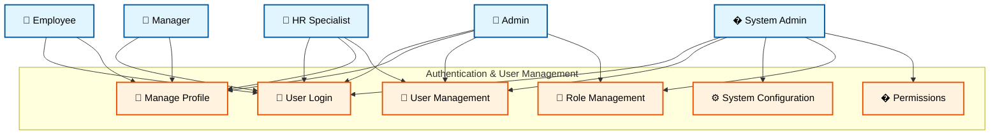

### 1.3 Project and Task Management

Project lifecycle and task management use cases showing the workflow from creation to completion.

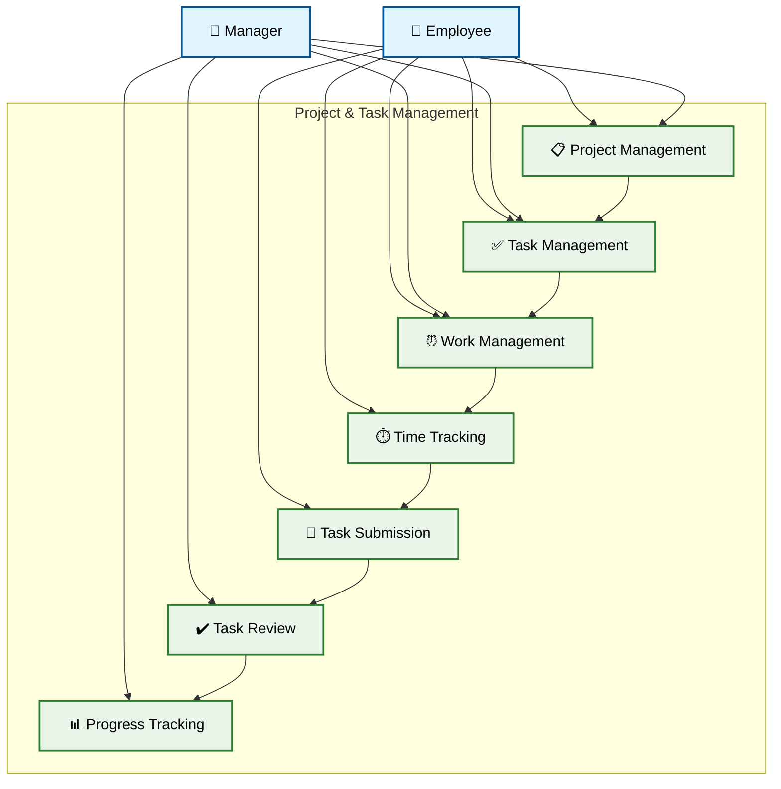

### 1.4 AI and Communication Features

Advanced features including AI-powered recommendations, analysis tools, and communication systems.

```mermaid
graph TB
    %% Actors
    Employee[👤 Employee]
    Manager[👤 Manager]
    Admin[👤 Admin]
    HR[👤 HR Specialist]
    
    %% AI & Communication System
    subgraph "AI & Analytics"
        HRProposal[🤖 HR Proposal System]
        AIAnalytics[📊 AI Analytics]
        MLModels[🧠 ML Models]
        Performance[📈 Performance Analysis]
    end
    
    subgraph "Communication & Files"
        Chat[💬 Real-time Chat]
        Notification[🔔 Notifications]
        FileMgmt[📁 File Management]
        Search[🔍 Global Search]
    end
    
    %% Connections - AI Services
    HR --> HRProposal
    HR --> AIAnalytics
    HR --> Performance
    
    Manager --> AIAnalytics
    Manager --> Performance
    Manager --> MLModels
    
    Admin --> AIAnalytics
    Admin --> Performance
    
    %% Connections - Communication
    Employee --> Chat
    Employee --> Notification
    Employee --> FileMgmt
    Employee --> Search
    
    Manager --> Chat
    Manager --> Notification
    Manager --> FileMgmt
    Manager --> Search
    
    Admin --> Chat
    Admin --> Notification
    
    HR --> Chat
    HR --> Notification
    
    %% Styling
    classDef actor fill:#e1f5fe,stroke:#01579b,stroke-width:2px,color:#000
    classDef ai fill:#fff8e1,stroke:#f57c00,stroke-width:2px,color:#000
    classDef comm fill:#e0f2f1,stroke:#00695c,stroke-width:2px,color:#000
    
    class Employee,Manager,Admin,HR actor
    class HRProposal,AIAnalytics,MLModels,Performance ai
    class Chat,Notification,FileMgmt,Search comm
```

---

## 2. Project Management Use Cases

### 2.1 Detailed Use Case for Project Management

Comprehensive project management use case diagram with UML relationships and system boundary.

```mermaid
graph TB
    %% System Boundary for Project Management
    subgraph ProjectSystemBoundary["🏢 Project Management System"]
        %% Core Project Management Use Cases
        subgraph CoreProjectUC["Core Project Management"]
            CreateProject((Create Project))
            EditProject((Edit Project))
            DeleteProject((Delete Project))
            ViewProject((View Project Details))
            CloseProject((Close Project))
            ArchiveProject((Archive Project))
        end
        
        %% Project Planning Use Cases
        subgraph PlanningUC["Project Planning"])
            DefineScope((Define Project Scope))
            SetBudget((Set Project Budget))
            CreateMilestone((Create Milestones))
            SetDeadline((Set Project Deadline))
            AllocateResources((Allocate Resources))
            RiskAssessment((Risk Assessment))
            CreateSchedule((Create Project Schedule))
        end
        
        %% Team Management Use Cases
        subgraph TeamUC["Team Management"]
            AssignTeam((Assign Team Members))
            DefineRoles((Define Team Roles))
            SetPermissions((Set Team Permissions))
            ManageAccess((Manage Project Access))
        end
        
        %% Monitoring Use Cases
        subgraph MonitoringUC["Project Monitoring"]
            TrackProgress((Track Project Progress))
            MonitorBudget((Monitor Budget Usage))
            GenerateReports((Generate Project Reports))
            UpdateStatus((Update Project Status))
            ViewMetrics((View Project Metrics))
        end
        
        %% Communication Use Cases
        subgraph CommunicationUC["Project Communication"]
            SendNotification((Send Project Notification))
            CreateProjectChat((Create Project Chat))
            ShareDocuments((Share Project Documents))
            ScheduleMeeting((Schedule Project Meeting))
        end
        
        %% Base Use Cases for Extension/Inclusion
        ManageProject((Manage Project))
        ProjectCommunication((Project Communication))
        ValidatePermissions((Validate User Permissions))
        AuditProject((Audit Project Activity))
    end
    
    %% Actors outside system boundary
    ProjectManager[👤 Project Manager]
    TeamLead[👤 Team Lead]
    TeamMember[👤 Team Member]
    Stakeholder[👤 Stakeholder]
    Admin[👤 Admin]
    
    %% External Systems
    TaskManagementSystem[📋 Task Management System]
    NotificationService[🔔 Notification Service]
    DocumentService[📁 Document Management System]
    
    %% Generalization relationships
    User[👤 User]
    User <|-- ProjectManager
    User <|-- TeamLead
    User <|-- TeamMember
    User <|-- Stakeholder
    ProjectManager <|-- Admin
    
    %% Communication Links
    %% Project Manager
    ProjectManager --> CreateProject
    ProjectManager --> EditProject
    ProjectManager --> DeleteProject
    ProjectManager --> DefineScope
    ProjectManager --> SetBudget
    ProjectManager --> CreateMilestone
    ProjectManager --> SetDeadline
    ProjectManager --> AllocateResources
    ProjectManager --> RiskAssessment
    ProjectManager --> AssignTeam
    ProjectManager --> DefineRoles
    ProjectManager --> TrackProgress
    ProjectManager --> MonitorBudget
    ProjectManager --> GenerateReports
    ProjectManager --> CloseProject
    
    %% Team Lead
    TeamLead --> ViewProject
    TeamLead --> EditProject
    TeamLead --> CreateMilestone
    TeamLead --> AssignTeam
    TeamLead --> DefineRoles
    TeamLead --> TrackProgress
    TeamLead --> UpdateStatus
    TeamLead --> CreateProjectChat
    TeamLead --> ScheduleMeeting
    
    %% Team Member
    TeamMember --> ViewProject
    TeamMember --> ViewMetrics
    TeamMember --> CreateProjectChat
    TeamMember --> ShareDocuments
    
    %% Stakeholder
    Stakeholder --> ViewProject
    Stakeholder --> ViewMetrics
    Stakeholder --> GenerateReports
    
    %% Admin
    Admin --> ArchiveProject
    Admin --> ManageAccess
    Admin --> SetPermissions
    Admin --> AuditProject
    
    %% Include relationships (mandatory sub-functions)
    CreateProject -.->|<<include>>| ValidatePermissions
    EditProject -.->|<<include>>| ValidatePermissions
    DeleteProject -.->|<<include>>| ValidatePermissions
    AssignTeam -.->|<<include>>| SendNotification
    CreateMilestone -.->|<<include>>| SendNotification
    SetDeadline -.->|<<include>>| SendNotification
    CreateProject -.->|<<include>>| DefineScope
    TrackProgress -.->|<<include>>| UpdateStatus
    
    %% Extend relationships (optional enhancements)
    CreateProject -.->|<<extend>>| SetBudget
    CreateProject -.->|<<extend>>| RiskAssessment
    CreateProject -.->|<<extend>>| CreateSchedule
    EditProject -.->|<<extend>>| AllocateResources
    ViewProject -.->|<<extend>>| ViewMetrics
    TrackProgress -.->|<<extend>>| GenerateReports
    AssignTeam -.->|<<extend>>| DefineRoles
    CreateProjectChat -.->|<<extend>>| ScheduleMeeting
    UpdateStatus -.->|<<extend>>| SendNotification
    
    %% Generalization (inheritance) relationships
    ManageProject <|-- CreateProject
    ManageProject <|-- EditProject
    ManageProject <|-- DeleteProject
    ProjectCommunication <|-- CreateProjectChat
    ProjectCommunication <|-- SendNotification
    ProjectCommunication <|-- ShareDocuments
    
    %% External system interactions
    SendNotification --> NotificationService
    CreateMilestone --> TaskManagementSystem
    SetDeadline --> TaskManagementSystem
    ShareDocuments --> DocumentService
    
    %% Styling
    classDef actor fill:#e1f5fe,stroke:#01579b,stroke-width:3px,color:#000
    classDef usecase fill:#f3e5f5,stroke:#7b1fa2,stroke-width:2px,color:#000
    classDef system fill:#e8f5e8,stroke:#2e7d32,stroke-width:3px,color:#000
    classDef subsystem fill:#fff3e0,stroke:#f57c00,stroke-width:2px,color:#000
    classDef external fill:#ffebee,stroke:#c62828,stroke-width:2px,color:#000
    classDef base fill:#f1f8e9,stroke:#33691e,stroke-width:2px,color:#000
    
    class ProjectManager,TeamLead,TeamMember,Stakeholder,Admin,User actor
    class CreateProject,EditProject,DeleteProject,ViewProject,CloseProject,ArchiveProject usecase
    class DefineScope,SetBudget,CreateMilestone,SetDeadline,AllocateResources,RiskAssessment,CreateSchedule usecase
    class AssignTeam,DefineRoles,SetPermissions,ManageAccess usecase
    class TrackProgress,MonitorBudget,GenerateReports,UpdateStatus,ViewMetrics usecase
    class SendNotification,CreateProjectChat,ShareDocuments,ScheduleMeeting usecase
    class ManageProject,ProjectCommunication,ValidatePermissions,AuditProject base
    class ProjectSystemBoundary system
    class CoreProjectUC,PlanningUC,TeamUC,MonitoringUC,CommunicationUC subsystem
    class TaskManagementSystem,NotificationService,DocumentService external
```

### 2.2 Team and Resource Management

Team assignment, resource allocation, and collaboration management.

```mermaid
graph TB
    %% Actors
    Manager[👤 Manager]
    TeamLead[👤 Team Lead]
    Employee[👤 Employee]
    
    %% Team Management
    subgraph "Team Management"
        AssignTeam[👥 Assign Team Members]
        RemoveMembers[➖ Remove Team Members]
        DefineRoles[🎭 Define Team Roles]
        SetPermissions[🔑 Set Team Permissions]
    end
    
    %% Resource Management
    subgraph "Resource Management"
        AllocateResources[📦 Allocate Resources]
        TrackUtilization[� Track Resource Utilization]
        RequestResources[🙋 Request Additional Resources]
        BudgetTracking[💰 Budget Tracking]
    end
    
    %% Collaboration
    subgraph "Collaboration"
        ProjectChat[💬 Project Communication]
        FileShare[📁 Project File Sharing]
        MeetingSchedule[📅 Schedule Meetings]
        DocumentCollab[📝 Document Collaboration]
    end
    
    %% Manager Actions
    Manager --> AssignTeam
    Manager --> RemoveMembers
    Manager --> DefineRoles
    Manager --> SetPermissions
    Manager --> AllocateResources
    Manager --> BudgetTracking
    
    %% Team Lead Actions
    TeamLead --> AssignTeam
    TeamLead --> TrackUtilization
    TeamLead --> RequestResources
    TeamLead --> ProjectChat
    TeamLead --> MeetingSchedule
    
    %% Employee Actions
    Employee --> ProjectChat
    Employee --> FileShare
    Employee --> DocumentCollab
    Employee --> RequestResources
    
    %% Styling
    classDef actor fill:#e1f5fe,stroke:#01579b,stroke-width:2px,color:#000
    classDef team fill:#e8f5e8,stroke:#2e7d32,stroke-width:2px,color:#000
    classDef resource fill:#fff8e1,stroke:#f57c00,stroke-width:2px,color:#000
    classDef collab fill:#e0f2f1,stroke:#00695c,stroke-width:2px,color:#000
    
    class Manager,TeamLead,Employee actor
    class AssignTeam,RemoveMembers,DefineRoles,SetPermissions team
    class AllocateResources,TrackUtilization,RequestResources,BudgetTracking resource
    class ProjectChat,FileShare,MeetingSchedule,DocumentCollab collab
```

### 2.3 Monitoring and AI Integration

Project monitoring, reporting, and AI-powered analytics integration.

```mermaid
graph TB
    %% Actors
    Manager[👤 Manager]
    TeamLead[👤 Team Lead]
    Employee[👤 Employee]
    
    %% Monitoring & Reporting
    subgraph "Monitoring & Reporting"
        TrackProgress[📈 Track Project Progress]
        GenerateReport[📊 Generate Project Report]
        ExportData[💾 Export Project Data]
        RealTimeMetrics[⚡ Real-time Metrics]
        QualityMetrics[🎯 Quality Metrics]
    end
    
    %% AI Integration
    subgraph "AI Analytics"
        PredictiveAnalytics[🔮 Predictive Analytics]
        RiskPrediction[⚠️ Risk Prediction]
        ResourceOptimization[⚖️ Resource Optimization]
        DeadlineEstimation[📅 Deadline Estimation]
        PerformanceInsights[💡 Performance Insights]
    end
    
    %% External Systems
    AIAnalytics[🤖 AI Analytics System]
    ReportingSystem[📊 Reporting System]
    DashboardSystem[📈 Dashboard System]
    
    %% Manager Actions
    Manager --> TrackProgress
    Manager --> GenerateReport
    Manager --> ExportData
    Manager --> PredictiveAnalytics
    Manager --> RiskPrediction
    Manager --> ResourceOptimization
    
    %% Team Lead Actions
    TeamLead --> TrackProgress
    TeamLead --> RealTimeMetrics
    TeamLead --> QualityMetrics
    TeamLead --> DeadlineEstimation
    TeamLead --> PerformanceInsights
    
    %% Employee Actions
    Employee --> RealTimeMetrics
    Employee --> QualityMetrics
    
    %% System Integration
    TrackProgress --> AIAnalytics
    GenerateReport --> ReportingSystem
    RealTimeMetrics --> DashboardSystem
    PredictiveAnalytics --> AIAnalytics
    
    %% Styling
    classDef actor fill:#e1f5fe,stroke:#01579b,stroke-width:2px,color:#000
    classDef monitoring fill:#e8f5e8,stroke:#2e7d32,stroke-width:2px,color:#000
    classDef ai fill:#fff8e1,stroke:#f57c00,stroke-width:2px,color:#000
    classDef system fill:#f3e5f5,stroke:#7b1fa2,stroke-width:2px,color:#000
    
    class Manager,TeamLead,Employee actor
    class TrackProgress,GenerateReport,ExportData,RealTimeMetrics,QualityMetrics monitoring
    class PredictiveAnalytics,RiskPrediction,ResourceOptimization,DeadlineEstimation,PerformanceInsights ai
    class AIAnalytics,ReportingSystem,DashboardSystem system
```

---

## 3. Work Management Use Cases

### 3.1 Detailed Use Case for Work Management

Comprehensive work management use case diagram with UML relationships and system boundary.

```mermaid
graph TB
    %% System Boundary for Work Management
    subgraph WorkSystemBoundary["🏢 Work Management System"]
        %% Task Management Use Cases
        subgraph TaskManagementUC["Task Management"]
            CreateTask((Create Task))
            EditTask((Edit Task))
            DeleteTask((Delete Task))
            ViewTasks((View Tasks))
            AssignTask((Assign Task))
            UpdateTaskStatus((Update Task Status))
            SetTaskPriority((Set Task Priority))
            ManageTaskDependencies((Manage Task Dependencies))
            ReviewTask((Review Task))
            ApproveTask((Approve Task))
            RejectTask((Reject Task))
        end
        
        %% Time Management Use Cases
        subgraph TimeManagementUC["Time Management"]
            CheckIn((Check In))
            CheckOut((Check Out))
            LogWorkTime((Log Work Time))
            TrackBreaks((Track Breaks))
            EstimateTime((Estimate Task Time))
            RecordOvertime((Record Overtime))
            GenerateTimesheet((Generate Timesheet))
        end
        
        %% Workload Management Use Cases
        subgraph WorkloadUC["Workload Management"]
            ViewWorkload((View Personal Workload))
            AnalyzeCapacity((Analyze Team Capacity))
            BalanceWorkload((Balance Team Workload))
            RequestResources((Request Additional Resources))
            OptimizeSchedule((Optimize Work Schedule))
        end
        
        %% Performance Management Use Cases
        subgraph PerformanceUC["Performance Management"]
            TrackPerformance((Track Performance))
            SetGoals((Set Performance Goals))
            ReviewPerformance((Review Performance))
            ProvideFeedback((Provide Feedback))
            GeneratePerformanceReport((Generate Performance Report))
        end
        
        %% Leave Management Use Cases
        subgraph LeaveUC["Leave Management"]
            RequestLeave((Request Leave))
            ApproveLeave((Approve Leave))
            ViewLeaveBalance((View Leave Balance))
            ManageHolidays((Manage Company Holidays))
            TrackAttendance((Track Attendance))
        end
        
        %% Base Use Cases for Extension/Inclusion
        ManageWork((Manage Work))
        ValidateWorkflow((Validate Workflow))
        SendWorkNotification((Send Work Notification))
        AuditWork((Audit Work Activity))
        TimeTracking((Time Tracking))
    end
    
    %% Actors outside system boundary
    Employee[👤 Employee]
    TeamLead[👤 Team Lead]
    Manager[👤 Manager]
    HR[👤 HR Specialist]
    Admin[👤 Admin]
    
    %% External Systems
    ProjectSystem[� Project Management System]
    NotificationSystem[🔔 Notification System]
    CalendarSystem[📅 Calendar System]
    PayrollSystem[💰 Payroll System]
    AISystem[🤖 AI Optimization System]
    
    %% Generalization relationships
    User[👤 User]
    User <|-- Employee
    User <|-- TeamLead
    User <|-- Manager
    User <|-- HR
    TeamLead <|-- Manager
    
    %% Communication Links
    %% Employee
    Employee --> ViewTasks
    Employee --> UpdateTaskStatus
    Employee --> CheckIn
    Employee --> CheckOut
    Employee --> LogWorkTime
    Employee --> TrackBreaks
    Employee --> EstimateTime
    Employee --> ViewWorkload
    Employee --> TrackPerformance
    Employee --> SetGoals
    Employee --> RequestLeave
    Employee --> ViewLeaveBalance
    Employee --> TrackAttendance
    
    %% Team Lead
    TeamLead --> CreateTask
    TeamLead --> EditTask
    TeamLead --> AssignTask
    TeamLead --> SetTaskPriority
    TeamLead --> ManageTaskDependencies
    TeamLead --> ReviewTask
    TeamLead --> ApproveTask
    TeamLead --> RejectTask
    TeamLead --> AnalyzeCapacity
    TeamLead --> BalanceWorkload
    TeamLead --> ProvideFeedback
    TeamLead --> ApproveLeave
    
    %% Manager
    Manager --> CreateTask
    Manager --> EditTask
    Manager --> DeleteTask
    Manager --> AssignTask
    Manager --> SetTaskPriority
    Manager --> ReviewPerformance
    Manager --> ProvideFeedback
    Manager --> GeneratePerformanceReport
    Manager --> ApproveLeave
    Manager --> RequestResources
    Manager --> OptimizeSchedule
    Manager --> GenerateTimesheet
    
    %% HR
    HR --> ReviewPerformance
    HR --> GeneratePerformanceReport
    HR --> ApproveLeave
    HR --> ManageHolidays
    HR --> TrackAttendance
    HR --> BalanceWorkload
    
    %% Admin
    Admin --> DeleteTask
    Admin --> ManageHolidays
    Admin --> AuditWork
    Admin --> OptimizeSchedule
    
    %% AI System
    AISystem --> AnalyzeCapacity
    AISystem --> BalanceWorkload
    AISystem --> OptimizeSchedule
    
    %% Include relationships (mandatory sub-functions)
    CreateTask -.->|<<include>>| ValidateWorkflow
    AssignTask -.->|<<include>>| SendWorkNotification
    UpdateTaskStatus -.->|<<include>>| SendWorkNotification
    CheckIn -.->|<<include>>| TimeTracking
    CheckOut -.->|<<include>>| TimeTracking
    LogWorkTime -.->|<<include>>| TimeTracking
    RequestLeave -.->|<<include>>| ValidateWorkflow
    ApproveTask -.->|<<include>>| SendWorkNotification
    
    %% Extend relationships (optional enhancements)
    ViewTasks -.->|<<extend>>| SetTaskPriority
    UpdateTaskStatus -.->|<<extend>>| EstimateTime
    LogWorkTime -.->|<<extend>>| TrackBreaks
    LogWorkTime -.->|<<extend>>| RecordOvertime
    ViewWorkload -.->|<<extend>>| RequestResources
    TrackPerformance -.->|<<extend>>| SetGoals
    CheckOut -.->|<<extend>>| GenerateTimesheet
    RequestLeave -.->|<<extend>>| ViewLeaveBalance
    AnalyzeCapacity -.->|<<extend>>| BalanceWorkload
    
    %% Generalization (inheritance) relationships
    ManageWork <|-- CreateTask
    ManageWork <|-- EditTask
    ManageWork <|-- DeleteTask
    ManageWork <|-- AssignTask
    TimeTracking <|-- CheckIn
    TimeTracking <|-- CheckOut
    TimeTracking <|-- LogWorkTime
    
    %% External system interactions
    SendWorkNotification --> NotificationSystem
    AssignTask --> ProjectSystem
    CreateTask --> ProjectSystem
    CheckIn --> CalendarSystem
    CheckOut --> CalendarSystem
    GenerateTimesheet --> PayrollSystem
    RecordOvertime --> PayrollSystem
    AnalyzeCapacity --> AISystem
    BalanceWorkload --> AISystem
    OptimizeSchedule --> AISystem
    
    %% Styling
    classDef actor fill:#e1f5fe,stroke:#01579b,stroke-width:3px,color:#000
    classDef usecase fill:#f3e5f5,stroke:#7b1fa2,stroke-width:2px,color:#000
    classDef system fill:#e8f5e8,stroke:#2e7d32,stroke-width:3px,color:#000
    classDef subsystem fill:#fff3e0,stroke:#f57c00,stroke-width:2px,color:#000
    classDef external fill:#ffebee,stroke:#c62828,stroke-width:2px,color:#000
    classDef base fill:#f1f8e9,stroke:#33691e,stroke-width:2px,color:#000
    classDef ai fill:#e8eaf6,stroke:#3f51b5,stroke-width:3px,color:#000
    
    class Employee,TeamLead,Manager,HR,Admin,User actor
    class CreateTask,EditTask,DeleteTask,ViewTasks,AssignTask,UpdateTaskStatus,SetTaskPriority usecase
    class ManageTaskDependencies,ReviewTask,ApproveTask,RejectTask usecase
    class CheckIn,CheckOut,LogWorkTime,TrackBreaks,EstimateTime,RecordOvertime,GenerateTimesheet usecase
    class ViewWorkload,AnalyzeCapacity,BalanceWorkload,RequestResources,OptimizeSchedule usecase
    class TrackPerformance,SetGoals,ReviewPerformance,ProvideFeedback,GeneratePerformanceReport usecase
    class RequestLeave,ApproveLeave,ViewLeaveBalance,ManageHolidays,TrackAttendance usecase
    class ManageWork,ValidateWorkflow,SendWorkNotification,AuditWork,TimeTracking base
    class WorkSystemBoundary system
    class TaskManagementUC,TimeManagementUC,WorkloadUC,PerformanceUC,LeaveUC subsystem
    class ProjectSystem,NotificationSystem,CalendarSystem,PayrollSystem external
    class AISystem ai
```

### 3.2 Performance and Quality Management

Performance tracking, quality assessment, and workload optimization features.

```mermaid
graph TB
    %% Actors
    Employee[👤 Employee]
    Manager[� Manager]
    HR[👤 HR Specialist]
    
    %% Performance Management
    subgraph "Performance Tracking"
        ViewWorkload[📊 View Personal Workload]
        TrackProductivity[📈 Track Productivity]
        PerformanceMetrics[� Performance Metrics]
        QualityAssessment[🎯 Quality Assessment]
        GoalSetting[🎯 Goal Setting]
    end
    
    %% Leave & Attendance
    subgraph "Leave Management"
        RequestLeave[🏖️ Request Leave]
        ApproveLeave[✅ Approve Leave]
        AttendanceRecord[📋 Attendance Record]
        LeaveBalance[⚖️ Leave Balance]
    end
    
    %% AI Optimization
    subgraph "AI Workload Optimization"
        WorkloadAnalysis[� Workload Analysis]
        TaskRecommendation[💡 Task Recommendations]
        EfficiencyOptimization[⚡ Efficiency Optimization]
        BurnoutPrevention[�️ Burnout Prevention]
    end
    
    %% External Systems
    AISys[🤖 AI Workload Optimizer]
    HRSys[👥 HR Management System]
    
    %% Employee Actions
    Employee --> ViewWorkload
    Employee --> PerformanceMetrics
    Employee --> RequestLeave
    Employee --> AttendanceRecord
    Employee --> GoalSetting
    
    %% Manager Actions
    Manager --> ViewWorkload
    Manager --> TrackProductivity
    Manager --> QualityAssessment
    Manager --> ApproveLeave
    Manager --> WorkloadAnalysis
    Manager --> TaskRecommendation
    
    %% HR Actions
    HR --> TrackProductivity
    HR --> ApproveLeave
    HR --> LeaveBalance
    HR --> EfficiencyOptimization
    HR --> BurnoutPrevention
    
    %% System Integration
    TrackProductivity --> AISys
    ViewWorkload --> AISys
    RequestLeave --> HRSys
    ApproveLeave --> HRSys
    
    %% Styling
    classDef actor fill:#e1f5fe,stroke:#01579b,stroke-width:2px,color:#000
    classDef performance fill:#e8f5e8,stroke:#2e7d32,stroke-width:2px,color:#000
    classDef leave fill:#fff8e1,stroke:#f57c00,stroke-width:2px,color:#000
    classDef ai fill:#f3e5f5,stroke:#7b1fa2,stroke-width:2px,color:#000
    classDef system fill:#ffebee,stroke:#c62828,stroke-width:2px,color:#000
    
    class Employee,Manager,HR actor
    class ViewWorkload,TrackProductivity,PerformanceMetrics,QualityAssessment,GoalSetting performance
    class RequestLeave,ApproveLeave,AttendanceRecord,LeaveBalance leave
    class WorkloadAnalysis,TaskRecommendation,EfficiencyOptimization,BurnoutPrevention ai
    class AISys,HRSys system
```

### 3.3 Communication and Collaboration

Work-related communication, reporting, and collaboration tools.

```mermaid
graph TB
    %% Actors
    Employee[👤 Employee]
    Manager[👤 Manager]
    HR[👤 HR Specialist]
    
    %% Communication
    subgraph "Work Communication"
        TaskChat[💬 Task-specific Chat]
        TeamComm[👥 Team Communication]
        StatusUpdates[📢 Status Updates]
        Announcements[📣 Work Announcements]
        FeedbackExchange[💭 Feedback Exchange]
    end
    
    %% Reporting
    subgraph "Work Reporting"
        DailyReport[📋 Daily Work Report]
        WeeklyReport[📊 Weekly Summary]
        PerformanceReport[📈 Performance Analysis]
        ProjectReport[📊 Project Status Report]
        TimeReport[⏰ Time Utilization Report]
    end
    
    %% Collaboration Tools
    subgraph "Collaboration"
        FileSharing[📁 Work File Sharing]
        DocumentCollab[📝 Document Collaboration]
        KnowledgeBase[📚 Knowledge Base]
        BestPractices[⭐ Best Practices Sharing]
    end
    
    %% External Systems
    NotificationSys[🔔 Notification System]
    ReportingSys[📊 Reporting System]
    
    %% Employee Actions
    Employee --> TaskChat
    Employee --> TeamComm
    Employee --> StatusUpdates
    Employee --> DailyReport
    Employee --> FileSharing
    Employee --> DocumentCollab
    Employee --> KnowledgeBase
    
    %% Manager Actions
    Manager --> TeamComm
    Manager --> Announcements
    Manager --> FeedbackExchange
    Manager --> WeeklyReport
    Manager --> PerformanceReport
    Manager --> ProjectReport
    Manager --> BestPractices
    
    %% HR Actions
    HR --> Announcements
    HR --> PerformanceReport
    HR --> TimeReport
    HR --> BestPractices
    
    %% System Integration
    StatusUpdates --> NotificationSys
    DailyReport --> ReportingSys
    WeeklyReport --> ReportingSys
    PerformanceReport --> ReportingSys
    
    %% Styling
    classDef actor fill:#e1f5fe,stroke:#01579b,stroke-width:2px,color:#000
    classDef communication fill:#e0f2f1,stroke:#00695c,stroke-width:2px,color:#000
    classDef reporting fill:#fff3e0,stroke:#f57c00,stroke-width:2px,color:#000
    classDef collaboration fill:#f3e5f5,stroke:#7b1fa2,stroke-width:2px,color:#000
    classDef system fill:#ffebee,stroke:#c62828,stroke-width:2px,color:#000
    
    class Employee,Manager,HR actor
    class TaskChat,TeamComm,StatusUpdates,Announcements,FeedbackExchange communication
    class DailyReport,WeeklyReport,PerformanceReport,ProjectReport,TimeReport reporting
    class FileSharing,DocumentCollab,KnowledgeBase,BestPractices collaboration
    class NotificationSys,ReportingSys system
```

---

## 4. System Architecture

### 4.1 Core Microservices Architecture

The core microservices that handle user management, authentication, and basic system functionality.

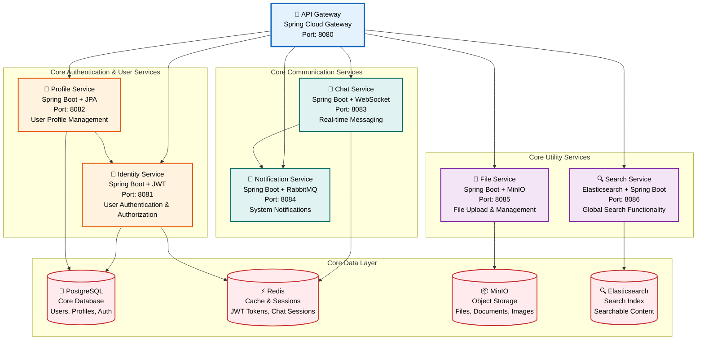

### 4.2 Business Logic Services

Business-specific microservices handling projects, tasks, workload, and content management.

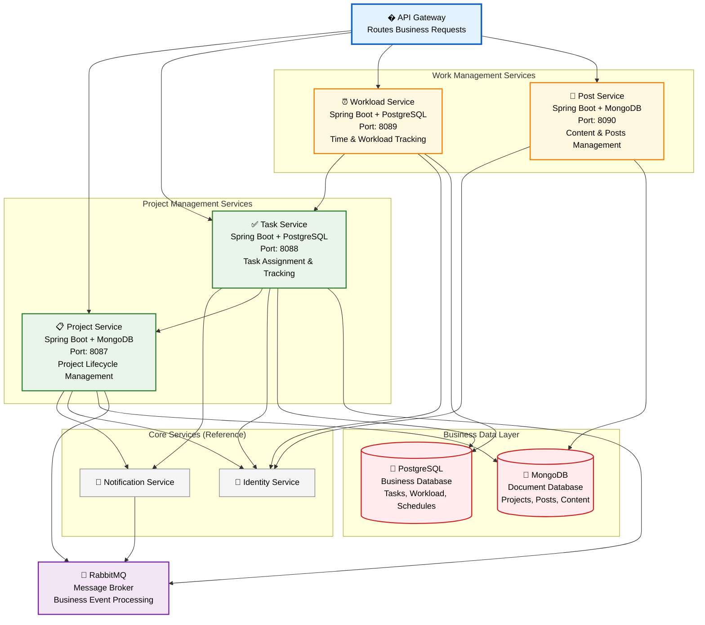

### 4.3 AI/ML Services and Infrastructure

AI/ML services, external integrations, and system infrastructure components.

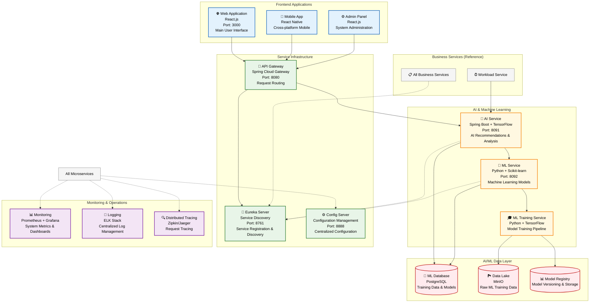

---

## 5. Service Communication

### 5.1 User Authentication Flow

Complete user authentication and authorization flow across microservices.

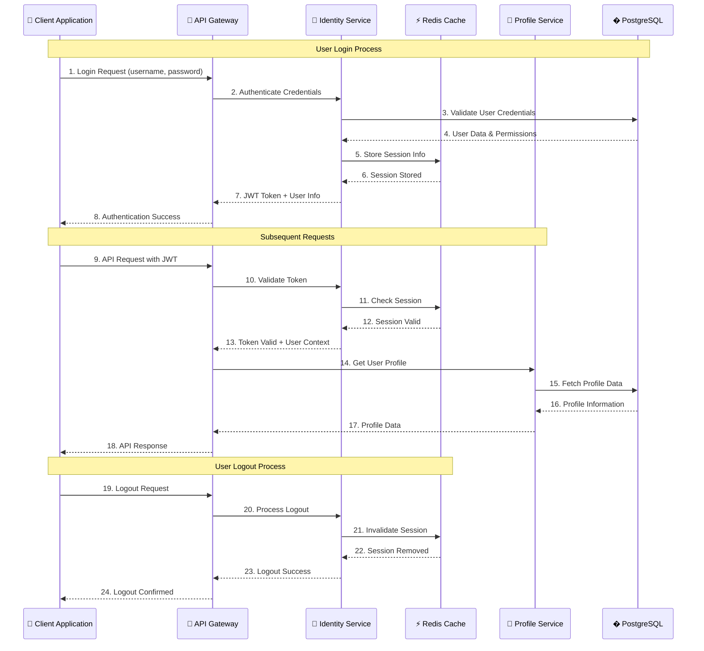

### 5.2 Project and Task Management Flow

Project creation, task assignment, and progress tracking workflow.

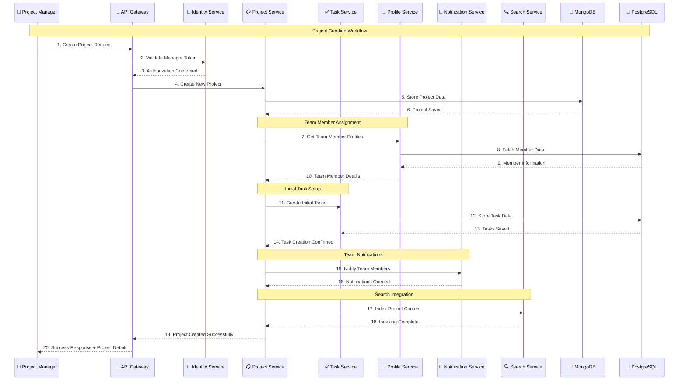

### 5.3 AI and Performance Analysis Flow

AI-powered analysis, performance calculation, and recommendation generation workflow.

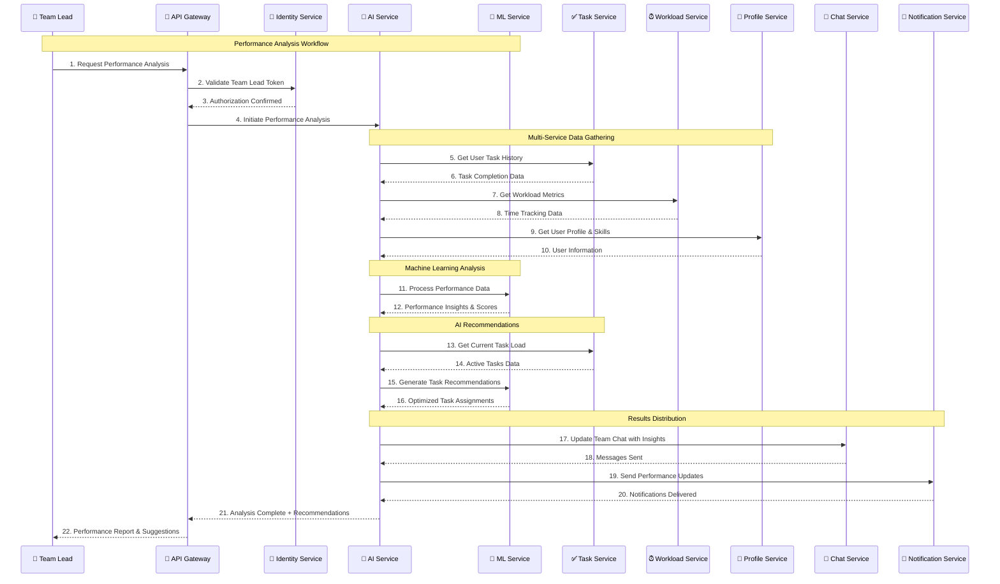

### 5.4 Microservices Data Flow Diagram

Comprehensive data flow sequence showing complete task creation workflow across all microservices (excluding post-service).

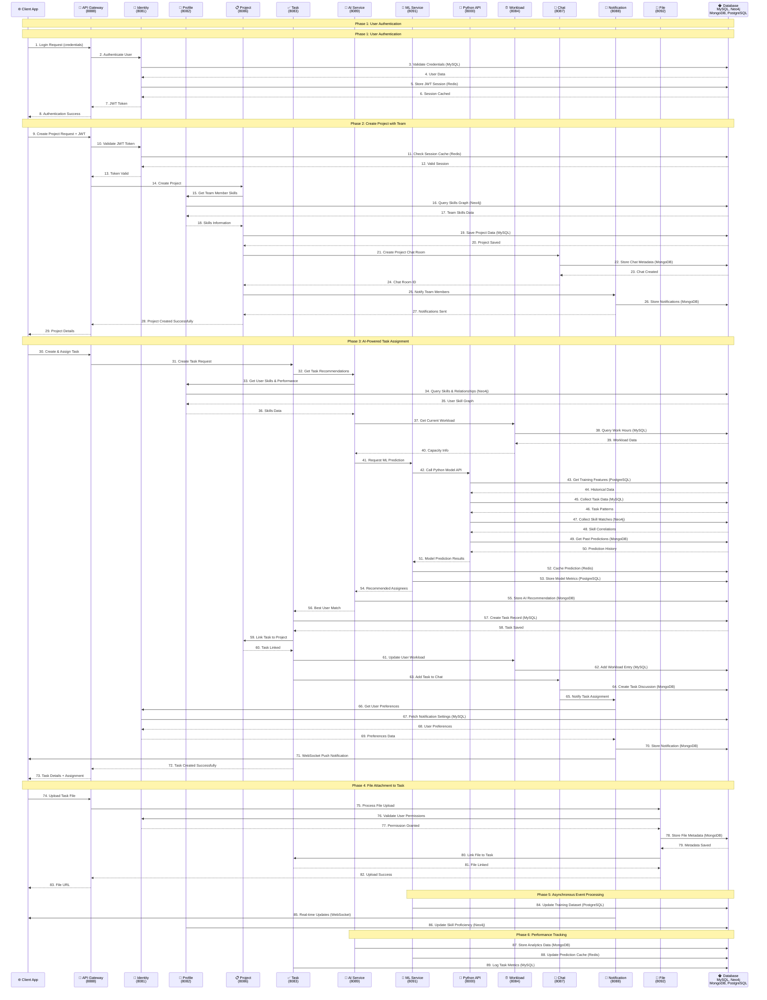

---

## 6. System Data Models

### 6.1 Core Entity Data Models

User management, profile, and authentication data structures.

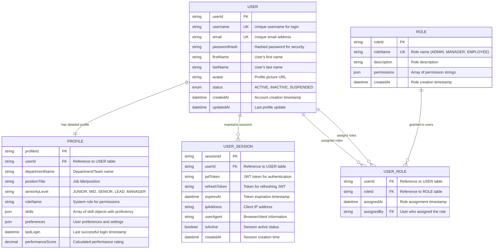

### 6.2 Project and Task Data Models

Project management, task tracking, and workflow data structures.

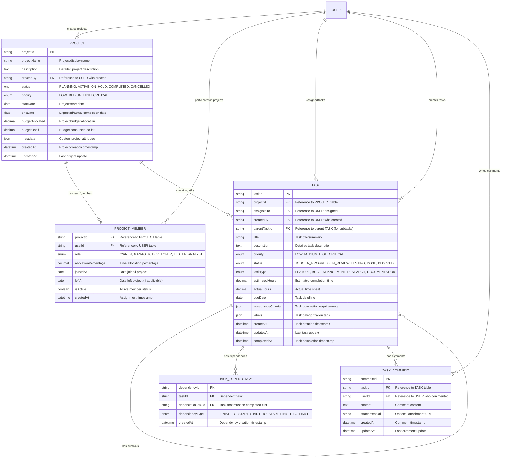

### 6.3 Communication and ML Data Models

Communication, workload tracking, and AI/ML data structures.

```mermaid
erDiagram
    %% Communication System
    CONVERSATION {
        string conversationId PK
        string conversationName "Chat/channel name"
        enum type "DIRECT, GROUP, PROJECT_CHANNEL, TEAM_CHANNEL"
        string createdBy FK "Reference to USER who created"
        string projectId FK "Reference to PROJECT (if project-related)"
        boolean isPrivate "Private conversation flag"
        datetime createdAt "Conversation creation timestamp"
        datetime updatedAt "Last message timestamp"
    }
    
    CHAT_MESSAGE {
        string messageId PK
        string conversationId FK "Reference to CONVERSATION"
        string senderId FK "Reference to USER sender"
        text message "Message content"
        enum type "TEXT, FILE, IMAGE, SYSTEM, TASK_UPDATE"
        enum status "SENT, DELIVERED, READ"
        string replyToMessageId FK "Reference to parent MESSAGE"
        string mediaUrl "Attached media URL"
        string mediaType "MIME type of attachment"
        boolean isEdited "Message edit status"
        datetime createdAt "Message timestamp"
        datetime editedAt "Last edit timestamp"
    }
    
    MESSAGE_READ_RECEIPT {
        string receiptId PK
        string messageId FK "Reference to CHAT_MESSAGE"
        string userId FK "Reference to USER who read"
        datetime readAt "Message read timestamp"
    }
    
    %% Workload & Performance Tracking
    WORKLOAD {
        string workloadId PK
        string userId FK "Reference to USER"
        string taskId FK "Reference to TASK"
        string projectId FK "Reference to PROJECT"
        decimal hoursLogged "Hours worked on task"
        date workDate "Date of work performed"
        text description "Work description/notes"
        enum workType "DEVELOPMENT, TESTING, RESEARCH, MEETING, DOCUMENTATION"
        boolean isBillable "Billable hours flag"
        datetime createdAt "Log entry timestamp"
        datetime updatedAt "Last update timestamp"
    }
    
    PERFORMANCE_METRIC {
        string metricId PK
        string userId FK "Reference to USER"
        string taskId FK "Reference to TASK (optional)"
        string projectId FK "Reference to PROJECT (optional)"
        enum metricType "QUALITY, TIMELINESS, EFFICIENCY, COLLABORATION"
        decimal score "Performance score (0-100)"
        text feedback "Performance feedback"
        string evaluatedBy FK "Reference to USER evaluator"
        date evaluationPeriod "Evaluation period (monthly/quarterly)"
        datetime createdAt "Evaluation timestamp"
    }
    
    %% AI/ML Data Models
    AI_MODEL {
        string modelId PK
        string modelName "Model identifier name"
        string version "Model version (semver)"
        enum modelType "WORKLOAD_PREDICTOR, PERFORMANCE_ANALYZER, TASK_RECOMMENDER"
        string filePath "Model file storage path"
        json parameters "Model hyperparameters"
        json metrics "Model performance metrics"
        float accuracy "Model accuracy score"
        datetime trainedAt "Model training timestamp"
        datetime deployedAt "Model deployment timestamp"
        boolean isActive "Currently active model"
        string trainedBy FK "Reference to USER who trained"
    }
    
    PREDICTION_LOG {
        string logId PK
        string modelId FK "Reference to AI_MODEL used"
        string userId FK "Reference to USER for prediction"
        json inputData "Input features for prediction"
        json outputData "Prediction results"
        float confidence "Prediction confidence score"
        enum predictionType "WORKLOAD, PERFORMANCE, RECOMMENDATION"
        boolean wasAccurate "Actual outcome validation"
        datetime predictedAt "Prediction timestamp"
        datetime validatedAt "Outcome validation timestamp"
    }
    
    %% File Management
    FILE_STORAGE {
        string fileId PK
        string uploadedBy FK "Reference to USER uploader"
        string projectId FK "Reference to PROJECT (optional)"
        string taskId FK "Reference to TASK (optional)"
        string originalName "Original filename"
        string storedName "Internal storage filename"
        string mimeType "File MIME type"
        long fileSize "File size in bytes"
        string storageUrl "File access URL"
        string checksum "File integrity checksum"
        boolean isPublic "Public access flag"
        datetime uploadedAt "Upload timestamp"
        datetime lastAccessed "Last access timestamp"
    }
    
    %% Relationships
    CONVERSATION ||--o{ CHAT_MESSAGE : "contains messages"
    CHAT_MESSAGE ||--o{ MESSAGE_READ_RECEIPT : "has read receipts"
    CHAT_MESSAGE ||--o{ CHAT_MESSAGE : "replies to message"
    USER ||--o{ CONVERSATION : "creates conversations"
    USER ||--o{ CHAT_MESSAGE : "sends messages"
    USER ||--o{ MESSAGE_READ_RECEIPT : "reads messages"
    
    USER ||--o{ WORKLOAD : "logs work time"
    TASK ||--o{ WORKLOAD : "tracked in workload"
    PROJECT ||--o{ WORKLOAD : "project work tracking"
    USER ||--o{ PERFORMANCE_METRIC : "receives evaluations"
    USER ||--o{ PERFORMANCE_METRIC : "conducts evaluations"
    
    AI_MODEL ||--o{ PREDICTION_LOG : "generates predictions"
    USER ||--o{ PREDICTION_LOG : "subject of predictions"
    USER ||--o{ AI_MODEL : "trains models"
    
    USER ||--o{ FILE_STORAGE : "uploads files"
    PROJECT ||--o{ FILE_STORAGE : "project files"
    TASK ||--o{ FILE_STORAGE : "task attachments"
```

---

## 7. AI and Machine Learning Architecture

### 7.1 AI/ML Service Infrastructure

Core AI/ML infrastructure components and data processing pipeline.

```mermaid
graph TB
    %% Input Sources
    subgraph "Data Sources Layer"
        UserData[👤 User Activity Data<br/>Login patterns, work hours]
        ProjectData[📋 Project Data<br/>Progress, timelines, budgets]
        TaskData[✅ Task Performance Data<br/>Completion rates, quality metrics]
        WorkloadData[⏰ Workload Logs<br/>Time tracking, capacity utilization]
        ChatData[💬 Communication Data<br/>Team interactions, feedback]
    end
    
    %% Data Processing Infrastructure
    subgraph "Data Processing Infrastructure"
        DataCollector[📥 Data Collector Service<br/>Real-time data ingestion<br/>Apache Kafka + Spring Boot]
        DataCleaner[🧹 Data Cleaning Pipeline<br/>Data validation & normalization<br/>Apache Spark + Python]
        FeatureExtractor[🔧 Feature Extraction Engine<br/>ML feature generation<br/>Pandas + NumPy + Scikit-learn]
        DataValidator[✅ Data Validation Service<br/>Schema validation & quality checks<br/>Great Expectations + Pydantic]
    end
    
    %% Core AI/ML Services
    subgraph "Core AI/ML Services"
        ModelManager[🎯 Model Management Service<br/>MLOps lifecycle management<br/>MLflow + Kubernetes]
        TrainingEngine[🏋️ Model Training Engine<br/>Distributed model training<br/>TensorFlow + PyTorch]
        PredictionEngine[🔮 Prediction Service<br/>Real-time inference<br/>TensorFlow Serving + FastAPI]
        ModelRegistry[📚 Model Registry<br/>Version control & metadata<br/>MLflow Model Registry]
    end
    
    %% ML Infrastructure Storage
    subgraph "ML Infrastructure Storage"
        ModelStorage[(🗄️ Model Storage<br/>MinIO/S3<br/>Trained models & artifacts)]
        TrainingData[(📊 Training Data Lake<br/>Apache Parquet + Delta Lake<br/>Historical training datasets)]
        FeatureStore[(🎯 Feature Store<br/>Redis + PostgreSQL<br/>Real-time & batch features)]
        MLMetrics[(📈 ML Metrics Store<br/>Prometheus + InfluxDB<br/>Model performance metrics)]
    end
    
    %% Data Flow Connections
    UserData --> DataCollector
    ProjectData --> DataCollector
    TaskData --> DataCollector
    WorkloadData --> DataCollector
    ChatData --> DataCollector
    
    DataCollector --> DataCleaner
    DataCleaner --> FeatureExtractor
    FeatureExtractor --> DataValidator
    DataValidator --> TrainingData
    FeatureExtractor --> FeatureStore
    
    TrainingData --> TrainingEngine
    FeatureStore --> TrainingEngine
    TrainingEngine --> ModelManager
    ModelManager --> ModelRegistry
    ModelRegistry --> PredictionEngine
    FeatureStore --> PredictionEngine
    
    ModelManager --> ModelStorage
    TrainingEngine --> MLMetrics
    PredictionEngine --> MLMetrics
    
    %% Styling
    classDef dataSource fill:#e1f5fe,stroke:#01579b,stroke-width:2px,color:#000
    classDef processing fill:#e8f5e8,stroke:#2e7d32,stroke-width:2px,color:#000
    classDef aiService fill:#fff3e0,stroke:#f57c00,stroke-width:2px,color:#000
    classDef storage fill:#f3e5f5,stroke:#7b1fa2,stroke-width:2px,color:#000
    
    class UserData,ProjectData,TaskData,WorkloadData,ChatData dataSource
    class DataCollector,DataCleaner,FeatureExtractor,DataValidator processing
    class ModelManager,TrainingEngine,PredictionEngine,ModelRegistry aiService
    class ModelStorage,TrainingData,FeatureStore,MLMetrics storage
```

### 7.2 Machine Learning Models and Applications

Specialized ML models and their business applications.

```mermaid
graph TB
    %% ML Model Layer
    subgraph "Specialized ML Models"
        WorkloadPredictor[📊 Workload Prediction Model<br/>Time series forecasting<br/>LSTM + Prophet + XGBoost]
        PerformanceAnalyzer[📈 Performance Analysis Model<br/>Classification & regression<br/>Random Forest + Neural Networks]
        TaskRecommender[🎯 Task Recommendation Model<br/>Collaborative filtering<br/>Matrix Factorization + Deep Learning]
        TeamOptimizer[👥 Team Optimization Model<br/>Optimization algorithms<br/>Genetic Algorithms + Reinforcement Learning]
        SkillMatcher[🎪 Skill Matching Model<br/>Natural Language Processing<br/>BERT + Cosine Similarity]
    end
    
    %% AI Application Layer
    subgraph "AI Business Applications"
        HRAssistant[🤖 HR Proposal Assistant<br/>Automated HR recommendations<br/>Rule-based + ML insights]
        WorkloadOptimizer[⚖️ Workload Optimizer<br/>Resource allocation optimization<br/>Linear programming + heuristics]
        ProductivityAnalyzer[📊 Productivity Analyzer<br/>Performance pattern analysis<br/>Statistical analysis + clustering]
        TeamRecommender[👥 Team Recommendation Engine<br/>Team composition optimization<br/>Graph algorithms + ML scoring]
        SkillGapAnalyzer[📊 Skill Gap Analyzer<br/>Competency assessment<br/>NLP + knowledge graphs]
    end
    
    %% External Integration Layer
    subgraph "Integration & Monitoring"
        BusinessServices[🏢 Business Services Integration<br/>API gateway connections<br/>Spring Boot microservices]
        RealtimeAPI[⚡ Real-time API Endpoints<br/>Low-latency predictions<br/>FastAPI + WebSockets]
        BatchProcessing[🔄 Batch Processing Jobs<br/>Scheduled analytics<br/>Apache Airflow + Celery]
        MLMonitoring[� ML Monitoring & Alerting<br/>Model drift detection<br/>Evidently + Grafana]
    end
    
    %% Core Services Reference
    subgraph "Core Services (Reference)"
        PredictionEngine[🔮 Prediction Service]
        FeatureStore[🎯 Feature Store]
        ModelRegistry[� Model Registry]
    end
    
    %% Model to Application Mapping
    PredictionEngine --> WorkloadPredictor
    PredictionEngine --> PerformanceAnalyzer
    PredictionEngine --> TaskRecommender
    PredictionEngine --> TeamOptimizer
    PredictionEngine --> SkillMatcher
    
    WorkloadPredictor --> WorkloadOptimizer
    PerformanceAnalyzer --> ProductivityAnalyzer
    TaskRecommender --> HRAssistant
    TeamOptimizer --> TeamRecommender
    SkillMatcher --> SkillGapAnalyzer
    
    %% Application to Service Integration
    HRAssistant --> RealtimeAPI
    WorkloadOptimizer --> RealtimeAPI
    ProductivityAnalyzer --> BatchProcessing
    TeamRecommender --> BusinessServices
    SkillGapAnalyzer --> BusinessServices
    
    %% Infrastructure Dependencies
    FeatureStore --> WorkloadPredictor
    FeatureStore --> PerformanceAnalyzer
    FeatureStore --> TaskRecommender
    ModelRegistry --> PredictionEngine
    
    RealtimeAPI --> MLMonitoring
    BatchProcessing --> MLMonitoring
    BusinessServices --> MLMonitoring
    
    %% Styling
    classDef model fill:#fff3e0,stroke:#f57c00,stroke-width:2px,color:#000
    classDef application fill:#e8f5e8,stroke:#2e7d32,stroke-width:2px,color:#000
    classDef integration fill:#f3e5f5,stroke:#7b1fa2,stroke-width:2px,color:#000
    classDef core fill:#e1f5fe,stroke:#01579b,stroke-width:2px,color:#000
    
    class WorkloadPredictor,PerformanceAnalyzer,TaskRecommender,TeamOptimizer,SkillMatcher model
    class HRAssistant,WorkloadOptimizer,ProductivityAnalyzer,TeamRecommender,SkillGapAnalyzer application
    class BusinessServices,RealtimeAPI,BatchProcessing,MLMonitoring integration
    class PredictionEngine,FeatureStore,ModelRegistry core
```

### 7.3 ML Operations and Monitoring

MLOps pipeline including model deployment, monitoring, and continuous improvement.

```mermaid
graph TB
    %% Model Lifecycle Management
    subgraph "Model Lifecycle Management"
        ModelDevelopment[🔬 Model Development<br/>Jupyter Notebooks + VS Code<br/>Experimentation environment]
        ModelValidation[✅ Model Validation<br/>Cross-validation + A/B testing<br/>Statistical significance testing]
        ModelDeployment[🚀 Model Deployment<br/>Blue-green deployment<br/>Kubernetes + Docker containers]
        ModelRetirement[📁 Model Retirement<br/>Graceful model sunsetting<br/>Version deprecation workflow]
    end
    
    %% Performance Monitoring
    subgraph "Performance Monitoring"
        ModelDrift[📊 Model Drift Detection<br/>Distribution shifts<br/>KL divergence + statistical tests]
        PerformanceMetrics[📈 Performance Metrics<br/>Accuracy, precision, recall<br/>Business KPI alignment]
        DataQuality[🔍 Data Quality Monitoring<br/>Schema validation<br/>Anomaly detection]
        LatencyMonitoring[⏱️ Latency Monitoring<br/>Response time tracking<br/>SLA compliance monitoring]
    end
    
    %% Continuous Learning
    subgraph "Continuous Learning Pipeline"
        FeedbackLoop[🔄 Feedback Collection<br/>User interactions<br/>Business outcome tracking]
        AutoRetraining[🤖 Automated Retraining<br/>Trigger-based model updates<br/>Pipeline automation]
        ExperimentTracking[📊 Experiment Tracking<br/>MLflow + Weights & Biases<br/>Hyperparameter optimization]
        ModelComparison[⚖️ Model Comparison<br/>Champion vs challenger<br/>Statistical significance testing]
    end
    
    %% Infrastructure & DevOps
    subgraph "MLOps Infrastructure"
        CIPipeline[🔧 CI/CD Pipeline<br/>GitHub Actions + Jenkins<br/>Automated testing & deployment]
        ModelVersioning[📚 Model Versioning<br/>Git-based model tracking<br/>DVC + MLflow integration]
        ResourceScaling[📈 Auto-scaling<br/>Kubernetes HPA<br/>Cost-optimized inference]
        SecurityCompliance[🔒 Security & Compliance<br/>Model governance<br/>GDPR compliance & audit trails]
    end
    
    %% External Integrations
    subgraph "External Systems"
        AlertingSystem[🚨 Alerting System<br/>Slack + PagerDuty<br/>Proactive incident management]
        DashboardReporting[📊 Dashboard & Reporting<br/>Grafana + Tableau<br/>Business intelligence integration]
        DataSources[📥 External Data Sources<br/>APIs + data partnerships<br/>Real-time data enrichment]
        BusinessSystems[🏢 Business System Integration<br/>ERP + CRM systems<br/>Bi-directional data sync]
    end
    
    %% Workflow Connections
    ModelDevelopment --> ModelValidation
    ModelValidation --> ModelDeployment
    ModelDeployment --> PerformanceMetrics
    PerformanceMetrics --> ModelDrift
    
    ModelDrift --> AutoRetraining
    DataQuality --> AutoRetraining
    FeedbackLoop --> AutoRetraining
    AutoRetraining --> ExperimentTracking
    ExperimentTracking --> ModelComparison
    ModelComparison --> ModelValidation
    
    ModelDeployment --> LatencyMonitoring
    LatencyMonitoring --> ResourceScaling
    ModelDeployment --> CIPipeline
    CIPipeline --> ModelVersioning
    
    PerformanceMetrics --> AlertingSystem
    ModelDrift --> AlertingSystem
    DataQuality --> DashboardReporting
    PerformanceMetrics --> DashboardReporting
    
    DataSources --> DataQuality
    BusinessSystems --> FeedbackLoop
    ModelRetirement --> ModelVersioning
    SecurityCompliance --> ModelDeployment
    
    %% Styling
    classDef lifecycle fill:#e3f2fd,stroke:#1565c0,stroke-width:2px,color:#000
    classDef monitoring fill:#fff3e0,stroke:#f57c00,stroke-width:2px,color:#000
    classDef learning fill:#e8f5e8,stroke:#2e7d32,stroke-width:2px,color:#000
    classDef infrastructure fill:#f3e5f5,stroke:#7b1fa2,stroke-width:2px,color:#000
    classDef external fill:#ffebee,stroke:#c62828,stroke-width:2px,color:#000
    
    class ModelDevelopment,ModelValidation,ModelDeployment,ModelRetirement lifecycle
    class ModelDrift,PerformanceMetrics,DataQuality,LatencyMonitoring monitoring
    class FeedbackLoop,AutoRetraining,ExperimentTracking,ModelComparison learning
    class CIPipeline,ModelVersioning,ResourceScaling,SecurityCompliance infrastructure
    class AlertingSystem,DashboardReporting,DataSources,BusinessSystems external
```

---

## 8. AI/ML Service Workflows

### 8.1 Real-time Prediction Workflow

Real-time ML inference for user requests and immediate recommendations.

```mermaid
sequenceDiagram
    participant User as 👤 End User
    participant WebApp as 🌐 Web Application
    participant Gateway as 🚪 API Gateway
    participant AIService as 🤖 AI Service
    participant MLEngine as 🧠 ML Engine
    participant ModelRegistry as 📚 Model Registry
    participant FeatureStore as 🎯 Feature Store
    participant Monitoring as 📊 ML Monitoring
    
    %% User Request for Prediction
    Note over User, Monitoring: Real-time Workload Prediction Request
    User->>WebApp: 1. Request Workload Analysis
    WebApp->>Gateway: 2. API Call: /api/ai/workload-prediction
    Gateway->>AIService: 3. Route Prediction Request + User Context
    
    %% Model Loading & Feature Preparation
    Note over AIService, FeatureStore: Model & Feature Preparation
    AIService->>ModelRegistry: 4. Get Active Workload Model
    ModelRegistry-->>AIService: 5. Model Version & Metadata
    AIService->>FeatureStore: 6. Fetch User Features (skills, history, current load)
    FeatureStore-->>AIService: 7. Feature Vector + Context Data
    
    %% Prediction Execution
    Note over AIService, MLEngine: ML Inference Execution
    AIService->>MLEngine: 8. Execute Prediction (features + model)
    MLEngine-->>AIService: 9. Prediction Results + Confidence Score
    
    %% Logging & Response
    Note over AIService, Monitoring: Logging & Response
    AIService->>Monitoring: 10. Log Prediction Metrics (latency, confidence)
    AIService-->>Gateway: 11. Formatted Prediction Response
    Gateway-->>WebApp: 12. Prediction Results + Recommendations
    WebApp-->>User: 13. Display Workload Analysis & Suggestions
    
    %% Error Handling
    alt Model Loading Fails
        ModelRegistry-->>AIService: Error: Model Not Available
        AIService-->>Gateway: Fallback: Use Default Rules
        Gateway-->>WebApp: Basic Workload Estimation
    end
    
    alt Feature Store Unavailable
        FeatureStore-->>AIService: Error: Feature Store Down
        AIService->>MLEngine: Use Cached Features + Default Values
        MLEngine-->>AIService: Prediction with Lower Confidence
    end
```

### 8.2 Model Training and Deployment Workflow

Automated model training, validation, and deployment pipeline.

```mermaid
sequenceDiagram
    participant Scheduler as ⏰ Training Scheduler
    participant TrainingPipeline as 🏋️ Training Pipeline
    participant DataService as 📊 Data Service
    participant FeatureStore as 🎯 Feature Store
    participant MLEngine as 🧠 ML Training Engine
    participant ModelRegistry as 📚 Model Registry
    participant ValidationService as ✅ Validation Service
    participant DeploymentService as 🚀 Deployment Service
    participant Monitoring as 📊 ML Monitoring
    
    %% Training Initialization
    Note over Scheduler, Monitoring: Scheduled Model Training Process
    Scheduler->>TrainingPipeline: 1. Trigger Weekly Training Job
    TrainingPipeline->>DataService: 2. Request Historical Training Data
    DataService-->>TrainingPipeline: 3. Training Dataset (last 6 months)
    
    %% Feature Engineering
    Note over TrainingPipeline, FeatureStore: Feature Engineering Phase
    TrainingPipeline->>FeatureStore: 4. Generate Training Features
    FeatureStore->>DataService: 5. Fetch Raw Data for Feature Engineering
    DataService-->>FeatureStore: 6. Raw Performance & Task Data
    FeatureStore-->>TrainingPipeline: 7. Engineered Feature Matrix
    
    %% Model Training
    Note over TrainingPipeline, MLEngine: Model Training Execution
    TrainingPipeline->>MLEngine: 8. Start Training Process (data + hyperparams)
    MLEngine-->>TrainingPipeline: 9. Training Progress Updates
    MLEngine-->>TrainingPipeline: 10. Trained Model + Training Metrics
    
    %% Model Validation
    Note over TrainingPipeline, ValidationService: Model Performance Validation
    TrainingPipeline->>ValidationService: 11. Validate New Model
    ValidationService->>DataService: 12. Get Validation Dataset
    DataService-->>ValidationService: 13. Holdout Validation Data
    ValidationService->>MLEngine: 14. Run Model Evaluation
    MLEngine-->>ValidationService: 15. Performance Metrics (accuracy, F1, etc.)
    
    %% Decision Logic
    ValidationService-->>TrainingPipeline: 16. Validation Results
    alt Model Performance Acceptable (>= 85% accuracy)
        TrainingPipeline->>ModelRegistry: 17. Register New Model Version
        ModelRegistry-->>TrainingPipeline: 18. Model Registered Successfully
        
        %% Deployment Process
        Note over TrainingPipeline, DeploymentService: Model Deployment
        TrainingPipeline->>DeploymentService: 19. Deploy New Model to Production
        DeploymentService->>ModelRegistry: 20. Get Model Artifacts
        ModelRegistry-->>DeploymentService: 21. Model Files + Metadata
        DeploymentService-->>TrainingPipeline: 22. Deployment Successful
        
        %% Success Monitoring
        TrainingPipeline->>Monitoring: 23. Log Training Success + Metrics
        DeploymentService->>Monitoring: 24. Log Deployment Success
        
    else Model Performance Poor (< 85% accuracy)
        ValidationService->>Monitoring: 25. Log Performance Issues
        TrainingPipeline->>Monitoring: 26. Alert: Model Training Failed
        TrainingPipeline->>MLEngine: 27. Trigger Hyperparameter Tuning
        MLEngine-->>TrainingPipeline: 28. Retry Training with New Parameters
    end
    
    %% Cleanup & Archival
    Note over TrainingPipeline, ModelRegistry: Cleanup Process
    TrainingPipeline->>ModelRegistry: 29. Archive Old Model Versions
    ModelRegistry-->>TrainingPipeline: 30. Old Versions Archived
    TrainingPipeline->>Monitoring: 31. Training Pipeline Complete
```

### 8.3 Performance Monitoring and Feedback Loop

Continuous model performance monitoring and improvement workflow.

```mermaid
sequenceDiagram
    participant User as 👤 System Users
    participant BusinessApp as 🏢 Business Applications
    participant MonitoringService as 📊 Monitoring Service
    participant DriftDetector as 🚨 Drift Detection
    participant ModelRegistry as 📚 Model Registry
    participant FeedbackCollector as 💬 Feedback Collector
    participant DataService as 📊 Data Service
    participant RetrainingTrigger as 🔄 Retraining Trigger
    participant AlertingSystem as 🚨 Alerting System
    participant MLTeam as 👥 ML Engineering Team
    
    %% Continuous Monitoring
    Note over User, MLTeam: Continuous Performance Monitoring
    User->>BusinessApp: 1. Normal System Usage + Interactions
    BusinessApp->>MonitoringService: 2. Log Prediction Usage + Outcomes
    MonitoringService->>DataService: 3. Store Performance Metrics
    
    %% Drift Detection
    Note over MonitoringService, DriftDetector: Model Drift Analysis
    MonitoringService->>DriftDetector: 4. Analyze Recent Predictions
    DriftDetector->>DataService: 5. Get Historical Performance Baseline
    DataService-->>DriftDetector: 6. Baseline Performance Data
    DriftDetector-->>MonitoringService: 7. Drift Analysis Results
    
    %% Feedback Collection
    Note over User, FeedbackCollector: User Feedback Integration
    User->>BusinessApp: 8. Provide Feedback on Recommendations
    BusinessApp->>FeedbackCollector: 9. Collect User Satisfaction Data
    FeedbackCollector->>DataService: 10. Store Feedback Metrics
    
    %% Performance Analysis
    Note over MonitoringService, ModelRegistry: Performance Evaluation
    MonitoringService->>ModelRegistry: 11. Get Current Model Performance
    ModelRegistry-->>MonitoringService: 12. Model Metrics + Thresholds
    
    %% Decision Logic for Action
    alt Performance Degradation Detected
        MonitoringService->>AlertingSystem: 13. Trigger Performance Alert
        AlertingSystem->>MLTeam: 14. Notify: Model Performance Below Threshold
        
        %% Investigation & Response
        MLTeam->>MonitoringService: 15. Investigate Performance Issues
        MonitoringService-->>MLTeam: 16. Detailed Performance Report
        MLTeam->>RetrainingTrigger: 17. Approve Model Retraining
        RetrainingTrigger->>DataService: 18. Collect Recent Training Data
        DataService-->>RetrainingTrigger: 19. Updated Training Dataset
        
    else Significant Drift Detected
        DriftDetector->>AlertingSystem: 20. Trigger Drift Alert
        AlertingSystem->>MLTeam: 21. Notify: Data Drift Detected
        MLTeam->>RetrainingTrigger: 22. Trigger Emergency Retraining
        
    else User Satisfaction Low
        FeedbackCollector->>AlertingSystem: 23. Trigger UX Alert
        AlertingSystem->>MLTeam: 24. Notify: User Satisfaction Issues
        MLTeam->>ModelRegistry: 25. Review Model Behavior + Tuning
        
    else Performance Within Normal Range
        MonitoringService->>DataService: 26. Continue Normal Monitoring
        Note over MonitoringService: System Operating Normally
    end
    
    %% Continuous Improvement
    Note over FeedbackCollector, RetrainingTrigger: Continuous Learning Loop
    FeedbackCollector->>RetrainingTrigger: 27. Provide Feedback for Model Improvement
    RetrainingTrigger-->>FeedbackCollector: 28. Acknowledge Feedback Integration
    
    %% Regular Reporting
    Note over MonitoringService, MLTeam: Regular Performance Reporting
    MonitoringService->>MLTeam: 29. Weekly Performance Summary
    MLTeam->>BusinessApp: 30. Model Performance Dashboard Update
    BusinessApp-->>User: 31. Improved Recommendations Based on Feedback
```

---

## 9. Intelligent HR Management System

### 9.1 HR Data Collection and Analysis

Automated data collection and AI-powered analysis for HR decision making.

```mermaid
flowchart TD
    Start([🚀 HR Analysis Initiated]) --> TriggerEvent{🎯 Trigger Event}
    
    %% Trigger Events
    TriggerEvent --> |Quarterly Review| QuarterlyReview[📅 Quarterly Performance Review]
    TriggerEvent --> |Performance Alert| PerformanceAlert[⚠️ Performance Issue Detected]
    TriggerEvent --> |Promotion Request| PromotionRequest[📈 Promotion Request Submitted]
    TriggerEvent --> |Team Restructure| TeamRestructure[🔄 Team Restructure Needed]
    
    %% Data Collection Phase
    QuarterlyReview --> DataCollection[📊 Data Collection Phase]
    PerformanceAlert --> DataCollection
    PromotionRequest --> DataCollection
    TeamRestructure --> DataCollection
    
    %% Multi-source Data Collection
    DataCollection --> |Employee Performance| PerformanceData[👤 Employee Performance Data<br/>• Task completion rates<br/>• Quality metrics<br/>• Time management<br/>• Goal achievement]
    
    DataCollection --> |Project Metrics| ProjectData[📋 Project Metrics<br/>• Project success rates<br/>• Leadership roles<br/>• Collaboration scores<br/>• Innovation contributions]
    
    DataCollection --> |Workload Analysis| WorkloadData[⏰ Workload Analytics<br/>• Hours worked vs planned<br/>• Overtime patterns<br/>• Capacity utilization<br/>• Stress indicators]
    
    DataCollection --> |Skills Assessment| SkillData[🎯 Skill Assessment Data<br/>• Technical competencies<br/>• Soft skills evaluation<br/>• Learning progress<br/>• Certification achievements]
    
    DataCollection --> |Communication Patterns| CommunicationData[💬 Communication Analysis<br/>• Team collaboration<br/>• Mentoring activities<br/>• Conflict resolution<br/>• Knowledge sharing]
    
    %% AI Analysis Engine
    PerformanceData --> AIAnalysis[🤖 AI Analysis Engine]
    ProjectData --> AIAnalysis
    WorkloadData --> AIAnalysis
    SkillData --> AIAnalysis
    CommunicationData --> AIAnalysis
    
    %% Pattern Recognition
    AIAnalysis --> PatternRecognition[🧠 Pattern Recognition<br/>• Performance trends<br/>• Skill progression<br/>• Workload patterns<br/>• Team dynamics]
    
    PatternRecognition --> RiskAssessment[⚠️ Risk Assessment<br/>• Burnout prediction<br/>• Flight risk analysis<br/>• Performance decline<br/>• Team conflicts]
    
    PatternRecognition --> OpportunityIdentification[🌟 Opportunity Identification<br/>• Promotion readiness<br/>• Leadership potential<br/>• Skill development needs<br/>• Team optimization]
    
    %% Analysis Results
    RiskAssessment --> AnalysisResults[📊 Analysis Results Dashboard]
    OpportunityIdentification --> AnalysisResults
    
    AnalysisResults --> DecisionMatrix{🧠 AI Decision Matrix}
    
    %% Styling
    classDef startEnd fill:#e1f5fe,stroke:#01579b,stroke-width:2px
    classDef trigger fill:#fff3e0,stroke:#f57c00,stroke-width:2px
    classDef dataCollection fill:#f3e5f5,stroke:#7b1fa2,stroke-width:2px
    classDef aiProcess fill:#e8f5e8,stroke:#2e7d32,stroke-width:2px
    classDef decision fill:#ffebee,stroke:#c62828,stroke-width:2px
    
    class Start startEnd
    class TriggerEvent,QuarterlyReview,PerformanceAlert,PromotionRequest,TeamRestructure trigger
    class DataCollection,PerformanceData,ProjectData,WorkloadData,SkillData,CommunicationData dataCollection
    class AIAnalysis,PatternRecognition,RiskAssessment,OpportunityIdentification,AnalysisResults aiProcess
    class DecisionMatrix decision
```

### 9.2 HR Proposal Generation and Decision Making

AI-driven proposal generation based on analysis results and business rules.

```mermaid
flowchart TD
    DecisionMatrix{🧠 AI Decision Matrix} --> CareerAdvancement{📈 Career Advancement<br/>Opportunity?}
    DecisionMatrix --> PerformanceIssues{📉 Performance<br/>Issues Detected?}
    DecisionMatrix --> WorkloadProblems{⚖️ Workload<br/>Imbalance?}
    DecisionMatrix --> TeamDynamics{👥 Team Dynamics<br/>Issues?}
    DecisionMatrix --> SkillGaps{🎯 Skill Gaps<br/>Identified?}
    
    %% Career Advancement Path
    CareerAdvancement --> |High Performance + Leadership| PromotionAnalysis[📈 Promotion Analysis<br/>• Role requirements check<br/>• Salary impact analysis<br/>• Team transition plan<br/>• Success probability]
    
    PromotionAnalysis --> PromotionEligibility{✅ Meets All<br/>Promotion Criteria?}
    PromotionEligibility --> |Yes| GeneratePromotionProposal[📋 Generate Promotion Proposal<br/>• New role definition<br/>• Compensation adjustment<br/>• Transition timeline<br/>• Success metrics]
    PromotionEligibility --> |No| SkillDevelopmentPath
    
    %% Performance Issues Path
    PerformanceIssues --> |Low Performance| PerformanceAnalysis[📉 Performance Root Cause Analysis<br/>• Skill deficiencies<br/>• Workload factors<br/>• External challenges<br/>• Motivation issues]
    
    PerformanceAnalysis --> PerformanceImprovement[🎯 Performance Improvement Plan<br/>• Specific goals<br/>• Support resources<br/>• Timeline milestones<br/>• Success criteria]
    
    %% Workload Optimization Path
    WorkloadProblems --> |Overwork/Underwork| WorkloadAnalysis[⚖️ Workload Optimization Analysis<br/>• Capacity assessment<br/>• Task redistribution<br/>• Efficiency opportunities<br/>• Resource requirements]
    
    WorkloadAnalysis --> ResourceReallocation[📊 Resource Reallocation Proposal<br/>• Task redistribution plan<br/>• Team balancing<br/>• Tool/process improvements<br/>• Hiring recommendations]
    
    %% Team Dynamics Path
    TeamDynamics --> |Communication/Collaboration Issues| TeamAnalysisDeep[👥 Deep Team Analysis<br/>• Communication patterns<br/>• Conflict sources<br/>• Role clarity issues<br/>• Cultural fit assessment]
    
    TeamAnalysisDeep --> TeamRestructuring[🔄 Team Restructuring Proposal<br/>• Role redefinition<br/>• Reporting structure<br/>• Communication protocols<br/>• Team building initiatives]
    
    %% Skill Development Path
    SkillGaps --> SkillDevelopmentPath[🎓 Skill Development Analysis<br/>• Critical skill gaps<br/>• Learning preferences<br/>• Training options<br/>• ROI assessment]
    
    SkillDevelopmentPath --> TrainingRecommendation[📚 Training Recommendation<br/>• Learning curriculum<br/>• Training providers<br/>• Budget requirements<br/>• Timeline & milestones]
    
    %% Proposal Consolidation
    GeneratePromotionProposal --> ProposalConsolidation[📝 Proposal Consolidation]
    PerformanceImprovement --> ProposalConsolidation
    ResourceReallocation --> ProposalConsolidation
    TeamRestructuring --> ProposalConsolidation
    TrainingRecommendation --> ProposalConsolidation
    
    ProposalConsolidation --> RiskBenefitAnalysis[⚖️ Risk-Benefit Analysis<br/>• Implementation risks<br/>• Expected benefits<br/>• Cost implications<br/>• Success probability]
    
    RiskBenefitAnalysis --> FinalProposal[📄 Final HR Proposal<br/>• Executive summary<br/>• Detailed recommendations<br/>• Implementation plan<br/>• Success metrics]
    
    %% Styling
    classDef decision fill:#fff3e0,stroke:#f57c00,stroke-width:2px
    classDef analysis fill:#e8f5e8,stroke:#2e7d32,stroke-width:2px
    classDef proposal fill:#f3e5f5,stroke:#7b1fa2,stroke-width:2px
    classDef final fill:#e1f5fe,stroke:#01579b,stroke-width:2px
    
    class DecisionMatrix,CareerAdvancement,PerformanceIssues,WorkloadProblems,TeamDynamics,SkillGaps,PromotionEligibility decision
    class PromotionAnalysis,PerformanceAnalysis,WorkloadAnalysis,TeamAnalysisDeep,SkillDevelopmentPath,RiskBenefitAnalysis analysis
    class GeneratePromotionProposal,PerformanceImprovement,ResourceReallocation,TeamRestructuring,TrainingRecommendation proposal
    class ProposalConsolidation,FinalProposal final
```

### 9.3 HR Proposal Review and Implementation

Review, approval, and implementation workflow for HR proposals.

```mermaid
flowchart TD
    FinalProposal[📄 Final HR Proposal] --> ReviewAssignment[� Review Assignment<br/>• Assign to relevant managers<br/>• Set review deadlines<br/>• Provide context & rationale<br/>• Include supporting data]
    
    ReviewAssignment --> ManagerReview{👤 Direct Manager<br/>Review}
    
    %% Manager Review Process
    ManagerReview --> |Needs More Info| InformationRequest[❓ Request Additional Information<br/>• Clarify proposal details<br/>• Request supporting data<br/>• Ask for alternative options<br/>• Discuss implementation concerns]
    
    InformationRequest --> ProposalRevision[✏️ AI-Assisted Proposal Revision<br/>• Address manager concerns<br/>• Provide additional analysis<br/>• Offer alternative approaches<br/>• Update risk assessments]
    
    ProposalRevision --> ManagerReview
    
    ManagerReview --> |Approved| ManagerApproval[✅ Manager Approval<br/>• Implementation endorsement<br/>• Resource commitment<br/>• Timeline agreement<br/>• Success criteria acceptance]
    
    ManagerReview --> |Rejected| ManagerRejection[❌ Manager Rejection<br/>• Document rejection reasons<br/>• Suggest alternatives<br/>• Update employee records<br/>• Schedule follow-up review]
    
    %% HR Review Process
    ManagerApproval --> HRReview{👥 HR Department<br/>Final Review}
    
    HRReview --> |Policy Check Required| PolicyCompliance[📋 Policy Compliance Check<br/>• Legal requirements<br/>• Company policies<br/>• Budget constraints<br/>• Equity considerations]
    
    PolicyCompliance --> ComplianceResults{✅ Compliant with<br/>All Policies?}
    ComplianceResults --> |No| PolicyAdjustment[🔧 Policy Adjustment Proposal<br/>• Modify proposal terms<br/>• Adjust implementation plan<br/>• Update compensation<br/>• Revise timeline]
    
    PolicyAdjustment --> HRReview
    ComplianceResults --> |Yes| HRApproval
    
    HRReview --> |Approved| HRApproval[✅ HR Final Approval<br/>• Budget approval<br/>• Implementation authorization<br/>• Success metrics finalization<br/>• Communication plan approval]
    
    HRReview --> |Rejected| HRRejection[❌ HR Rejection<br/>• Document rejection rationale<br/>• Archive proposal<br/>• Schedule future review<br/>• Provide feedback to AI system]
    
    %% Implementation Process
    HRApproval --> ImplementationPlanning[📋 Implementation Planning<br/>• Task breakdown<br/>• Resource allocation<br/>• Timeline scheduling<br/>• Stakeholder communication]
    
    ImplementationPlanning --> StakeholderNotification[🔔 Stakeholder Notification<br/>• Notify affected employees<br/>• Update team members<br/>• Inform department heads<br/>• Update HR records]
    
    StakeholderNotification --> Implementation[⚙️ Implementation Execution<br/>• Execute approved changes<br/>• Monitor progress<br/>• Address implementation issues<br/>• Collect real-time feedback]
    
    %% Monitoring and Feedback
    Implementation --> ProgressMonitoring[📊 Progress Monitoring<br/>• Track success metrics<br/>• Monitor employee satisfaction<br/>• Assess business impact<br/>• Identify improvement areas]
    
    ProgressMonitoring --> FeedbackCollection[💬 Feedback Collection<br/>• Employee surveys<br/>• Manager assessments<br/>• Performance data analysis<br/>• Stakeholder interviews]
    
    FeedbackCollection --> OutcomeEvaluation[� Outcome Evaluation<br/>• Compare to success criteria<br/>• Measure ROI<br/>• Assess employee satisfaction<br/>• Document lessons learned]
    
    %% Continuous Learning
    OutcomeEvaluation --> AILearningUpdate[🔄 AI System Learning Update<br/>• Update prediction models<br/>• Refine decision algorithms<br/>• Improve proposal templates<br/>• Enhance success criteria]
    
    AILearningUpdate --> ProcessComplete[🏁 Process Complete<br/>• Archive case study<br/>• Update knowledge base<br/>• Schedule follow-up review<br/>• Prepare next cycle analysis]
    
    %% Rejection Paths
    ManagerRejection --> RejectionAnalysis[📊 Rejection Analysis<br/>• Analyze rejection patterns<br/>• Update AI decision criteria<br/>• Improve proposal quality<br/>• Adjust future recommendations]
    
    HRRejection --> RejectionAnalysis
    RejectionAnalysis --> ProcessComplete
    
    %% Styling
    classDef review fill:#fff3e0,stroke:#f57c00,stroke-width:2px
    classDef decision fill:#ffebee,stroke:#c62828,stroke-width:2px
    classDef implementation fill:#e8f5e8,stroke:#2e7d32,stroke-width:2px
    classDef monitoring fill:#f3e5f5,stroke:#7b1fa2,stroke-width:2px
    classDef completion fill:#e1f5fe,stroke:#01579b,stroke-width:2px
    
    class ReviewAssignment,InformationRequest,ProposalRevision,PolicyCompliance,PolicyAdjustment review
    class ManagerReview,HRReview,ComplianceResults decision
    class ManagerApproval,HRApproval,ImplementationPlanning,StakeholderNotification,Implementation implementation
    class ProgressMonitoring,FeedbackCollection,OutcomeEvaluation,AILearningUpdate monitoring
    class ProcessComplete,ManagerRejection,HRRejection,RejectionAnalysis completion
```

---

## 10. Pipeline for Training and Predicting Machine Learning Models

```mermaid
flowchart TD
    %% Data Ingestion Layer
    Start([🚀 ML Pipeline Start]) --> DataSources{📊 Data Sources}
    
    DataSources --> |Employee Data| EmployeeDB[(👤 Employee Database)]
    DataSources --> |Project Data| ProjectDB[(📋 Project Database)]
    DataSources --> |Task Data| TaskDB[(✅ Task Database)]
    DataSources --> |Performance Data| PerformanceDB[(📈 Performance Database)]
    DataSources --> |External Data| ExternalAPIs[🌐 External APIs]
    
    %% Data Processing Pipeline
    EmployeeDB --> DataIngestion[📥 Data Ingestion Service]
    ProjectDB --> DataIngestion
    TaskDB --> DataIngestion
    PerformanceDB --> DataIngestion
    ExternalAPIs --> DataIngestion
    
    DataIngestion --> DataValidation[✅ Data Validation]
    DataValidation --> DataCleaning[🧹 Data Cleaning & Preprocessing]
    DataCleaning --> FeatureEngineering[🔧 Feature Engineering]
    
    %% Feature Store
    FeatureEngineering --> FeatureStore[(🎯 Feature Store)]
    FeatureStore --> FeatureSelection[🎪 Feature Selection]
    
    %% Model Training Branch
    FeatureSelection --> TrainingDecision{🤔 Training Trigger?}
    TrainingDecision --> |Scheduled/Manual| TrainingPipeline[🏋️ Training Pipeline]
    TrainingDecision --> |Real-time Request| PredictionPipeline[�� Prediction Pipeline]
    
    %% Training Pipeline
    TrainingPipeline --> DataSplit[📊 Train/Validation/Test Split]
    DataSplit --> ModelSelection[🎯 Model Selection & Tuning]
    
    ModelSelection --> |Workload Prediction| WorkloadModel[📊 Workload Prediction Model]
    ModelSelection --> |Performance Analysis| PerformanceModel[📈 Performance Analysis Model]
    ModelSelection --> |Skill Matching| SkillModel[🎪 Skill Matching Model]
    ModelSelection --> |Team Optimization| TeamModel[�� Team Optimization Model]
    
    WorkloadModel --> ModelTraining[🏋️ Model Training]
    PerformanceModel --> ModelTraining
    SkillModel --> ModelTraining
    TeamModel --> ModelTraining
    
    %% Model Evaluation
    ModelTraining --> ModelEvaluation[📊 Model Evaluation]
    ModelEvaluation --> PerformanceCheck{✅ Performance<br/>Acceptable?}
    
    PerformanceCheck --> |No| HyperparameterTuning[🔧 Hyperparameter Tuning]
    HyperparameterTuning --> ModelTraining
    
    PerformanceCheck --> |Yes| ModelValidation[✅ Cross Validation]
    ModelValidation --> ModelRegistry[(📚 Model Registry)]
    
    %% Model Deployment
    ModelRegistry --> DeploymentCheck{🚀 Deploy Model?}
    DeploymentCheck --> |Yes| ModelDeployment[🚀 Model Deployment]
    DeploymentCheck --> |No| ModelArchive[📁 Archive Model]
    
    ModelDeployment --> ProductionModel[🏭 Production Model Endpoint]
    ProductionModel --> ModelMonitoring[📊 Model Performance Monitoring]
    
    %% Prediction Pipeline
    PredictionPipeline --> LoadModel[📚 Load Model from Registry]
    LoadModel --> FeatureFetch[🎯 Fetch Features]
    FeatureFetch --> ModelInference[🔮 Model Inference]
    ModelInference --> PostProcessing[⚙️ Post-processing]
    PostProcessing --> PredictionResults[📋 Prediction Results]
    
    %% Feedback Loop
    PredictionResults --> FeedbackCollection[💬 Feedback Collection]
    FeedbackCollection --> ModelPerformanceTracking[📊 Track Model Performance]
    ModelPerformanceTracking --> DriftDetection{🚨 Model Drift<br/>Detected?}
    
    DriftDetection --> |Yes| RetrainingTrigger[�� Trigger Retraining]
    RetrainingTrigger --> TrainingPipeline
    DriftDetection --> |No| ContinueMonitoring[📊 Continue Monitoring]
    
    %% Model Monitoring
    ModelMonitoring --> AlertSystem[🚨 Alert System]
    AlertSystem --> ModelMaintenance{🔧 Maintenance<br/>Required?}
    ModelMaintenance --> |Yes| ModelUpdate[🔄 Model Update]
    ModelMaintenance --> |No| ContinueMonitoring
    
    ModelUpdate --> ModelRegistry
    ContinueMonitoring --> End([🏁 Pipeline Complete])
    PredictionResults --> End
    ModelArchive --> End
    
    %% Batch Processing Branch
    FeatureSelection --> |Batch Processing| BatchAnalysis[📊 Batch Analysis Pipeline]
    BatchAnalysis --> BatchResults[📋 Batch Analysis Results]
    BatchResults --> ReportGeneration[📄 Report Generation]
    ReportGeneration --> End
    
    %% Styling
    classDef startEnd fill:#e1f5fe,stroke:#01579b,stroke-width:2px
    classDef dataSource fill:#f3e5f5,stroke:#4a148c,stroke-width:2px
    classDef processing fill:#e8f5e8,stroke:#1b5e20,stroke-width:2px
    classDef training fill:#fff3e0,stroke:#e65100,stroke-width:2px
    classDef model fill:#fce4ec,stroke:#880e4f,stroke-width:2px
    classDef decision fill:#f1f8e9,stroke:#33691e,stroke-width:2px
    classDef storage fill:#e3f2fd,stroke:#0d47a1,stroke-width:2px
    
    class Start,End startEnd
    class EmployeeDB,ProjectDB,TaskDB,PerformanceDB,ExternalAPIs,FeatureStore,ModelRegistry dataSource
    class DataIngestion,DataValidation,DataCleaning,FeatureEngineering,FeatureSelection,PostProcessing processing
    class TrainingPipeline,ModelTraining,ModelEvaluation,WorkloadModel,PerformanceModel,SkillModel,TeamModel training
    class ProductionModel,PredictionPipeline,ModelInference,PredictionResults model
    class TrainingDecision,PerformanceCheck,DeploymentCheck,DriftDetection,ModelMaintenance decision
    class ModelMonitoring,AlertSystem,FeedbackCollection,ModelPerformanceTracking storage
```

---

## Usage Instructions

To use these diagrams in your documentation or presentations:

1. **Copy the Mermaid code** from any section above
2. **Paste it into any Mermaid-compatible renderer** such as:
   - GitHub Markdown (native support)
   - GitLab Markdown (native support) 
   - Mermaid Live Editor (https://mermaid.live/)
   - VS Code with Mermaid extension
   - Notion, Obsidian, or other documentation tools with Mermaid support

3. **Customize the diagrams** as needed for your specific implementation

## Notes

- All diagrams are designed to be scalable and maintainable
- Icons and emojis are used to enhance visual appeal and understanding
- Color coding and styling help differentiate between different types of components
- The diagrams follow standard software architecture and UML conventions
- Each diagram focuses on a specific aspect of the system while showing relevant connections to other components

---

*Generated on: November 3, 2025*
*Version: 1.0*
*Author: System Architecture Team*
