# Use Case Diagrams - Internal Management System

This document contains comprehensive UML use case diagrams for the Internal Management System, including all standard UML elements: Actors, Use Cases, Communication Links, System Boundaries, and Relationships (Include, Extend, and Generalization).

## Table of Contents

1. [Overall System Use Case Diagram](#1-overall-system-use-case-diagram)
2. [Detailed Use Case for Project Management](#2-detailed-use-case-for-project-management)
3. [Detailed Use Case for Work Management](#3-detailed-use-case-for-work-management)

---

## 1. Overall System Use Case Diagram

Complete system overview showing all actors, use cases, system boundary, and UML relationships for the Internal Management System.

```mermaid
graph TB
    %% System Boundary
    subgraph SystemBoundary["🏢 Internal Management System"]
        %% Core System Functions
        Login((User Authentication))
        ManageProfile((Manage Profile))
        ManageUsers((User Management))
        
        %% Project & Task Management
        ManageProjects((Project Management))
        ManageTasks((Task Management))
        
        %% Work & Time Management
        TimeTracking((Time Tracking))
        WorkloadManagement((Workload Management))
        LeaveManagement((Leave Management))
        
        %% Communication & Collaboration
        Communication((Communication))
        FileSharing((File Sharing))
        
        %% Performance & Analytics
        PerformanceTracking((Performance Tracking))
        Reporting((Generate Reports))
        
        %% AI & Optimization
        AIRecommendations((AI Recommendations))
        
        %% System Administration
        SystemAdmin((System Administration))
        
        %% Base Use Cases
        ValidateAccess((Validate Access))
        SendNotifications((Send Notifications))
    end
    
    %% Primary Actors
    Employee[👤 Employee]
    Manager[👤 Manager] 
    Admin[👤 Admin]
    HR[👤 HR Specialist]
    
    %% External Systems
    AISystem[🤖 AI System]
    ExternalSystems[� External Systems]
    
    %% Communication Links (Actor to Use Case)
    %% Employee Communications
    Employee --> Login
    Employee --> ManageProfile
    Employee --> ManageTasks
    Employee --> TimeTracking
    Employee --> Communication
    Employee --> FileSharing
    Employee --> LeaveManagement
    Employee --> PerformanceTracking
    
    %% Manager Communications  
    Manager --> Login
    Manager --> ManageProfile
    Manager --> ManageProjects
    Manager --> ManageTasks
    Manager --> WorkloadManagement
    Manager --> Communication
    Manager --> PerformanceTracking
    Manager --> Reporting
    Manager --> LeaveManagement
    
    %% Admin Communications
    Admin --> Login
    Admin --> ManageUsers
    Admin --> SystemAdmin
    Admin --> Reporting
    Admin --> ManageProjects
    
    %% HR Communications
    HR --> Login
    HR --> ManageProfile
    HR --> PerformanceTracking
    HR --> Reporting
    HR --> ManageUsers
    HR --> LeaveManagement
    HR --> WorkloadManagement
    
    %% AI System Communications
    AISystem --> AIRecommendations
    AISystem --> WorkloadManagement
    AISystem --> PerformanceTracking
    
    %% External System Communications
    ExternalSystems --> TimeTracking
    ExternalSystems --> SendNotifications
    ExternalSystems --> Reporting
    
    %% Include Relationships (Mandatory Sub-functions)
    Login -.->|<<include>>| ValidateAccess
    ManageProjects -.->|<<include>>| ValidateAccess
    ManageTasks -.->|<<include>>| ValidateAccess
    ManageUsers -.->|<<include>>| ValidateAccess
    ManageTasks -.->|<<include>>| SendNotifications
    LeaveManagement -.->|<<include>>| SendNotifications
    
    %% Extend Relationships (Optional Enhancements)
    ManageTasks -.->|<<extend>>| TimeTracking
    Communication -.->|<<extend>>| FileSharing
    ManageProjects -.->|<<extend>>| Reporting
    PerformanceTracking -.->|<<extend>>| AIRecommendations
    WorkloadManagement -.->|<<extend>>| AIRecommendations
    
    %% Actor Hierarchy (Conceptual)
    %% User (Base) → Employee, Manager, Admin, HR
    %% All actors inherit basic system access and profile management capabilities
    
    %% Styling
    classDef actor fill:#e1f5fe,stroke:#01579b,stroke-width:3px,color:#000
    classDef usecase fill:#f3e5f5,stroke:#7b1fa2,stroke-width:2px,color:#000
    classDef system fill:#e8f5e8,stroke:#2e7d32,stroke-width:3px,color:#000
    classDef aiactor fill:#ffebee,stroke:#c62828,stroke-width:3px,color:#000
    classDef external fill:#f1f8e9,stroke:#33691e,stroke-width:3px,color:#000
    classDef base fill:#fce4ec,stroke:#880e4f,stroke-width:2px,color:#000
    
    class Employee,Manager,Admin,HR actor
    class AISystem aiactor
    class ExternalSystems external
    class Login,ManageProfile,ManageUsers,ManageProjects,ManageTasks usecase
    class TimeTracking,WorkloadManagement,LeaveManagement,Communication,FileSharing usecase
    class PerformanceTracking,Reporting,AIRecommendations,SystemAdmin usecase
    class ValidateAccess,SendNotifications base
    class SystemBoundary system
```

---

## 2. Detailed Use Case for Project Management

Comprehensive project management use case diagram based on actual system implementation with complete UML relationships and system boundary.

```mermaid
graph TB
    %% System Boundary for Project Management
    subgraph ProjectSystemBoundary["🏢 Project Management System"]
        %% Core Project Management Use Cases (Actually Implemented)
        subgraph CoreProjectUC["Core Project Management"]
            CreateProject((Create Project))
            EditProject((Update Project))
            DeleteProject((Delete Project))
            ViewProject((View Project))
            SearchProjects((Search Projects))
            GetProjectsByStatus((Get Projects by Status))
            GetProjectsByLeader((Get Projects by Leader))
            GetProjectsByDateRange((Get Projects by Date Range))
        end
        
        %% Project Status & Progress Management (Actually Implemented)
        subgraph StatusProgressUC["Status & Progress Management"]
            UpdateProjectStatus((Update Project Status))
            CalculateProgress((Calculate Project Progress))
            GetProjectProgress((Get Project Progress))
            IncrementTotalTasks((Increment Total Tasks))
            DecrementTotalTasks((Decrement Total Tasks))
            IncrementCompletedTasks((Increment Completed Tasks))
            DecrementCompletedTasks((Decrement Completed Tasks))
        end
        
        %% Budget Management (Actually Implemented)
        subgraph BudgetUC["Budget Management"]
            SetProjectBudget((Set Project Budget))
            UpdateActualCost((Update Actual Cost))
            MonitorBudgetVariance((Monitor Budget Variance))
            GetProjectAnalytics((Get Project Analytics))
        end
        
        %% Team Management (Actually Implemented)
        subgraph TeamManagementUC["Team Management"]
            AssignProjectLeader((Assign Project Leader))
            AssignTeamLead((Assign Team Lead))
            AddProjectMember((Add Project Member))
            RemoveProjectMember((Remove Project Member))
            UpdateMemberRole((Update Member Role))
            GetProjectsByTeamLead((Get Projects by Team Lead))
        end
        
        %% Communication Integration (Actually Implemented)
        subgraph CommunicationUC["Project Communication"]
            CreateProjectGroup((Create Project Chat Group))
            AddMemberToChat((Add Member to Project Chat))
            RemoveMemberFromChat((Remove Member from Project Chat))
            SendProjectNotification((Send Project Notification))
        end
        
        %% Reporting & Analytics (Actually Implemented)
        subgraph ReportingUC["Reporting & Analytics"]
            GetProjectSummaries((Get Project Summaries))
            GenerateProjectAnalytics((Generate Project Analytics))
            ViewProjectMetrics((View Project Metrics))
            GetProjectsForUser((Get Projects for User))
        end
        
        %% Task Integration (Actually Implemented)
        subgraph TaskIntegrationUC["Task Integration"]
            GetProjectTasks((Get Project Tasks))
            UpdateSkillsFromTasks((Update Skills from Tasks))
            SyncTaskProgress((Sync Task Progress))
        end
        
        %% Base Use Cases for Extension/Inclusion
        ValidatePermissions((Validate Permissions))
        NotifyMembers((Notify Members))
        UpdateProjectMetrics((Update Project Metrics))
    end
    
    %% Actors outside system boundary (Based on actual roles)
    ProjectLeader[👤 Project Leader]
    TeamLead[👤 Team Lead]
    ProjectMember[👤 Project Member]
    Manager[👤 Manager]
    Admin[👤 Admin]
    
    %% External Systems (Actually Integrated)
    TaskService[📋 Task Service]
    ChatService[💬 Chat Service]
    NotificationService[🔔 Notification Service]
    IdentityService[� Identity Service]
    
    %% Actor Hierarchy (Conceptual)
    %% User (Base) → ProjectLeader, TeamLead, ProjectMember, Manager, Admin
    %% Leadership (Category) → ProjectLeader, TeamLead, Manager
    
    %% Communication Links
    %% Project Leader (Full Project Control)
    ProjectLeader --> CreateProject
    ProjectLeader --> EditProject
    ProjectLeader --> DeleteProject
    ProjectLeader --> UpdateProjectStatus
    ProjectLeader --> SetProjectBudget
    ProjectLeader --> UpdateActualCost
    ProjectLeader --> AssignTeamLead
    ProjectLeader --> AddProjectMember
    ProjectLeader --> RemoveProjectMember
    ProjectLeader --> UpdateMemberRole
    ProjectLeader --> CreateProjectGroup
    ProjectLeader --> AddMemberToChat
    ProjectLeader --> RemoveMemberFromChat
    ProjectLeader --> CalculateProgress
    ProjectLeader --> GetProjectAnalytics
    ProjectLeader --> UpdateSkillsFromTasks
    
    %% Team Lead (Team Management)
    TeamLead --> ViewProject
    TeamLead --> EditProject
    TeamLead --> UpdateProjectStatus
    TeamLead --> AddProjectMember
    TeamLead --> RemoveProjectMember
    TeamLead --> CreateProjectGroup
    TeamLead --> AddMemberToChat
    TeamLead --> GetProjectProgress
    TeamLead --> GetProjectTasks
    TeamLead --> SyncTaskProgress
    TeamLead --> GetProjectsByTeamLead
    
    %% Project Member (Contributor Access)
    ProjectMember --> ViewProject
    ProjectMember --> GetProjectProgress
    ProjectMember --> ViewProjectMetrics
    ProjectMember --> GetProjectTasks
    
    %% Manager (Oversight & Analytics)
    Manager --> ViewProject
    Manager --> GetProjectsByStatus
    Manager --> GetProjectsByLeader
    Manager --> GetProjectsByDateRange
    Manager --> SearchProjects
    Manager --> GetProjectAnalytics
    Manager --> GetProjectSummaries
    Manager --> MonitorBudgetVariance
    Manager --> GetProjectsForUser
    
    %% Admin (System Management)
    Admin --> ViewProject
    Admin --> DeleteProject
    Admin --> GetProjectAnalytics
    Admin --> GetProjectSummaries
    Admin --> UpdateProjectMetrics
    
    %% Include Relationships (Mandatory Sub-functions)
    CreateProject -.->|<<include>>| ValidatePermissions
    EditProject -.->|<<include>>| ValidatePermissions
    DeleteProject -.->|<<include>>| ValidatePermissions
    AddProjectMember -.->|<<include>>| AddMemberToChat
    AddProjectMember -.->|<<include>>| NotifyMembers
    RemoveProjectMember -.->|<<include>>| RemoveMemberFromChat
    RemoveProjectMember -.->|<<include>>| NotifyMembers
    CreateProject -.->|<<include>>| CreateProjectGroup
    IncrementTotalTasks -.->|<<include>>| UpdateProjectMetrics
    IncrementCompletedTasks -.->|<<include>>| UpdateProjectMetrics
    
    %% Extend Relationships (Optional Enhancements)
    CreateProject -.->|<<extend>>| SetProjectBudget
    ViewProject -.->|<<extend>>| ViewProjectMetrics
    EditProject -.->|<<extend>>| UpdateActualCost
    GetProjectProgress -.->|<<extend>>| CalculateProgress
    AddProjectMember -.->|<<extend>>| UpdateMemberRole
    ViewProject -.->|<<extend>>| GetProjectTasks
    UpdateProjectStatus -.->|<<extend>>| NotifyMembers
    
    %% External System Interactions
    NotifyMembers --> NotificationService
    AddMemberToChat --> ChatService
    RemoveMemberFromChat --> ChatService
    CreateProjectGroup --> ChatService
    GetProjectTasks --> TaskService
    SyncTaskProgress --> TaskService
    UpdateSkillsFromTasks --> TaskService
    ValidatePermissions --> IdentityService
    
    %% Styling
    classDef actor fill:#e1f5fe,stroke:#01579b,stroke-width:3px,color:#000
    classDef usecase fill:#f3e5f5,stroke:#7b1fa2,stroke-width:2px,color:#000
    classDef system fill:#e8f5e8,stroke:#2e7d32,stroke-width:3px,color:#000
    classDef subsystem fill:#fff3e0,stroke:#f57c00,stroke-width:2px,color:#000
    classDef external fill:#ffebee,stroke:#c62828,stroke-width:2px,color:#000
    classDef base fill:#f1f8e9,stroke:#33691e,stroke-width:2px,color:#000
    
    class ProjectLeader,TeamLead,ProjectMember,Manager,Admin actor
    class CreateProject,EditProject,DeleteProject,ViewProject,SearchProjects,GetProjectsByStatus,GetProjectsByLeader,GetProjectsByDateRange usecase
    class UpdateProjectStatus,CalculateProgress,GetProjectProgress,IncrementTotalTasks,DecrementTotalTasks,IncrementCompletedTasks,DecrementCompletedTasks usecase
    class SetProjectBudget,UpdateActualCost,MonitorBudgetVariance,GetProjectAnalytics usecase
    class AssignProjectLeader,AssignTeamLead,AddProjectMember,RemoveProjectMember,UpdateMemberRole,GetProjectsByTeamLead usecase
    class CreateProjectGroup,AddMemberToChat,RemoveMemberFromChat,SendProjectNotification usecase
    class GetProjectSummaries,GenerateProjectAnalytics,ViewProjectMetrics,GetProjectsForUser usecase
    class GetProjectTasks,UpdateSkillsFromTasks,SyncTaskProgress usecase
    class ValidatePermissions,NotifyMembers,UpdateProjectMetrics base
    class ProjectSystemBoundary system
    class CoreProjectUC,StatusProgressUC,BudgetUC,TeamManagementUC,CommunicationUC,ReportingUC,TaskIntegrationUC subsystem
    class TaskService,ChatService,NotificationService,IdentityService external
```

---

## 3. Detailed Use Case for Work Management

Comprehensive work management use case diagram with complete UML relationships and system boundary.

```mermaid
graph TB
    %% System Boundary for Work Management
    subgraph WorkSystemBoundary["🏢 Work Management System"]
        %% Task Management Use Cases
        subgraph TaskManagementUC["Task Management"]
            CreateTask((Create Task))
            EditTask((Edit Task))
            DeleteTask((Delete Task))
            ViewTasks((View Tasks))
            AssignTask((Assign Task))
            ReassignTask((Reassign Task))
            UpdateTaskStatus((Update Task Status))
            SetTaskPriority((Set Task Priority))
            ManageTaskDependencies((Manage Task Dependencies))
            ReviewTask((Review Task))
            ApproveTask((Approve Task))
            RejectTask((Reject Task))
            CloneTask((Clone Task))
        end
        
        %% Time Management Use Cases
        subgraph TimeManagementUC["Time Management"]
            CheckIn((Check In))
            CheckOut((Check Out))
            LogWorkTime((Log Work Time))
            TrackBreaks((Track Breaks))
            EstimateTime((Estimate Task Time))
            RecordOvertime((Record Overtime))
            GenerateTimesheet((Generate Timesheet))
            AdjustTimeEntry((Adjust Time Entry))
            ApproveTimesheet((Approve Timesheet))
        end
        
        %% Workload Management Use Cases
        subgraph WorkloadUC["Workload Management"]
            ViewWorkload((View Personal Workload))
            ViewTeamWorkload((View Team Workload))
            AnalyzeCapacity((Analyze Team Capacity))
            BalanceWorkload((Balance Team Workload))
            RequestResources((Request Additional Resources))
            OptimizeSchedule((Optimize Work Schedule))
            ForecastWorkload((Forecast Workload))
            SetCapacityLimits((Set Capacity Limits))
        end
        
        %% Performance Management Use Cases
        subgraph PerformanceUC["Performance Management"]
            TrackPerformance((Track Performance))
            SetGoals((Set Performance Goals))
            ReviewPerformance((Review Performance))
            ProvideFeedback((Provide Feedback))
            GeneratePerformanceReport((Generate Performance Report))
            ConductEvaluation((Conduct Performance Evaluation))
            CreateDevelopmentPlan((Create Development Plan))
        end
        
        %% Leave & Attendance Use Cases
        subgraph LeaveUC["Leave & Attendance Management"]
            RequestLeave((Request Leave))
            ApproveLeave((Approve Leave))
            CancelLeave((Cancel Leave Request))
            ViewLeaveBalance((View Leave Balance))
            ManageHolidays((Manage Company Holidays))
            TrackAttendance((Track Attendance))
            GenerateAttendanceReport((Generate Attendance Report))
            SetLeavePolicy((Set Leave Policy))
        end
        
        %% Quality Management Use Cases
        subgraph QualityUC["Quality Management"]
            DefineQualityStandards((Define Quality Standards))
            ConductQualityReview((Conduct Quality Review))
            DocumentIssues((Document Quality Issues))
            TrackQualityMetrics((Track Quality Metrics))
            ImprovementActions((Improvement Actions))
        end
        
        %% Collaboration Use Cases
        subgraph CollaborationUC["Work Collaboration"]
            ShareWorkUpdates((Share Work Updates))
            CollaborateOnTask((Collaborate on Task))
            RequestHelp((Request Help))
            ProvideAssistance((Provide Assistance))
            KnowledgeSharing((Knowledge Sharing))
            MentorEmployee((Mentor Employee))
        end
        
        %% Base Use Cases for Extension/Inclusion
        ManageWork((Manage Work))
        ValidateWorkflow((Validate Workflow))
        SendWorkNotification((Send Work Notification))
        AuditWork((Audit Work Activity))
        TimeTracking((Time Tracking))
        ProcessWorkApproval((Process Work Approval))
        CalculateMetrics((Calculate Metrics))
    end
    
    %% Actors outside system boundary
    Employee[👤 Employee]
    TeamLead[👤 Team Lead]
    Manager[👤 Manager]
    HR[👤 HR Specialist]
    Admin[👤 Admin]
    QualityAssurance[👤 QA Specialist]
    Supervisor[👤 Supervisor]
    
    %% External Systems
    ProjectSystem[📋 Project Management System]
    NotificationSystem[🔔 Notification System]
    CalendarSystem[📅 Calendar System]
    PayrollSystem[💰 Payroll System]
    AISystem[🤖 AI Optimization System]
    HRSystem[👥 HR Management System]
    QualitySystem[✅ Quality Management System]
    
    %% Actor Hierarchy (Conceptual)
    %% User (Base) → Employee, TeamLead, Manager, HR, QualityAssurance, Supervisor, Admin
    %% WorkerRole (Category) → Employee
    %% ManagerRole (Category) → TeamLead, Manager, Supervisor
    
    %% Communication Links
    %% Employee (Worker Level)
    Employee --> ViewTasks
    Employee --> UpdateTaskStatus
    Employee --> CheckIn
    Employee --> CheckOut
    Employee --> LogWorkTime
    Employee --> TrackBreaks
    Employee --> EstimateTime
    Employee --> ViewWorkload
    Employee --> TrackPerformance
    Employee --> SetGoals
    Employee --> RequestLeave
    Employee --> CancelLeave
    Employee --> ViewLeaveBalance
    Employee --> TrackAttendance
    Employee --> ShareWorkUpdates
    Employee --> CollaborateOnTask
    Employee --> RequestHelp
    Employee --> KnowledgeSharing
    
    %% Team Lead (Team Management)
    TeamLead --> CreateTask
    TeamLead --> EditTask
    TeamLead --> AssignTask
    TeamLead --> ReassignTask
    TeamLead --> SetTaskPriority
    TeamLead --> ManageTaskDependencies
    TeamLead --> ReviewTask
    TeamLead --> ApproveTask
    TeamLead --> RejectTask
    TeamLead --> ViewTeamWorkload
    TeamLead --> AnalyzeCapacity
    TeamLead --> BalanceWorkload
    TeamLead --> ProvideFeedback
    TeamLead --> ApproveLeave
    TeamLead --> ApproveTimesheet
    TeamLead --> ConductQualityReview
    TeamLead --> ProvideAssistance
    TeamLead --> MentorEmployee
    
    %% Manager (Strategic Management)
    Manager --> CreateTask
    Manager --> EditTask
    Manager --> DeleteTask
    Manager --> AssignTask
    Manager --> SetTaskPriority
    Manager --> ReviewPerformance
    Manager --> ProvideFeedback
    Manager --> GeneratePerformanceReport
    Manager --> ConductEvaluation
    Manager --> CreateDevelopmentPlan
    Manager --> ApproveLeave
    Manager --> RequestResources
    Manager --> OptimizeSchedule
    Manager --> ForecastWorkload
    Manager --> GenerateTimesheet
    Manager --> SetCapacityLimits
    Manager --> DefineQualityStandards
    Manager --> TrackQualityMetrics
    Manager --> ImprovementActions
    
    %% HR (HR Management)
    HR --> ReviewPerformance
    HR --> GeneratePerformanceReport
    HR --> ConductEvaluation
    HR --> CreateDevelopmentPlan
    HR --> ApproveLeave
    HR --> ManageHolidays
    HR --> TrackAttendance
    HR --> GenerateAttendanceReport
    HR --> SetLeavePolicy
    HR --> BalanceWorkload
    HR --> SetCapacityLimits
    
    %% Quality Assurance (Quality Focus)
    QualityAssurance --> DefineQualityStandards
    QualityAssurance --> ConductQualityReview
    QualityAssurance --> DocumentIssues
    QualityAssurance --> TrackQualityMetrics
    QualityAssurance --> ImprovementActions
    QualityAssurance --> ReviewTask
    
    %% Supervisor (Direct Supervision)
    Supervisor --> ReviewTask
    Supervisor --> ApproveTask
    Supervisor --> RejectTask
    Supervisor --> ProvideFeedback
    Supervisor --> ApproveTimesheet
    Supervisor --> TrackPerformance
    Supervisor --> ProvideAssistance
    Supervisor --> MentorEmployee
    
    %% Admin (System Administration)
    Admin --> DeleteTask
    Admin --> ManageHolidays
    Admin --> SetLeavePolicy
    Admin --> AuditWork
    Admin --> OptimizeSchedule
    Admin --> SetCapacityLimits
    
    %% AI System (Automated Optimization)
    AISystem --> AnalyzeCapacity
    AISystem --> BalanceWorkload
    AISystem --> OptimizeSchedule
    AISystem --> ForecastWorkload
    AISystem --> CalculateMetrics
    
    %% Include Relationships (Mandatory Sub-functions)
    CreateTask -.->|<<include>>| ValidateWorkflow
    AssignTask -.->|<<include>>| SendWorkNotification
    UpdateTaskStatus -.->|<<include>>| SendWorkNotification
    CheckIn -.->|<<include>>| TimeTracking
    CheckOut -.->|<<include>>| TimeTracking
    LogWorkTime -.->|<<include>>| TimeTracking
    RequestLeave -.->|<<include>>| ValidateWorkflow
    ApproveTask -.->|<<include>>| SendWorkNotification
    RejectTask -.->|<<include>>| SendWorkNotification
    GeneratePerformanceReport -.->|<<include>>| CalculateMetrics
    ConductEvaluation -.->|<<include>>| ProcessWorkApproval
    ApproveLeave -.->|<<include>>| ProcessWorkApproval
    
    %% Extend Relationships (Optional Enhancements)
    ViewTasks -.->|<<extend>>| SetTaskPriority
    UpdateTaskStatus -.->|<<extend>>| EstimateTime
    LogWorkTime -.->|<<extend>>| TrackBreaks
    LogWorkTime -.->|<<extend>>| RecordOvertime
    ViewWorkload -.->|<<extend>>| RequestResources
    TrackPerformance -.->|<<extend>>| SetGoals
    CheckOut -.->|<<extend>>| GenerateTimesheet
    RequestLeave -.->|<<extend>>| ViewLeaveBalance
    AnalyzeCapacity -.->|<<extend>>| BalanceWorkload
    ReviewTask -.->|<<extend>>| ConductQualityReview
    ProvideFeedback -.->|<<extend>>| CreateDevelopmentPlan
    CollaborateOnTask -.->|<<extend>>| KnowledgeSharing
    ProvideAssistance -.->|<<extend>>| MentorEmployee
    
    %% Use Case Inheritance (Conceptual)
    %% ManageWork (Base) → CreateTask, EditTask, DeleteTask, AssignTask
    %% TimeTracking (Base) → CheckIn, CheckOut, LogWorkTime, TrackBreaks
    
    %% External System Interactions
    SendWorkNotification --> NotificationSystem
    AssignTask --> ProjectSystem
    CreateTask --> ProjectSystem
    CheckIn --> CalendarSystem
    CheckOut --> CalendarSystem
    GenerateTimesheet --> PayrollSystem
    RecordOvertime --> PayrollSystem
    ApproveLeave --> HRSystem
    ManageHolidays --> HRSystem
    TrackAttendance --> HRSystem
    AnalyzeCapacity --> AISystem
    BalanceWorkload --> AISystem
    OptimizeSchedule --> AISystem
    ConductQualityReview --> QualitySystem
    TrackQualityMetrics --> QualitySystem
    
    %% Styling
    classDef actor fill:#e1f5fe,stroke:#01579b,stroke-width:3px,color:#000
    classDef usecase fill:#f3e5f5,stroke:#7b1fa2,stroke-width:2px,color:#000
    classDef system fill:#e8f5e8,stroke:#2e7d32,stroke-width:3px,color:#000
    classDef subsystem fill:#fff3e0,stroke:#f57c00,stroke-width:2px,color:#000
    classDef external fill:#ffebee,stroke:#c62828,stroke-width:2px,color:#000
    classDef base fill:#f1f8e9,stroke:#33691e,stroke-width:2px,color:#000
    classDef ai fill:#e8eaf6,stroke:#3f51b5,stroke-width:3px,color:#000
    
    class Employee,TeamLead,Manager,HR,Admin,QualityAssurance,Supervisor,User,WorkerRole,ManagerRole actor
    class CreateTask,EditTask,DeleteTask,ViewTasks,AssignTask,ReassignTask,UpdateTaskStatus,SetTaskPriority usecase
    class ManageTaskDependencies,ReviewTask,ApproveTask,RejectTask,CloneTask usecase
    class CheckIn,CheckOut,LogWorkTime,TrackBreaks,EstimateTime,RecordOvertime,GenerateTimesheet,AdjustTimeEntry,ApproveTimesheet usecase
    class ViewWorkload,ViewTeamWorkload,AnalyzeCapacity,BalanceWorkload,RequestResources,OptimizeSchedule,ForecastWorkload,SetCapacityLimits usecase
    class TrackPerformance,SetGoals,ReviewPerformance,ProvideFeedback,GeneratePerformanceReport,ConductEvaluation,CreateDevelopmentPlan usecase
    class RequestLeave,ApproveLeave,CancelLeave,ViewLeaveBalance,ManageHolidays,TrackAttendance,GenerateAttendanceReport,SetLeavePolicy usecase
    class DefineQualityStandards,ConductQualityReview,DocumentIssues,TrackQualityMetrics,ImprovementActions usecase
    class ShareWorkUpdates,CollaborateOnTask,RequestHelp,ProvideAssistance,KnowledgeSharing,MentorEmployee usecase
    class ManageWork,ValidateWorkflow,SendWorkNotification,AuditWork,TimeTracking,ProcessWorkApproval,CalculateMetrics base
    class WorkSystemBoundary system
    class TaskManagementUC,TimeManagementUC,WorkloadUC,PerformanceUC,LeaveUC,QualityUC,CollaborationUC subsystem
    class ProjectSystem,NotificationSystem,CalendarSystem,PayrollSystem,HRSystem,QualitySystem external
    class AISystem ai
```

---

## UML Use Case Diagram Elements Summary

This document demonstrates all standard UML use case diagram elements:

### 🎯 **Actors**
- **Primary Actors:** Employee, Manager, Team Lead, HR, Admin, etc.
- **Secondary Actors:** AI System, External Systems
- **Actor Generalization:** User as base actor with inheritance hierarchies

### ⚪ **Use Cases**
- Represented as ovals with clear, action-oriented names
- Organized into logical subsystems within system boundaries
- Include base use cases for relationship modeling

### ↔️ **Communication Links**
- Solid lines connecting actors to use cases they can initiate
- Shows which actors interact with which system functions

### 🏢 **System Boundaries**
- Clear rectangular boundaries defining system scope
- Subsystem boundaries for logical functional grouping
- Actors and external systems positioned outside boundaries

### 🔗 **Relationships**

#### **Include (`<<include>>`)**
- Mandatory sub-functions that must execute
- Example: `Create Project <<include>> Validate Permissions`

#### **Extend (`<<extend>>`)**
- Optional enhancements or alternative flows
- Example: `View Tasks <<extend>> Set Priority`

#### **Generalization (Inheritance)**
- Inheritance between actors or use cases (represented conceptually)
- **Actor Hierarchy:** User → Employee, Manager, Admin, HR, Team Lead, etc.
- **Use Case Hierarchy:** ManageSystem → Create/Edit/Delete operations
- Note: Some diagram tools may not support all generalization syntax

Each diagram follows proper UML conventions with consistent styling and clear visual distinctions for different element types.

---

*Generated on: November 4, 2025*
*Version: 1.0*
*Author: System Analysis Team*